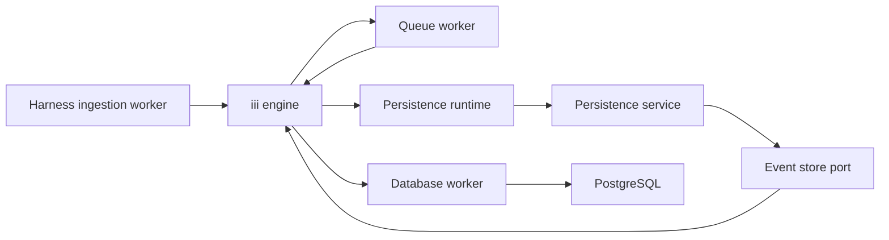
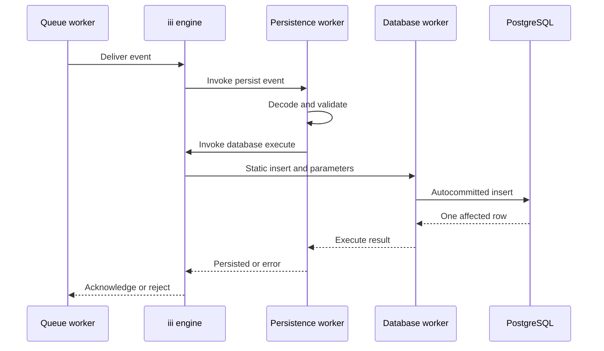

# Design Document

## Overview
The worker persists queued harness events through the iii database worker. It uses independent append-only tables and keeps vector enrichment outside the ingestion path.

### Goals
- Acknowledge a queue delivery only after one database row is confirmed written.
- Preserve the upstream ProtoJSON event contract and opaque observation data.
- Keep concurrent and out-of-order writes independent.
- Assign database-generated UUIDv7 receipt keys and support chronological scans within a session.
- Provide optional session-vector storage without indexing or populating it.

### Non-Goals
- Read APIs, projections, deduplication, ordering, embedding generation, vector search, queue provisioning, and database provisioning.

## Boundary Commitments

### This Spec Owns
- `harness::persist_event`, its `durable:subscriber` registration, and readiness verification.
- Consumer-side validation of the upstream event contract.
- Event-to-SQL mapping and database-worker result handling.
- Required append-only ledger migration and optional session-embedding migration.

### Out of Boundary
- The protobuf contract and publisher owned by `harness-ingestion-worker`.
- A production dependency on the `harness-ingestion` crate or extraction of a shared contracts crate.
- Queue backend reliability, retries, dead-letter configuration, and cross-namespace routing.
- Database-worker deployment, PostgreSQL or pgvector installation, credentials, migration execution, and backups.
- Session snapshots, additional read indexes, retention, partition maintenance, embeddings, and retrieval.

### Allowed Dependencies
- The implemented root `proto/total_recall/harness/v1/events.proto` as production schema input.
- The existing Cargo workspace, lockfile, development shell, and exact workspace dependency pins.
- `harness-ingestion` as a dev-dependency only for generated ProtoJSON and validation-parity fixtures.
- The in-process WebSocket fake pattern established by `integration/harness-engine-fake`.
- iii engine and Rust SDK 0.24.0, queue worker 0.21.13, and database worker 0.5.17 in one iii namespace.
- PostgreSQL 17 or 18 with `pg_uuidv7` release 1.7.0 installed; pgvector 0.8.6 or later only when the optional migration is applied.

### Revalidation Triggers
- Any protobuf field, event discriminator, ProtoJSON name, or timestamp-rule change.
- Addition of an upstream event ID, ordering guarantee, or exactly-once requirement.
- Cross-namespace queue or database deployment.
- A database-worker request or response change, or a queue trigger contract change.
- Read latency, retention, partitioning, or vector-index requirements.
- Receipt-key generation or chronological index contract changes.
- Extraction of a shared contract crate or any production dependency on `harness-ingestion`.

## Architecture

### Existing Architecture Analysis
- The workspace contains the implemented `harness-ingestion` worker and `harness-engine-fake`, with root dependency pins, lockfile, CI, and protobuf source.
- Ingestion publishes at `iii::durable::publish`; this worker begins at the subscriber target function.
- Ingestion establishes ports and adapters, managed iii identity, nonce-based catalog readiness, external crate tests, and an in-process protocol fake.
- Generated ingestion types are public but remain owned by that worker's `OUT_DIR`; they are not a shared production library.
- Persistence compiles the root `.proto` into its own `OUT_DIR` and uses ingestion serializers only in tests.

### Architecture Pattern & Boundary Map



**Architecture Integration**
- Selected pattern: a small ports-and-adapters boundary isolates event handling from iii database invocation.
- Dependency direction: generated contracts → configuration and SQL records → event-store port → persistence service → iii adapters and runtime.
- Function and database invocations inherit the managed client namespace; subscriber target and provider namespaces are explicit.
- The event-store port is retained because tests must observe database requests without live infrastructure.
- External crate tests and a dedicated protocol fake follow the implemented ingestion layout.

### Technology Stack

| Layer | Choice / Version | Role |
| --- | --- | --- |
| Language | Rust 1.98.1, edition 2024 | Worker implementation |
| Worker runtime | `iii-sdk` 0.24.0, Tokio 1.48.0 | Function, trigger, invocation, and lifecycle |
| Contract generation | Prost 0.14.1, pbjson 0.9.0 | Crate-local types from the shared root schema |
| Boundary types | Serde 1.0.228, Schemars 0.8.22, Chrono 0.4.42 | Strict iii schemas and timestamp validation |
| Messaging | Queue worker 0.21.13 | `durable:subscriber` delivery |
| Database bridge | Database worker 0.5.17 | Parameterized `database::execute` calls |
| Storage | PostgreSQL 17–18 | Append-only ledger |
| Receipt keys | `pg_uuidv7` 1.7.0, extension `1.7` | Database-generated UUIDv7 defaults |
| Optional vectors | pgvector 0.8.6+ | Unindexed session-embedding storage |
| Protocol testing | tokio-tungstenite 0.28.0 | In-process iii engine, subscriber, and database fake |

## File Structure Plan

### Directory Structure
```text
Cargo.toml                                             # Add the sibling workspace member
Cargo.lock                                             # Resolve the new crate dependencies
.github/workflows/ci.yml                               # Build and smoke-test persistence
proto/total_recall/harness/v1/events.proto             # Upstream-owned input; unchanged
workers/harness-event-persistence/
├── Cargo.toml                                         # Worker and build dependency pins
├── build.rs                                           # Crate-local Prost and pbjson generation
├── iii.worker.yaml                                    # Worker identity and release command
├── migrations/
│   ├── 0001_harness_event_ledger.sql                  # Required write ledger
│   └── 0002_session_embeddings.sql                    # Optional pgvector table
├── src/
│   ├── lib.rs                                         # Module surface for binary and tests
│   ├── main.rs                                        # Process startup and shutdown
│   ├── config.rs                                      # Queue and database destination validation
│   ├── contracts.rs                                   # Generated includes and strict event adapter
│   ├── persistence.rs                                 # Handler and EventStore contract
│   ├── database.rs                                    # Static SQL mapping, iii database adapter, and adapter tests
│   └── runtime.rs                                     # Function, trigger, and readiness registration
└── tests/
    ├── ci_workflow.rs                                 # CI command contract
    ├── config.rs                                      # Environment and manifest contracts
    ├── contract_oracle.rs                             # Ingestion-oracle ProtoJSON parity
    ├── generated_contracts.rs                          # Generated ProtoJSON output shape
    ├── migrations.rs                                  # Ledger and optional embedding schema checks
    ├── persistence.rs                                 # Service and duplicate/order behavior
    ├── queued_event_adapter.rs                        # Strict queued-event adapter edges
    └── runtime.rs                                     # Registration and readiness catalogs
integration/harness-persistence-engine-fake/
├── Cargo.toml                                         # Workspace protocol-fake binary
├── README.md                                          # Local invocation contract
└── src/main.rs                                        # Fake engine, subscriber, and database flow
```

### Modified Files
- `Cargo.toml` — add the persistence worker and protocol-fake members using existing workspace pins.
- `Cargo.lock` — record the resulting dependency graph.
- `.github/workflows/ci.yml` — release-build the persistence worker and run its fake-engine smoke test.

The `.proto`, ingestion crate, existing fake, and `flake.nix` are unchanged inputs. Production code does not import `harness-ingestion`; external contract tests use it as a dev-only oracle.

## System Flows



Validation stops before database invocation. A database timeout returns an error even though the eventual commit outcome is unknown; redelivery can append a duplicate.

## Requirements Traceability

| Requirement IDs | Summary | Design Elements |
| --- | --- | --- |
| 1.1, 1.2, 1.3 | Startup and subscription readiness | `Config`, `WorkerRuntime`, catalog matcher |
| 2.1, 2.2, 2.3, 2.4, 2.5, 2.6 | Queued contract consumption and normalized time | Contract Adapter, generated messages |
| 3.1, 3.2, 3.3, 3.4, 3.5, 3.6, 3.7 | Append-only records, receipt keys, and chronological lookup | `PersistenceService`, ledger schema, one-row inserts |
| 4.1, 4.2, 4.3, 4.4 | Lifecycle records | `SessionEventRecord`, `session_events` |
| 5.1, 5.2, 5.3, 5.4 | Raw observation records | `ObservationRecord`, `raw_observations` |
| 6.1, 6.2, 6.3, 6.4, 6.5 | Acknowledgment and failures | Database Adapter, error contract |
| 7.1, 7.2, 7.3 | Optional vectors | Optional embedding migration and boundary |
| 8.1, 8.2, 8.3, 8.4 | Infrastructure-free verification | External tests, recording/failing stores, protocol fake, CI |

## Components and Interfaces

| Component | Intent | Requirement Coverage | Dependencies | Contracts |
| --- | --- | --- | --- | --- |
| Contract Adapter | Decode one strict queued event | 2.1–2.6, 5.2, 5.4 | Generated contract, Chrono | API, Event |
| Persistence Service | Append one accepted event and report outcome | 3.1–6.5 | Contract Adapter, Event Store | Service |
| Database Adapter | Build and invoke one parameterized insert | 2.6, 3.1–6.3, 8.1–8.3 | iii SDK, database worker | Service, State |
| Worker Runtime | Register function and subscriber, then gate readiness | 1.1–1.3 | iii SDK, queue worker | API |
| Schema Migrations | Define required ledger and optional vector storage | 2.6, 3.1–5.4, 7.1–7.3 | PostgreSQL, pg_uuidv7, optional pgvector | State |
| Protocol Fake | Verify engine, subscriber, and database contracts | 1.3, 6.1–6.5, 8.1–8.4 | Worker release binary, WebSocket protocol | API, State |

### Contract Adapter

**Responsibilities & Constraints**
- Inspect `event_type` through a strict tagged adapter before converting to the matching crate-local generated event; generated protobuf defaults do not prove field presence.
- Require the exact upstream discriminator and field set; preserve values unchanged after validation.
- Reject only empty session IDs; whitespace-only session IDs and empty project, directory, and hook strings remain valid for parity with ingestion.
- Apply ingestion's exact RFC 3339 millisecond syntax, including lowercase `t` and `z`, offset bounds, calendar validation, and source-text preservation.
- Derive exact epoch milliseconds for chronological storage while retaining the source timestamp string.
- Accept `post_tool_use` as an ordinary observation `hook_type`; keep its generated `event_type` equal to `observation`.
- Preserve protobuf `Struct` number semantics, including `f64` rounding beyond the exact integer range.
- Convert the three generated messages into one internal `PersistableEvent` enum.

**Contracts**: API [x] / Event [x]

| Variant | Required fields |
| --- | --- |
| `SessionStart` | `event_type`, `session_id`, `project_name`, `timestamp`, `current_working_directory` |
| `Observation` | `event_type`, `hook_type`, `project_name`, `current_working_directory`, `timestamp`, `session_id`, object `data` |
| `SessionEnd` | Same shape as `SessionStart` with the end discriminator |

The iii request schema is a strict tagged union mirroring these generated messages. External compatibility tests serialize the public ingestion generated types and compare accepted persistence forms, validation edges, and observation values. Production builds remain independent.

### Persistence Service

**Responsibilities & Constraints**
- Accept one validated event and call the store exactly once.
- Return `{ "persisted": true }` only for an append receipt with one affected row.
- Keep no session state and perform no retries, deduplication, or ordering logic.

**Contracts**: Service [x]

```rust
async fn persist_event(
    input: QueuedHarnessEventInput,
    store: &dyn EventStore,
) -> Result<PersistenceResponse, PersistenceError>;

#[async_trait]
trait EventStore: Send + Sync {
    async fn append(&self, event: &PersistableEvent) -> Result<AppendReceipt, StoreError>;
}
```

`AppendReceipt` contains `affected_rows: u64`; the only valid success value is `1`.

### Database Adapter

**Responsibilities & Constraints**
- Select one static insert by event variant and bind every value through positional parameters.
- Let PostgreSQL generate the UUIDv7 receipt default and derive `source_timestamp_utc` from the validated epoch-millisecond parameter.
- Invoke `database::execute` once in the worker namespace with the configured logical database name.
- Parse `affected_rows`, `last_insert_id`, and `returned_rows`; reject malformed responses and affected-row counts other than one.
- Never place observation `data` in logs or error messages.

**Contracts**: Service [x] / State [x]

```json
{
  "db": "<configured logical name>",
  "sql": "<static insert with PostgreSQL placeholders>",
  "params": ["<ordered event values>"]
}
```

No `RETURNING` clause is used. The adapter treats a successful `database::execute` response with `affected_rows: 1` as the autocommit confirmation.

### Worker Runtime

**Responsibilities & Constraints**
- Mirror the implemented `Config::from_values` seam: require and trim non-blank `TOTAL_RECALL_QUEUE_TOPIC` and `TOTAL_RECALL_DATABASE`, default blank `III_URL`, and preserve optional managed worker name and namespace.
- Build `WorkerMetadata` from managed configuration, leave `InitOptions.namespace` unset, and use `WorkerIdentityMode::Managed`.
- Register `harness::persist_event` and one `durable:subscriber` with canonical `{ "queue": topic }` configuration.
- Set subscriber target and trigger-provider namespaces explicitly; function and database calls inherit the managed client namespace.
- Attach one UUIDv4 startup nonce to function and trigger metadata, retain both handles, wait for worker registration, and verify the nonce-bearing function through `EngineFunctions::INFO_FUNCTIONS` with the expected catalog namespace in its payload.
- Query `engine::registered-triggers::list` by trigger type and function ID with pending entries included, then inspect each candidate through `engine::registered-triggers::info` until exactly one binding has the nonce, expected configuration and namespaces, a non-null target function, and `active` status.
- Route engine catalog calls through the SDK's default engine namespace behavior, use one 30-second absolute deadline, fail on disconnect or mismatch, and race startup readiness against termination.

**Contracts**: API [x]

| Interface | Input | Success | Failure |
| --- | --- | --- | --- |
| `harness::persist_event` | Queued harness-event ProtoJSON | `{ "persisted": true }` | Contract or database error |
| `durable:subscriber` | `{ "queue": configured topic }` | Active registered-trigger instance | Registration timeout |

`iii.worker.yaml` declares `name: harness-event-persistence` and starts `../../target/release/harness-event-persistence` from the member directory.

### Protocol Fake

**Responsibilities & Constraints**
- Run as a separate workspace binary modeled on `harness-engine-fake`; do not add test-only protocol handling to the worker.
- Spawn the release persistence worker against a loopback WebSocket endpoint and emulate worker registration, function catalogs, subscriber registration, registered-trigger list/info, and `database::execute`.
- Invoke `harness::persist_event` with a valid queued event, verify the exact database request, delay the database response, and require the worker response afterward.
- Exit non-zero on protocol, namespace, ownership, request-shape, or ordering mismatch without using live iii, queue, database-worker, or PostgreSQL services.

**Contracts**: API [x] / State [x]

## Data Models

### Domain Model
- `PersistableEvent` is a closed enum of `SessionStart`, `Observation`, and `SessionEnd`.
- A delivery is the consistency boundary: one event maps to one row and one autocommitted database operation.
- `receipt_id` is a database-generated UUIDv7 receipt, not an upstream event or strict source order.
- `session_id` is correlation data. It is neither unique nor a foreign-key parent.

### Physical Data Model

#### Required ledger migration

```sql
CREATE TABLE session_events (
    receipt_id UUID PRIMARY KEY DEFAULT uuid_generate_v7(),
    session_id TEXT NOT NULL,
    event_type TEXT NOT NULL CHECK (event_type IN ('session_start', 'session_end')),
    project_name TEXT NOT NULL,
    current_working_directory TEXT NOT NULL,
    source_timestamp_rfc3339 TEXT NOT NULL,
    source_timestamp_utc TIMESTAMPTZ(3) NOT NULL,
    ingested_at TIMESTAMPTZ NOT NULL DEFAULT statement_timestamp()
);

CREATE INDEX session_events_session_source_timestamp_idx
    ON session_events USING btree
    (session_id ASC, source_timestamp_utc ASC);

CREATE TABLE raw_observations (
    receipt_id UUID PRIMARY KEY DEFAULT uuid_generate_v7(),
    session_id TEXT NOT NULL,
    event_type TEXT NOT NULL CHECK (event_type = 'observation'),
    hook_type TEXT NOT NULL,
    project_name TEXT NOT NULL,
    current_working_directory TEXT NOT NULL,
    source_timestamp_rfc3339 TEXT NOT NULL,
    source_timestamp_utc TIMESTAMPTZ(3) NOT NULL,
    ingested_at TIMESTAMPTZ NOT NULL DEFAULT statement_timestamp(),
    data JSON NOT NULL
);

CREATE INDEX raw_observations_session_source_timestamp_idx
    ON raw_observations USING btree
    (session_id ASC, source_timestamp_utc ASC);
```

The migration requires `pg_uuidv7` extension version `1.7` to be installed before execution; it does not install the extension. Each table has one UUID primary-key index and one required chronological B-tree index. There are no foreign keys, source-data uniqueness constraints, partitions, included columns, or updates. `source_timestamp_rfc3339` preserves the supplied lexical value; `source_timestamp_utc` is the normalized instant; `ingested_at` is statement time.

#### Optional embedding migration

```sql
CREATE TABLE session_embeddings (
    receipt_id UUID PRIMARY KEY DEFAULT uuid_generate_v7(),
    session_id TEXT NOT NULL,
    model_id TEXT NOT NULL,
    dimensions INTEGER NOT NULL CHECK (dimensions > 0),
    embedding vector NOT NULL,
    created_at TIMESTAMPTZ NOT NULL DEFAULT statement_timestamp(),
    CHECK (vector_dims(embedding) = dimensions)
);
```

The migration assumes pgvector is already installed. It adds no foreign key, unique constraint, HNSW index, or IVFFlat index. Embedding revisions append rows; a future embedding spec owns write and query contracts.

### Data Contract Mapping

| Event | Table | Parameters in order |
| --- | --- | --- |
| Session start/end | `session_events` | session ID, event type, project, working directory, source timestamp text, epoch milliseconds |
| Observation | `raw_observations` | session ID, event type, hook type, project, working directory, source timestamp text, epoch milliseconds, data cast to `json` |

Each insert derives `source_timestamp_utc` with `TIMESTAMPTZ 'epoch' + ($n::bigint * INTERVAL '1 millisecond')`. The database worker binds the epoch value as an integer; no direct timestamp binding is required.

## Error Handling

| Category | Worker behavior | Queue effect |
| --- | --- | --- |
| Configuration | Exit before readiness | No subscription |
| Contract or timestamp | Return a schema error before database invocation | Delivery rejected |
| Database invocation or timeout | Return an opaque persistence error | Delivery rejected and queue policy applies |
| Malformed execute response | Return an adapter error | Delivery rejected |
| Affected rows not equal to one | Return an unconfirmed-write error | Delivery rejected |
| Registration not visible by deadline | Exit without readiness | No accepted traffic claim |

Errors include event type and category only. They exclude SQL parameters, observation data, credentials, and full payloads.

## Testing Strategy

### Unit Tests
- Contract Adapter: accept all three generated ProtoJSON shapes, including `post_tool_use`; cover empty-versus-whitespace fields, lowercase and offset timestamps, epoch milliseconds, large-number rounding, wrong discriminators, unknown or missing fields, and non-object data.
- Persistence Service: call a recording store once per variant; accept one affected row; propagate store failures; append repeated and out-of-order events independently.
- Database Adapter: assert exact static SQL, parameter order, `json` cast, configured database name, and inherited namespace for each variant.
- Database Adapter: reject invocation errors, timeouts, malformed responses, zero rows, and multiple rows without exposing observation data.
- Worker Runtime: assert managed metadata, inherited call namespaces, explicit subscriber namespaces, retained handles, nonce metadata, function catalog payloads, registered-trigger list/info matching, disconnects, ambiguity, and one-deadline timeouts.

### Contract and Schema Tests
- Use `harness-ingestion` as a dev-only oracle for generated ProtoJSON and validation parity; do not import it from production modules.
- Assert migrations use UUIDv7 defaults, normalized timestamp columns, exact chronological indexes, and only the documented tables and constraints; the optional migration remains separate.

### Protocol and CI Tests
- Run the release worker against `harness-persistence-engine-fake`, which verifies function/subscriber registration, readiness ownership, one queue-style invocation, the exact `database::execute` request, and response-after-database ordering.
- Extend CI to run workspace tests, formatting, warning-free Clippy, `nix flake check`, both release worker builds, and both protocol fakes without live iii, queue, database-worker, or PostgreSQL services.

## Security Considerations
- Static SQL and positional parameters prevent event fields from changing statement structure.
- Opaque observation data crosses validation and storage boundaries but never logs or errors.
- The worker receives database selection from startup configuration only; events cannot select a database or function.
- UUIDv7 receipt keys expose approximate database generation time and are not returned by the persistence function.

## Performance and Scalability
- Every delivery performs one heap insert, one UUIDv7-primary-key update, and one chronological secondary-index update with no parent-row maintenance.
- Separate tables keep lifecycle rows narrow and avoid nullable variant columns.
- `json` avoids `jsonb`'s write-time decomposition; consumers pay read-time parsing costs.
- The required secondary indexes trade write throughput for chronological per-session access. Further indexes, batching, and partitioning require measured workloads and revalidation.

## Migration Strategy
- Install `pg_uuidv7` release 1.7.0 and enable extension version `1.7`, then apply `0001_harness_event_ledger.sql` before starting the worker; startup does not install extensions or run migrations.
- Apply `0002_session_embeddings.sql` only where pgvector is installed. Its failure does not block ledger migration or event persistence.
- Both migrations are additive on a repository with no existing data. Rollback and destructive table removal remain deployment operations.
