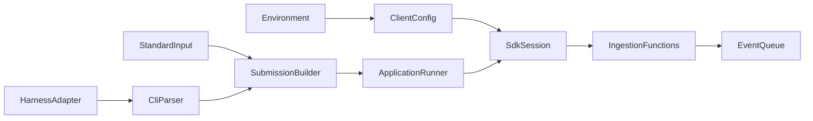
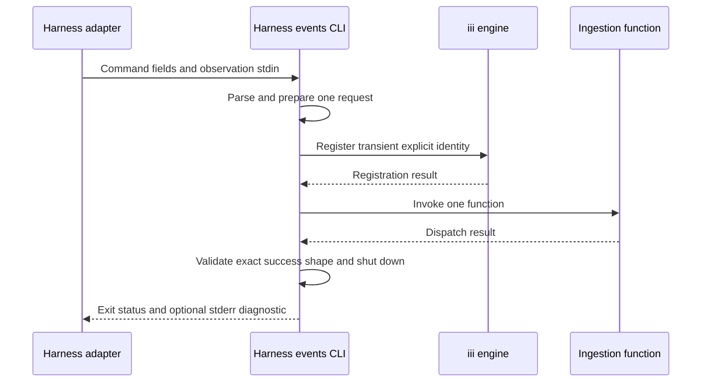

# Design Document: harness-events-cli

## Overview

The harness events CLI is a standalone Rust client that converts typed process inputs into authoritative harness ProtoJSON requests and invokes one existing ingestion function. It provides the stable process boundary consumed by future harness-specific adapters without taking ownership of ingestion, queueing, or persistence.

### Goals
- Provide typed commands for all three harness event stages.
- Preserve the root protobuf and ingestion function contracts.
- Expose deterministic, data-safe process outcomes.
- Keep client code independent from production worker crates.

### Non-Goals
- Implement concrete harness adapters or infer request fields.
- Change ingestion validation, queue dispatch, or persistence behavior.
- Guarantee at-most-once transport delivery.
- Package or distribute the binary outside the Cargo workspace.

## Boundary Commitments

### This Spec Owns
- The `harness-events` binary command, option, stdin, stderr, stdout, and exit-status contracts.
- Conversion from typed command inputs to the three ingestion request payloads.
- Transient iii client connection, function invocation, response validation, and deterministic shutdown.
- CLI-focused unit, process, contract, and protocol-fake tests.

### Out of Boundary
- The root harness protobuf and ingestion function identifiers, which remain upstream contracts.
- Ingestion request validation semantics, queue publication, persistence, ordering, and deduplication.
- SDK reconnect and queued-send replay behavior.
- Shared-contract extraction, harness-specific adapters, authentication extensions, installers, and release distribution.

### Allowed Dependencies
- `proto/total_recall/harness/v1/events.proto` as the only event-shape authority.
- `iii-sdk` 0.24.0 for engine registration and invocation.
- `clap` 4.6.7 with `derive` for the public command grammar.
- Existing pinned Tokio, Prost, pbjson, Serde, Thiserror, and UUID workspace dependencies.
- `tokio-tungstenite` and `futures-util` only in tests for an in-process protocol fake.
- `harness-ingestion` only as a development contract oracle.
- No production dependency on `harness-ingestion`, `harness-event-persistence`, or an integration fake crate.

### Revalidation Triggers
- Any root protobuf field, JSON mapping, or `google.protobuf.Struct` change.
- Any ingestion function identifier or success-response change.
- Any `iii-sdk` change to identity, namespace, registration, trigger, timeout, replay, or shutdown behavior.
- Any change to `III_URL` or `III_NAMESPACE` conventions.
- Any change to public commands, options, stdin shape, diagnostics, or exit statuses requires downstream harness adapters to revalidate.

## Architecture

### Existing Architecture Analysis
- Production workers use ports-and-adapters boundaries and exact workspace dependency pins.
- Each worker independently generates Prost and pbjson types from the root protobuf.
- iii calls use synchronous `TriggerRequest` values and inherit namespace from their client.
- Configuration exposes deterministic `from_values` seams.
- Process tests execute release binaries; protocol tests use loopback WebSocket fakes.
- The new CLI is a client boundary and does not belong under `workers/` or `integration/`.

### Architecture Pattern and Boundary Map



**Architecture Integration**
- Selected pattern: A standalone ports-and-adapters client with pure request preparation and an iii SDK boundary.
- Dependency direction: generated contracts and command types → configuration and submission preparation → application orchestration → SDK session → process adapter.
- Existing patterns preserved: independent protobuf generation, `from_values` configuration, one-call invocation seams, opaque errors, and protocol fakes.
- Simplification: no shared-contract refactor, generic plugin system, output receipt model, or reusable adapter framework is introduced.

### Technology Stack

| Layer | Choice / Version | Role | Constraint |
|---|---|---|---|
| CLI | Clap 4.6.7 | Typed subcommands, required options, help, usage exits | Exact pin with `derive`; usage exit remains `2` |
| Runtime | Rust 1.98.1, Tokio 1.48.0 | Async entry point and SDK calls | Workspace versions |
| Contracts | Prost 0.14.1, pbjson 0.9.0, pbjson-types 0.9.0 | Independent generated request types and ProtoJSON | Root protobuf is authoritative |
| Engine client | iii-sdk 0.24.0 | Registration, namespace routing, synchronous function invocation | One application trigger call; SDK replay remains possible |
| Test transport | Tokio Tungstenite 0.28.0 | In-process iii protocol fake | Development dependency only |

## File Structure Plan

### Directory Structure

```text
clients/harness-events-cli/
├── Cargo.toml                 # Client, build, and test dependencies
├── build.rs                   # Root harness protobuf and ProtoJSON generation
├── src/
│   ├── app.rs                 # One-submission orchestration and response contract
│   ├── cli.rs                 # Public clap command and option grammar
│   ├── config.rs              # III_URL and III_NAMESPACE environment contract
│   ├── contracts.rs           # Generated types, stdin parsing, and request preparation
│   ├── sdk.rs                 # Transient iii session, invocation, and shutdown
│   ├── lib.rs                 # Module exports and process-independent entry point
│   └── main.rs                # Environment, stdio, diagnostics, and exit mapping
└── tests/
    ├── process.rs             # Binary behavior and loopback protocol scenarios
    ├── contract.rs            # Authoritative ingestion contract oracle
    └── support/
        ├── mod.rs             # Test-support exports
        └── engine.rs          # Minimal registration and invocation protocol fake
```

Unit tests remain beside their owning modules. Generated files remain in `OUT_DIR`.

### Modified Files
- `Cargo.toml` — Add the client workspace member and exact Clap dependency.
- `Cargo.lock` — Lock the new client dependency graph.
- `.github/workflows/ci.yml` — Add an explicit release build for `harness-events-cli`; workspace test, format, and Clippy steps already cover it.

## System Flow



Local command and stdin validation completes before client creation. The application issues one trigger call and does not start a retry loop; the SDK may reconnect and replay a queued send. Event commands write nothing to stdout.

## Requirements Traceability

| Requirements | Summary | Design elements |
|---|---|---|
| 1.1, 1.6 | Commands and help | CLI Parser |
| 1.2, 1.3 | Required explicit fields | CLI Parser |
| 1.4, 1.5 | Pre-invocation usage rejection | CLI Parser, Process Adapter |
| 2.1, 2.2, 2.3 | Lifecycle mapping and preservation | Submission Builder, generated requests |
| 2.4 | Lifecycle rejection outcome | Application Runner, Process Adapter |
| 3.1, 3.2 | Single stdin value and observation invocation | Submission Builder |
| 3.3, 3.4 | Opaque Struct semantics | Submission Builder |
| 3.5, 3.6 | Invalid stdin and rejected observation | Submission Builder, Application Runner |
| 4.1, 4.2, 4.3, 4.4 | Engine and namespace environment | Client Config, SDK Session |
| 4.5 | Connection failure | SDK Session, Process Adapter |
| 5.1, 5.2, 5.3 | Success, failure, and diagnostics | Application Runner, Process Adapter |
| 5.4 | Observation-data secrecy | Process Adapter |
| 5.5, 5.6 | One application request and bounded success meaning | Application Runner, response contract |
| 6.1, 6.4 | Protobuf compatibility and opaque data preservation | Submission Builder, contract tests |
| 6.2, 6.3, 6.5 | Command, failure, and infrastructure-free verification | component unit tests, contract tests, process tests, protocol fake |

## Components and Interfaces

| Component | Layer | Intent | Requirements | Dependencies |
|---|---|---|---|---|
| CLI Parser | Process | Parse typed commands before side effects | 1.1–1.6 | Clap P0 |
| Submission Builder | Contract | Produce one authoritative function payload | 2.1–3.5, 6.1, 6.4 | Generated contracts P0 |
| Client Config | Configuration | Resolve engine URL and optional namespace | 4.1–4.4 | Environment, iii SDK constants P0 |
| Application Runner | Application | Invoke once and validate the response | 2.4, 3.6, 5.1, 5.5, 5.6 | Submission Builder, SDK Session P0 |
| SDK Session | Adapter | Register, route, invoke, and shut down | 4.3–4.5, 5.5 | iii-sdk P0 |
| Process Adapter | Process | Map outcomes to stderr and exit statuses | 5.1–5.4 | CLI Parser, Application Runner P0 |

### CLI Parser

The binary name is `harness-events`. Long options use kebab case and have no positional or snake-case aliases.

| Command | Required options | Standard input |
|---|---|---|
| `session-start` | `--session-id`, `--project-name`, `--current-working-directory`, `--timestamp` | Not read |
| `observation` | `--hook-type`, `--project-name`, `--current-working-directory`, `--timestamp`, `--session-id` | Exactly one JSON object |
| `session-end` | `--session-id`, `--project-name`, `--current-working-directory`, `--timestamp` | Not read |

Clap owns syntax errors, missing values, unknown arguments, and help rendering. Parsing completes before configuration or SDK initialization.

### Submission Builder

```rust
enum EventCommand {
    SessionStart(LifecycleArgs),
    Observation(ObservationArgs),
    SessionEnd(LifecycleArgs),
}

struct Submission {
    function_id: IngestionFunction,
    payload: serde_json::Value,
}

fn prepare(command: EventCommand, stdin: impl Read) -> Result<Submission, InputError>;
```

- `IngestionFunction` is a closed enum mapping to `harness::session_start`, `harness::observation`, and `harness::session_end`.
- Lifecycle values are copied unchanged into independently generated request types.
- Observation stdin is deserialized as one `serde_json::Value`, checked for object shape and end of input, then recursively converted to `pbjson_types::Struct`.
- JSON numbers use the ingestion contract's `as_f64()` conversion, including protobuf-double rounding for integers above JSON's exact double range; unrepresentable numbers are rejected.
- Request types serialize through generated pbjson implementations with preserved proto field names and emitted default fields.
- Preparation has no engine or process side effects.

### Client Config

```rust
struct ClientConfig {
    engine_url: String,
    namespace: Option<String>,
}

fn from_values(values: impl IntoIterator<Item = (String, String)>) -> ClientConfig;
```

- Non-blank `III_URL` is preserved; absent or blank input selects `iii_sdk::DEFAULT_ENGINE_URL`.
- Non-blank `III_NAMESPACE` is preserved; absent or blank input leaves namespace routing unset.
- `III_WORKER_NAME` is ignored to prevent collision with a deployed worker identity.

### Application Runner and SDK Session

```rust
async fn submit_once<F, Fut>(submission: Submission, invoke: F) -> Result<(), SubmitError>
where
    F: FnOnce(Submission) -> Fut,
    Fut: Future<Output = Result<serde_json::Value, InvokeError>>;
```

- The runner consumes the submission and a single-use invocation function.
- Only the exact JSON object `{"dispatched":true}` is success.
- Remote rejection, trigger timeout, and any other response are invocation failures.
- The SDK session uses an explicit `harness-events-cli-<uuid>` identity and applies `ClientConfig.namespace` directly.
- An internal timeout policy supplies registration and trigger bounds. Process execution always uses 30 seconds for both; adapter tests may inject shorter bounds without adding a CLI or environment setting.
- Shutdown runs after registration or invocation success and failure; the synchronous SDK shutdown joins its connection thread.
- The CLI calls the SDK trigger once. It neither retries nor claims that timeout means the function did not run.

### Process Adapter and Exit Contract

| Status | Category | Diagnostic behavior |
|---:|---|---|
| `0` | Successful dispatch response or help | Event commands are silent; Clap renders help |
| `2` | Command usage or local observation input | Clap usage text or `harness-events: invalid observation data` on stderr |
| `3` | Engine connection or registration | `harness-events: engine connection failed` on stderr |
| `4` | Function rejection, timeout, SDK invocation error, or unexpected response | Fixed invocation diagnostic on stderr |

Diagnostics do not print observation data, serialized payloads, SDK source chains, remote messages, or remote stack traces. Event-command stdout remains empty for every outcome.

## Data Contracts

### Build Contract

`build.rs` compiles the root harness proto with the same well-known-type mapping, default-field emission, and field-name preservation as the ingestion worker. The CLI does not copy protobuf definitions or generated source.

The contract-oracle test uses `harness-ingestion` as a development dependency. It compares function IDs with `HARNESS_FUNCTION_IDS`, passes CLI payloads through the authoritative input adapters, and derives the accepted success JSON from `DispatchResponse`.

### Invocation Contract

| Function | Payload type | Accepted result |
|---|---|---|
| `harness::session_start` | `SessionStartRequest` ProtoJSON | `{"dispatched":true}` |
| `harness::observation` | `ObservationRequest` ProtoJSON | `{"dispatched":true}` |
| `harness::session_end` | `SessionEndRequest` ProtoJSON | `{"dispatched":true}` |

No response receipt is exposed. No event data is persisted by the CLI.

## Error Handling

| Failure | Owner | Side-effect rule | Exit |
|---|---|---|---:|
| Syntax, missing option, unknown option | CLI Parser | No stdin read or client creation | 2 |
| Empty, malformed, non-object, or trailing stdin | Submission Builder | No client creation | 2 |
| Registration rejection or timeout | SDK Session | Shutdown; no trigger call | 3 |
| Remote rejection or trigger timeout | SDK Session | Shutdown; no CLI retry | 4 |
| Unexpected success value | Application Runner | Shutdown; no CLI retry | 4 |

Errors are typed internally but collapse to the fixed process diagnostics above. This preserves useful categories without exposing opaque harness data or untrusted remote text.

## Testing Strategy

### Unit Tests
- `cli.rs`: all commands, kebab-case options, required-option failures, unknown arguments, and help without dispatch.
- `contracts.rs`: exact lifecycle payloads, strict one-object stdin parsing, trailing-content rejection, nested values, and protobuf-double rounding including `9_007_199_254_740_993`.
- `config.rs`: non-blank, blank, and absent URL/namespace values plus ignored `III_WORKER_NAME`.
- `app.rs`: exact success shape, unexpected results, errors, and a recording `FnOnce` proving one application invocation.
- `sdk.rs`: explicit identity, namespace, one-trigger behavior, injected short timeout bounds, error classification, and joining shutdown.
- `main.rs`: error-category to exit-status and fixed-diagnostic mapping.

### Process and Protocol Tests
- Execute each binary subcommand against the in-process fake and assert function ID, namespace, ProtoJSON payload, empty stdout, and exit `0`.
- Run the child process through Tokio process APIs or a dedicated blocking thread so the in-process async fake continues servicing the socket.
- Return registration failure, remote rejection, malformed success, and dropped connections; assert statuses `3` or `4`, fixed stderr, and shutdown.
- Supply empty, malformed, scalar, array, and trailing stdin; assert status `2` and that the fake receives no connection.
- Include opaque sentinel values in nested observation data; assert payload preservation and absence from stdout and stderr.
- Run `tests/contract.rs` against public ingestion inputs, `HARNESS_FUNCTION_IDS`, and `DispatchResponse` to detect non-protobuf boundary drift.
- Run all tests without a live iii engine, ingestion worker, queue, or database.

### CI Verification
- `cargo test --workspace --locked`
- `cargo fmt --all --check`
- `cargo clippy --workspace --all-targets --locked -- -D warnings`
- `cargo build --locked --release --package harness-events-cli`

## Security Considerations

- Observation data uses stdin rather than process arguments and is never emitted by CLI diagnostics.
- Request metadata remains explicit command arguments and is therefore visible through normal operating-system process inspection.
- Remote error text and stack traces are untrusted and remain suppressed.
- The CLI adds no authentication mechanism; it relies on the configured iii engine boundary.
