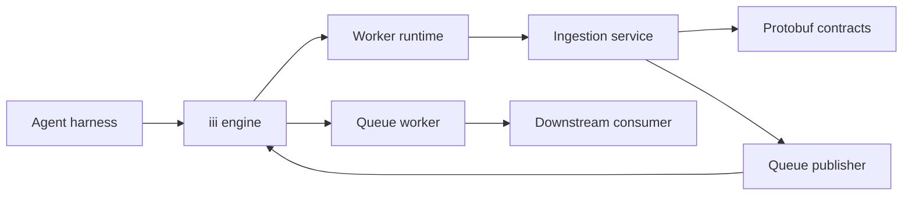
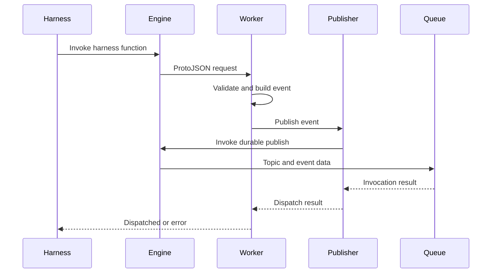

# Design Document: Harness Ingestion Worker

## Overview
The harness ingestion worker exposes three iii functions and forwards validated ProtoJSON events to one queue topic. Protobuf definitions own the request and event contracts; the worker owns validation and dispatch, not session state or delivery guarantees.

### Goals
- Provide stable iii functions for session start, observation, and session end hooks.
- Publish schema-defined events while preserving opaque observation data within protobuf Struct semantics.
- Keep contract and failure behavior testable without an iii engine or queue worker.

### Non-Goals
- Persist, order, deduplicate, retry, or interpret events.
- Generate session identifiers or validate session state.
- Provision the queue worker, topic subscriber, or downstream memory processor.

## Boundary Commitments

### This Spec Owns
- The protobuf package and field-numbered request and event schemas.
- The three harness-facing iii function identifiers and their input, success, and error contracts.
- Request validation, generated-event construction, ProtoJSON serialization, and one queue invocation per accepted request.
- Worker startup configuration, iii registration, readiness gating, and process lifecycle.
- An engine-independent fake protocol harness and CI workflow that validate the worker manifest and complete runtime seam.

### Out of Boundary
- Queue backend availability, durable acceptance, subscriber readiness, delivery order, and duplicate handling.
- Session persistence, lifecycle transition validation, observation interpretation, and memory retrieval.
- Authentication and authorization beyond the iii runtime boundary.
- Live-engine or live-queue integration tests.

### Allowed Dependencies
- `iii-sdk` 0.24.0 for worker registration and function invocation.
- iii engine 0.24.0 and a queue worker exposing `iii::durable::publish` in the worker namespace.
- Prost and pbjson generation/runtime libraries on the 0.14 and 0.9 compatibility lines.
- Serde, Schemars 0.8, Chrono, Tokio, UUID, and small error/async support crates.
- Futures, Tokio Tungstenite 0.28, and Serde YAML 0.9 for the test-only fake-engine harness.
- The repository's pinned Nix development shell for Rust, iii, `protoc`, and Actionlint.

### Revalidation Triggers
- Protobuf package, field number, field name, field type, or event discriminator changes.
- iii function identifier, queue topic configuration, or namespace-routing changes.
- Replacement of `iii::durable::publish` or addition of retry, ordering, or persistence guarantees.
- iii SDK, engine, queue worker, Prost, or pbjson compatibility-line changes.
- Moving session or observation processing into this worker.
- iii worker-manifest schema or fake-engine protocol changes.

## Architecture

### Existing Architecture Analysis
- The repository has a Nix development shell but no Cargo workspace or application code.
- iii 0.24.0 is present; `protoc` is absent.
- No source-layout, event-contract, configuration, or test conventions exist.
- This feature establishes a workspace and one isolated worker crate without defining downstream architecture.

### Architecture Pattern & Boundary Map



**Architecture Integration**
- Selected pattern: a small ports-and-adapters boundary isolates event construction from iii queue invocation.
- Dependency direction: generated contracts are independent; boundary adapters depend on contracts; the ingestion service depends on contracts and the publisher port; the iii adapter implements that port; runtime registration composes them.
- The worker and queue worker share one iii namespace. Cross-namespace routing is deferred.
- Compile-time code generation produces Rust and ProtoJSON support from the committed `.proto`; generated files remain in `OUT_DIR`.
- A test-only adapter launches `scripts.start` from `iii.worker.yaml` and emulates only the iii frames needed to prove registration, readiness, all three harness calls, and exact queue payloads.

### Technology Stack

| Layer | Choice / Version | Role |
| --- | --- | --- |
| Language | Rust 1.98.1, edition 2024 | Worker implementation |
| Worker runtime | `iii-sdk` 0.24.0, Tokio 1 | Function registration, invocation, lifecycle |
| Contract generation | `prost` and `prost-build` 0.14.1 | Protobuf messages and descriptors |
| ProtoJSON | `pbjson`, `pbjson-build`, `pbjson-types` 0.9.0 | Event JSON mapping and `google.protobuf.Struct` |
| Boundary schemas | Serde 1.0.228, Schemars 0.8.22 | iii input and output schemas |
| Validation | Chrono 0.4.42 | RFC 3339 calendar and offset validation |
| Runtime support | UUID 1 | Per-start function-registration nonce |
| Build environment | Nixpkgs `protobuf` 36.1 and Actionlint | Pinned `protoc` and workflow linting |
| Messaging | Queue worker 0.21.13 contract | `iii::durable::publish` target |
| Integration validation | Futures 0.3, Tokio Tungstenite 0.28, Serde YAML 0.9 | Test-only iii protocol and manifest-driven smoke |

## File Structure Plan

### Directory Structure
```text
.github/workflows/ci.yml                       # Canonical checks and manifest-driven smoke
Cargo.toml                                      # Workspace and shared dependency pins
Cargo.lock                                      # Reproducible Rust dependency graph
flake.nix                                       # Add protoc to the existing development shell
integration/harness-engine-fake/                # Test-only iii protocol and runtime smoke
├── Cargo.toml
├── README.md
└── src/main.rs
proto/total_recall/harness/v1/events.proto      # Authoritative request and event contracts
workers/harness-ingestion/
├── Cargo.toml                                  # Worker crate and build dependencies
├── build.rs                                    # Prost descriptor and pbjson generation
├── iii.worker.yaml                             # iii worker identity and release start command
├── src/
│   ├── lib.rs                                  # Module surface used by the binary and tests
│   ├── main.rs                                 # Process startup, registration wait, and shutdown
│   ├── config.rs                               # Queue-topic environment validation
│   ├── contracts.rs                            # Generated includes, iii adapters, validation, conversion
│   ├── ingestion.rs                            # Three handlers and event construction
│   ├── publisher.rs                            # Publisher port and iii queue implementation
│   └── runtime.rs                              # Function registration and readiness gating
└── tests/                                      # Cross-module contract and service tests
```

### Modified Files
- `flake.nix` — include Nixpkgs `protobuf` and Actionlint for the canonical build and CI checks.

Focused Cargo tests remain under the worker crate. The test-only fake engine is isolated under `integration/`; it does not provision or require a live iii engine or queue worker.

## System Flow



Validation failures stop before publication. Queue invocation occurs exactly once for each accepted request; no retry or delivery inference follows the queue result.

## Requirements Traceability

| Requirement IDs | Summary | Design Elements |
| --- | --- | --- |
| 1.1, 1.2, 1.3 | Startup, registration, readiness | `Config`, `WorkerRuntime`, manifest |
| 2.1, 2.2, 2.3, 2.4, 2.5, 2.6, 2.7 | Session lifecycle events | Protobuf contracts, `IngestionService` |
| 3.1, 3.2, 3.3, 3.4, 3.5, 3.6, 3.7 | Structured observation and opaque data | Protobuf contracts, adapters, `IngestionService` |
| 4.1, 4.2, 4.3, 4.4, 4.5, 4.6, 4.7 | Protobuf and ProtoJSON authority | `.proto`, `build.rs`, generated contract module |
| 5.1, 5.2, 5.3 | Timestamp precision and preservation | `HarnessTimestamp` validator |
| 6.1, 6.2, 6.3, 6.4, 6.5, 6.6 | Queue dispatch semantics | `QueuePublisher`, iii adapter, response contract |
| 7.1, 7.2, 7.3, 7.4, 7.5 | Engine-independent verification | Publisher fake, focused Cargo tests, and manifest-driven fake-engine smoke |

## Components and Interfaces

| Component | Intent | Requirement Coverage | Dependencies | Contracts |
| --- | --- | --- | --- | --- |
| Contract Pipeline | Generate, adapt, validate, and serialize event contracts | 2.1–5.3, 7.2–7.4 | Prost, pbjson, Serde, Schemars, Chrono | API, Event |
| Ingestion Service | Map each accepted hook to one event publication | 2.1–3.7, 6.2–6.6, 7.1, 7.4 | Contract Pipeline, Publisher port | Service |
| Queue Publisher | Invoke the queue worker with topic and event data | 6.1, 6.3–6.6, 7.4–7.5 | iii SDK | Service |
| Worker Runtime | Load configuration, register functions, gate readiness, stop | 1.1–1.3 | iii SDK, Tokio, all internal components | API |
| Integration Validation Harness | Prove the built runtime seam without live infrastructure | 1.1–1.3, 2.1–4.7, 6.1–6.6, 7.1–7.5 | Futures, Tokio Tungstenite, Serde YAML | API, Event |

### Contract Pipeline

**Responsibilities & Constraints**
- Compile package `total_recall.harness.v1` from the committed schema.
- Generate Prost messages and pbjson Serde implementations from one descriptor set.
- Map `.google.protobuf` to `pbjson_types` in both generators.
- Use thin serde/schemars input adapters because generated messages do not describe ProtoJSON accurately to iii.
- Reject unknown request fields; protobuf evolution must be deliberate.
- Emit all event fields in ProtoJSON, including default-valued strings and empty `data` objects.

**Dependencies**
- Inbound: Ingestion Service — validated requests and event serialization (P0).
- External: Prost and pbjson — generated contract/runtime support (P0).
- External: Chrono — timestamp validation without normalization (P0).

**Contracts**: API [x] / Event [x]

#### Protobuf Messages

All fields set `json_name` to the shown snake-case name.

| Message | Fields by number |
| --- | --- |
| `SessionStartRequest` | `1 session_id: string`, `2 project_name: string`, `3 timestamp: string`, `4 current_working_directory: string` |
| `SessionEndRequest` | Same field numbers and types as `SessionStartRequest` |
| `ObservationRequest` | `1 hook_type: string`, `2 project_name: string`, `3 current_working_directory: string`, `4 timestamp: string`, `5 session_id: string`, `6 data: google.protobuf.Struct` |
| `SessionStartEvent` | `1 event_type: string`, `2 session_id: string`, `3 project_name: string`, `4 timestamp: string`, `5 current_working_directory: string` |
| `SessionEndEvent` | Same field numbers and types as `SessionStartEvent` |
| `ObservationEvent` | `1 event_type: string`, `2 hook_type: string`, `3 project_name: string`, `4 current_working_directory: string`, `5 timestamp: string`, `6 session_id: string`, `7 data: google.protobuf.Struct` |

`event_type` remains a protobuf string so ProtoJSON emits the approved lower-case values `session_start`, `observation`, and `session_end`. Event constructors own those constants; harness requests do not contain the discriminator.

#### iii Boundary Types

```rust
struct SessionStartInput {
    session_id: String,
    project_name: String,
    timestamp: HarnessTimestamp,
    current_working_directory: String,
}

struct ObservationInput {
    hook_type: String,
    project_name: String,
    current_working_directory: String,
    timestamp: HarnessTimestamp,
    session_id: String,
    data: BTreeMap<String, serde_json::Value>,
}

struct DispatchResponse {
    dispatched: bool,
}
```

`SessionEndInput` has the same shape as `SessionStartInput`. Each adapter converts through its generated request message before constructing the generated event, keeping protobuf field ownership visible and testable.

#### Validation Rules
- `session_id` must contain at least one character.
- Required properties must be present; unknown properties are rejected.
- `data` must be a JSON object and converts to `google.protobuf.Struct`; numbers use protobuf double semantics.
- Convert `data` recursively into protobuf values; JSON numbers convert through `f64`, including rounding outside the exact IEEE-754 integer range.
- `timestamp` must match `YYYY-MM-DDTHH:MM:SS.sssZ` or `YYYY-MM-DDTHH:MM:SS.sss±HH:MM` with RFC 3339 case-insensitive `T` and `Z`, pass calendar/offset validation, and remain unchanged.
- Other string fields are schema-required but receive no content validation.

### Ingestion Service

**Responsibilities & Constraints**
- Provide one handler per function and one publication per accepted request.
- Construct only the event type associated with the invoked function.
- Return `DispatchResponse { dispatched: true }` only after publisher success.
- Keep no session state and perform no retry.

**Dependencies**
- Inbound: Worker Runtime — registered iii calls (P0).
- Outbound: Queue Publisher port — event publication (P0).
- Outbound: Contract Pipeline — input validation and event construction (P0).

**Contracts**: Service [x]

```rust
async fn session_start(input: SessionStartInput) -> Result<DispatchResponse, IngestionError>;
async fn observation(input: ObservationInput) -> Result<DispatchResponse, IngestionError>;
async fn session_end(input: SessionEndInput) -> Result<DispatchResponse, IngestionError>;
```

### Queue Publisher

**Responsibilities & Constraints**
- Accept a generated event already serialized through pbjson as a JSON object.
- Invoke `iii::durable::publish` in the inherited namespace with `{ topic, data }`.
- Use the SDK invocation timeout and return its error without retrying.
- Treat JSON `null` as successful invocation only.

**Dependencies**
- Inbound: Ingestion Service — generated event publication (P0).
- External: iii engine and queue worker — dispatch target (P0).

**Contracts**: Service [x] / Event [x]

```rust
#[async_trait]
trait QueuePublisher: Send + Sync {
    async fn publish(&self, event: serde_json::Value) -> Result<(), PublishError>;
}
```

The production adapter stores `IIIClient` and the validated queue topic supplied by `Config`. A pure request builder fixes `function_id` to `iii::durable::publish`, sets `action` to none, and places only `topic` and `data` in the payload. Tests replace the adapter with a recording or failing implementation.

### Worker Runtime

**Responsibilities & Constraints**
- Require a non-blank `TOTAL_RECALL_QUEUE_TOPIC`; trim surrounding whitespace once at startup.
- Obtain engine URL, worker identity, and namespace through iii's managed `III_*` environment.
- Generate one UUID registration nonce and attach it to each function's registration metadata.
- Register `harness::session_start`, `harness::observation`, and `harness::session_end` with the nonce.
- Wait for worker registration, then poll `EngineFunctions::INFO_FUNCTIONS` until all three catalog entries match the expected namespace, worker name, and nonce.
- Use one 30-second deadline across worker acknowledgment and catalog verification; report readiness only after both pass.
- Exit non-zero on configuration or registration failure and shut down the iii client on process termination.

**Dependencies**
- Outbound: Ingestion Service and Queue Publisher — runtime composition (P0).
- External: iii SDK and Tokio — registration and process lifecycle (P0).

**Contracts**: API [x]

| Function ID | Input | Success | Errors |
| --- | --- | --- | --- |
| `harness::session_start` | `SessionStartInput` ProtoJSON | `{ "dispatched": true }` | Schema, timestamp, queue invocation |
| `harness::observation` | `ObservationInput` ProtoJSON | `{ "dispatched": true }` | Schema, timestamp, queue invocation |
| `harness::session_end` | `SessionEndInput` ProtoJSON | `{ "dispatched": true }` | Schema, timestamp, queue invocation |

`iii.worker.yaml` declares `name: harness-ingestion` and starts `../../target/release/harness-ingestion` from the workspace member directory. Deployment supplies the queue topic and standard iii environment; this spec does not add a project Compose topology.

### Integration Validation Harness

**Responsibilities & Constraints**
- Parse `iii.worker.yaml` and launch its non-blank `scripts.start` command from the worker directory.
- Emulate only worker registration, function catalog, function invocation, and `iii::durable::publish` frames over loopback WebSocket.
- Invoke session start, observation, and session end, requiring one exact queued event and one dispatched response for each.
- Remain test-only and require no live iii engine, queue worker, network service, or downstream consumer.

**Dependencies**
- Inbound: CI and local verification commands (P0).
- Outbound: Built Worker Runtime and its declared manifest (P0).
- External: Futures, Tokio Tungstenite, and Serde YAML for test-only protocol and manifest support (P0).

**Contracts**: API [x] / Event [x]

## Error Handling

| Category | Detection | Result |
| --- | --- | --- |
| Startup configuration | Missing or blank queue topic | Log field name and exit non-zero before registration |
| Request schema | Deserialization, missing or unknown property, non-object `data` | Return an iii function error; do not publish |
| Session identifier | Empty string | Return a validation error; do not publish |
| Timestamp | Lexical or RFC 3339 validation failure | Return a validation error; do not publish |
| ProtoJSON encoding | Generated-event serialization failure | Return an internal contract error; do not invoke queue |
| Queue invocation | iii error or timeout | Return a dispatch error; do not retry |
| Registration | Rejection, disconnect, catalog mismatch, function conflict, or 30-second timeout | Do not report readiness; exit non-zero |

Errors identify the failing field or boundary without including observation `data`.

## Testing Strategy

### Unit Tests
- Contract tests assert exact ProtoJSON fields and `event_type` for all three generated events.
- Observation tests round-trip nested objects, arrays, booleans, strings, nulls, and representable numbers through `google.protobuf.Struct`.
- Struct tests assert the documented `f64` result at and beyond the exact integer boundary.
- Timestamp tests accept `Z` and offset forms with exactly three digits, preserve source text, and reject wrong precision or invalid calendar values.
- Input tests reject missing and unknown properties, empty session IDs, and non-object `data`.
- Handler tests use a recording publisher to verify one event per function and no session-state prerequisite.
- Failure tests use a failing publisher and verify error propagation without retry.
- Publisher tests assert the pure iii trigger request uses `iii::durable::publish`, the configured topic, event data, inherited namespace, and no action.
- Configuration tests reject missing, empty, and whitespace-only topics.
- Readiness matcher tests require all function IDs, expected ownership fields, and the current registration nonce.

### Verification Commands
- `cargo test --workspace`
- `cargo fmt --all --check`
- `actionlint`
- `cargo clippy --workspace --all-targets -- -D warnings`
- `nix flake check`
- `cargo build --locked --release --package harness-ingestion`
- `cargo run --locked --release --package harness-engine-fake -- --manifest "$PWD/workers/harness-ingestion/iii.worker.yaml"`

No live iii engine, queue worker, or downstream consumer is required.

## Security Considerations
- Treat observation `data` as potentially sensitive and never include it in logs or error messages.
- Inherit access control from the iii engine; this worker introduces no separate authentication surface.
- Apply no payload inspection or redaction because `data` is explicitly opaque.
