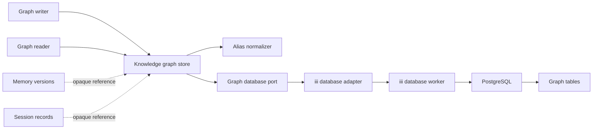
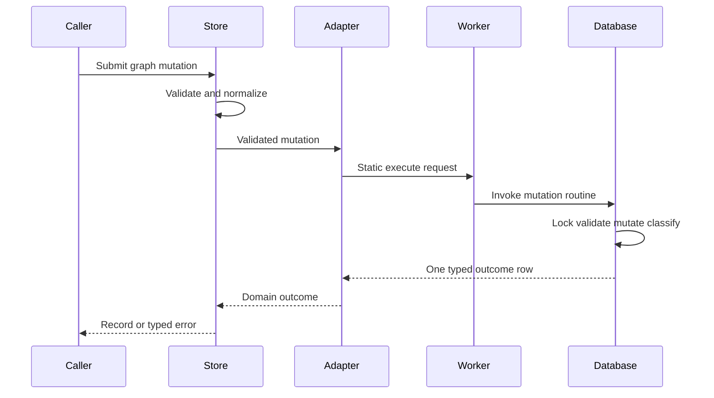
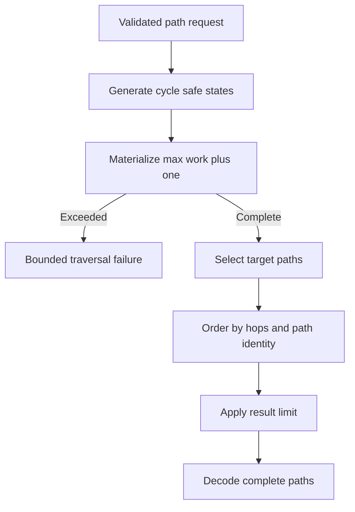
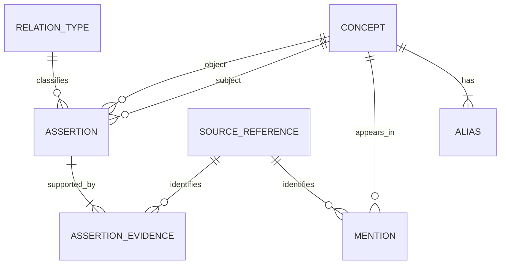

# Design: knowledge-graph-foundation

## Overview

This feature adds an in-process Rust graph-store boundary backed by the existing PostgreSQL deployment. It owns canonical concepts, aliases, typed external source references, concept mentions, evidence-backed semantic assertions, and bounded internal graph queries.

### Goals

- Preserve stable concept identity while supporting globally unambiguous aliases and revision-safe correction.
- Store semantic assertions separately from the source references supporting them.
- Provide deterministic direct lookup, neighbor, related-source, and bounded-path operations.
- Enforce graph invariants under retries and concurrent mutation without changing memory or event schemas.

### Non-Goals

- Session synthesis, graph extraction, embedding, search fusion, MCP tools, generic property graphs, ranking, tenancy, audit history, retention, or graph analytics.

## Boundary Commitments

### This Spec Owns

- Rust contracts, normalization, validation, operations, and errors for graph state.
- `graph_*` tables, fixed relation rows, integrity triggers, mutation routines, indexes, and graph-specific privileges.
- Internal graph reads and mutable operations through the iii database boundary.
- Unicode compatibility fixtures, iii protocol verification, and PostgreSQL 17/18 graph verification.

### Out of Boundary

- Existing `memories`, memory search, harness ledger, and session-embedding schemas.
- Canonical session-record creation, source existence checks, and cross-owner foreign keys.
- Automatic graph writers, extraction models, retries, checkpoints, and reprocessing.
- Network or MCP contracts, result presentation, relevance ranking, and graph/search fusion.
- PostgreSQL, iii, role, credential, TLS, extension, backup, and production timeout provisioning.

### Allowed Dependencies

- Rust 1.98.1, edition 2024, Tokio, Serde, `thiserror`, async traits, UUID with v7 support, and exact workspace dependency pins.
- ICU4X `icu_normalizer` and `icu_casemap` 2.3.0 for the versioned alias-key algorithm.
- `iii-sdk` 0.24.0 and database worker 0.5.17 for static parameterized database calls.
- PostgreSQL 17 or 18 using UTF-8 encoding and 8 KiB pages. No graph extension or dependency on memory-store production code is allowed.
- Memory `(id, version)` and future canonical session-record IDs enter only as opaque typed values.

### Revalidation Triggers

- Changing alias normalization order, ICU/Unicode data, input bounds, alias uniqueness, or preferred-alias behavior.
- Adding a relation type or changing its symmetry, assertion identity, evidence requirements, or source-reference shape.
- Changing revisions, idempotency, deletion rules, mutation outcome codes, or application-role privileges.
- Changing query direction, deterministic ordering, depth/work/result bounds, path completeness, or timeout classification.
- Adding external source foreign keys, a graph extension, graph population, MCP exposure, ranking, tenancy, history, or soft deletion.
- Changing PostgreSQL, iii SDK, database worker, or database error-envelope contracts.

## Architecture

### Existing Architecture Analysis

- `memory-store` owns immutable memory history and ranked memory search; this feature does not extend it.
- Harness persistence owns append-only receipts, not canonical session records.
- Existing domain crates validate before an async port and isolate iii request envelopes in adapters.
- Existing database verification splits protocol fakes from direct PostgreSQL 17/18 checks.
- The new crate follows those patterns while introducing graph-only mutable privileges and recursive reads.

### Architecture Pattern & Boundary Map



**Architecture Integration**

- Selected pattern: ports and adapters with one dedicated reusable domain crate.
- Dependency direction: contracts and normalization → graph service → database port → iii adapter. Migrations and verifiers are not runtime dependencies.
- Mutation routines own atomic classification; read queries remain static adapter SQL.
- Source systems provide identifiers only. The graph store neither reads nor imports source content.

### Technology Stack

| Layer | Choice / Version | Role in Feature | Notes |
|---|---|---|---|
| Domain | Rust 1.98.1, edition 2024 | Typed contracts, validation, service | Exact workspace pins |
| Unicode | ICU4X `icu_normalizer` and `icu_casemap` 2.3.0 | NFKC and full non-Turkic case folding | Persisted algorithm version |
| Integration | `iii-sdk` 0.24.0, database worker 0.5.17 | Static writes and bounded read queries | Stable `QUERY_TIMEOUT` code |
| Storage | PostgreSQL 17/18 | Relational graph integrity and recursive paths | No graph extension |
| Verification | Nix, protocol fake, direct PostgreSQL scripts | Reproducible adapter and schema checks | Git-backed flake references |

## File Structure Plan

### Directory Structure

```text
crates/knowledge-graph-store/
├── Cargo.toml                                      # Crate dependencies and test targets
├── migrations/
│   └── 0001_knowledge_graph_foundation.sql         # Tables, relation seed, routines, triggers, grants, indexes
├── src/
│   ├── lib.rs                                      # Minimal public exports
│   ├── contracts.rs                                # Inputs, outputs, bounds, revisions, enums, errors
│   ├── normalization.rs                            # Versioned alias-key transformation
│   ├── graph.rs                                    # KnowledgeGraphStore orchestration and unit tests
│   └── database.rs                                 # Database port, static SQL, iii adapter, protocol tests
└── tests/
    ├── contracts.rs                                # Field, shape, revision, relation, and bound contracts
    ├── migration.rs                                # Schema and SQL contract checks
    ├── normalization.rs                            # Unicode compatibility and algorithm-version fixtures
    └── source_mutations.sql                        # Direct PostgreSQL source and mention checks
integration/knowledge-graph-database-engine-fake/
├── Cargo.toml                                      # iii SDK protocol-fake dependencies
├── README.md                                       # Invocation and failure contract
└── src/main.rs                                     # Execute/query request and response-envelope checks
integration/knowledge-graph-postgres-smoke/
├── Cargo.toml                                      # Workspace shell target
├── README.md                                       # Role, timeout, and PG17/18 prerequisites
├── scripts/
│   ├── setup.sh                                    # Isolated owner and application role fixture
│   ├── verify-schema.sh                            # Tables, constraints, routines, grants, rollback
│   ├── verify-mutations.sh                         # Idempotency, revisions, concurrency, delete behavior
│   └── verify-traversal.sh                         # Direction, evidence, cycles, bounds, ordering, timeout
└── src/main.rs                                     # Workspace shell for Nix verifier packages
```

### Modified Files

- `Cargo.toml` — add the graph crate, two integration crates, exact ICU4X dependencies, and UUIDv7 support.
- `Cargo.lock` — record the exact dependency graph.
- `flake.nix` — include graph migration/scripts and expose PG17/18 graph verifier packages.
- `.github/workflows/ci.yml` — run graph crate tests, protocol fake, and both direct PostgreSQL matrices using Git-backed flake references.
- `crates/knowledge-graph-store/src/contracts.rs` — enforce the 2,048-byte source-key bound before port calls.
- `crates/knowledge-graph-store/migrations/0001_knowledge_graph_foundation.sql` — enforce the same external-ID byte bound in the source table.
- `crates/knowledge-graph-store/src/graph.rs` and `crates/knowledge-graph-store/src/database.rs` — prove pre-port rejection and preserve bounded keys in adapter parameters.
- `crates/knowledge-graph-store/tests/contracts.rs`, `tests/migration.rs`, and `tests/source_mutations.sql` — verify exact-boundary validation and PG17/18 persistence.

Existing memory, persistence, MCP, and protobuf files remain unchanged.

## System Flows

### Atomic Mutation



Every mutation is one database statement. Migration-owned routines lock affected aggregates, preserve all-or-none behavior, and return an outcome instead of relying on database error text.

### Bounded Path Query



One generated recursive state is one work unit. The SQL returns either an explicit exhaustion marker or complete results; the adapter never returns paths alongside an exhaustion marker.

## Requirements Traceability

| Requirement IDs | Summary | Components | Interfaces / State | Flows |
|---|---|---|---|---|
| 1.1, 1.2, 1.3, 1.4, 1.5, 1.6, 1.7, 1.8, 1.9 | Concepts and aliases | Contracts, Normalizer, Store, Schema | Concept operations, concepts, aliases | Atomic Mutation |
| 2.1, 2.2, 2.3, 2.4, 2.5, 2.6, 2.7, 2.8 | Sources and mentions | Contracts, Store, Schema | Source and mention operations | Atomic Mutation |
| 3.1, 3.2, 3.3, 3.4, 3.5, 3.6, 3.7, 3.8, 3.9 | Relation assertions | Contracts, Store, Schema | Assertion operations, relation registry | Atomic Mutation |
| 4.1, 4.2, 4.3, 4.4, 4.5, 4.6, 4.7, 4.8 | Assertion evidence | Store, Schema | Evidence operations, cap, and deferred invariant | Atomic Mutation |
| 5.1, 5.2, 5.3, 5.4, 5.5, 5.6, 5.7, 5.8 | Mutable lifecycle | Store, Adapter, Schema | Revisions, routines, foreign keys | Atomic Mutation |
| 6.1, 6.2, 6.3, 6.4, 6.5, 6.6, 6.7 | Direct lookup | Normalizer, Adapter | Lookup and resolution queries | — |
| 7.1, 7.2, 7.3, 7.4, 7.5, 7.6, 7.7, 7.8 | Neighbors and related sources | Adapter, Schema | Adjacency and source projections | — |
| 8.1, 8.2, 8.3, 8.4, 8.5, 8.6, 8.7, 8.8 | Bounded paths | Adapter, Schema | Recursive query and timeout mapping | Bounded Path Query |
| 9.1, 9.2, 9.3, 9.4, 9.5, 9.6, 9.7 | Validation and diagnostics | Contracts, Store, Adapter, Schema | Bounds, response budget, and error envelope | Both |
| 10.1, 10.2, 10.3, 10.4, 10.5, 10.6, 10.7, 10.8 | Focused verification | Crate tests, Protocol Fake, PostgreSQL Smoke | Fixtures and matrices | Both |

## Components and Interfaces

| Component | Domain / Layer | Intent | Requirement Coverage | Dependencies | Contracts |
|---|---|---|---|---|---|
| Contracts and Normalizer | Domain | Define graph values, bounds, Unicode keys, and errors | 1.1–4.8, 6.1–9.7 | ICU4X | State |
| KnowledgeGraphStore | Application | Validate requests and expose complete-or-error graph operations | 1.1–9.7 | Contracts, Database Port | Service |
| KnowledgeGraphDatabase | Port / Adapter | Invoke graph routines and queries and decode typed outcomes | 1.5–9.7 | iii database worker | Service |
| Schema Migration | Data | Enforce graph identity, evidence, revisions, privileges, and indexes | 1.1–8.8, 9.1, 9.2 | PostgreSQL 17/18 | State |
| Protocol Fake | Verification | Prove iii request, response, timeout, and privacy contracts | 5.6–10.8 | iii SDK | Batch |
| PostgreSQL Smoke | Verification | Prove schema, races, traversal, privileges, and rollback | 1.1–10.8 | PostgreSQL 17/18 | Batch |

### Domain and Application

#### Contracts and Normalizer

| Field | Detail |
|---|---|
| Intent | Represent validated graph operations and one stable alias-key algorithm |
| Requirements | 1.1–4.8, 6.1–9.7 |

**Responsibilities & Constraints**

- Concept and assertion IDs are store-generated UUIDv7 values. Alias display text is 1 through 512 UTF-8 bytes and normalized keys are 1 through 2,048 bytes. All persisted text is NUL-free.
- Memory IDs inherit the memory-store non-empty, NUL-free contract with a positive version. Memory and session-record keys are limited to 2,048 UTF-8 bytes and rejected before the database port.
- A concept has 1 through 64 aliases. Exactly one alias is preferred. Alias collections are sets ordered by normalized key in results.
- Alias key version `icu4x-2.3.0-nfkc-fold-v1` performs Unicode whitespace collapse, NFKC, a second whitespace collapse, then locale-independent full non-Turkic case folding.
- Revisions are positive `i64` values. Concept and assertion updates and deletes require the current revision.
- An assertion has at most 32 supporting source references. Creates accept 1 through 32, and additions lock the assertion before enforcing the total cap.
- Neighbor and related-source limits are 1 through 256. Path limits are 1 through 50, depth is 1 through 8, and work is 1 through 10,000 generated states.
- Every read has a 4 MiB serialized JSON response budget. SQL returns either one complete payload or a `result_too_large` marker, never a truncated payload.
- Worker query timeout is 1 through 30 seconds. Invocation timeout is greater than query timeout and at most 60 seconds; defaults are 10 and 15 seconds.
- Direction is `Outgoing`, `Incoming`, or `Either`. Path and neighbor results expose `Outgoing`, `Incoming`, or `Symmetric` orientation per edge.

**Dependencies**

- External P0: ICU4X 2.3.0 — deterministic NFKC and case folding.

**Contracts**: Service [ ] / API [ ] / Event [ ] / Batch [ ] / State [x]

```rust
pub enum SourceReferenceInput {
    MemoryVersion { memory_id: String, version: i64 },
    SessionRecord { session_record_id: String },
}

pub enum RelationType {
    RelatedTo, IsA, PartOf, DependsOn, Uses,
    Implements, Causes, Resolves, Contradicts,
}

pub enum DirectionMode { Outgoing, Incoming, Either }

pub struct DatabaseTimeouts {
    pub query: std::time::Duration,
    pub invocation: std::time::Duration,
}

pub struct PathQuery {
    pub from: ConceptId,
    pub to: ConceptId,
    pub direction: DirectionMode,
    pub max_depth: u8,
    pub max_work: u32,
    pub limit: u16,
}
```

The code block defines signatures only. Inputs become private validated types before reaching the database port.

#### KnowledgeGraphStore

| Field | Detail |
|---|---|
| Intent | Coordinate graph operations without owning transport or source-record behavior |
| Requirements | 1.1–9.7 |

**Responsibilities & Constraints**

- Validate and normalize every request before database activity.
- Generate UUIDv7 concept and assertion candidates; normalized alias-set and semantic assertion uniqueness determine the stored IDs.
- Treat concept aliases as one revisioned aggregate replacement. Mentions and evidence are identity-only associations corrected by delete/create.
- Return `Option` for absent direct reads and empty vectors for absent matches.
- Preserve complete-or-error semantics for every mutation and query.

**Dependencies**

- Inbound P1: future graph population and retrieval callers — in-process typed requests.
- Outbound P0: KnowledgeGraphDatabase — persistence and graph reads.

**Contracts**: Service [x] / API [ ] / Event [ ] / Batch [ ] / State [ ]

##### Service Interface

```rust
impl<D: KnowledgeGraphDatabase> KnowledgeGraphStore<D> {
    pub async fn create_concept(&self, input: CreateConcept) -> GraphResult<Concept>;
    pub async fn replace_concept_aliases(&self, input: ReplaceConceptAliases) -> GraphResult<Concept>;
    pub async fn delete_concept(&self, input: DeleteConcept) -> GraphResult<()>;
    pub async fn register_source(&self, input: SourceReferenceInput) -> GraphResult<SourceReference>;
    pub async fn delete_source(&self, input: DeleteSource) -> GraphResult<()>;
    pub async fn create_mention(&self, input: ConceptMentionInput) -> GraphResult<ConceptMention>;
    pub async fn delete_mention(&self, input: ConceptMentionInput) -> GraphResult<()>;
    pub async fn create_assertion(&self, input: CreateAssertion) -> GraphResult<Assertion>;
    pub async fn update_assertion(&self, input: UpdateAssertion) -> GraphResult<Assertion>;
    pub async fn delete_assertion(&self, input: DeleteAssertion) -> GraphResult<()>;
    pub async fn add_evidence(&self, input: AssertionEvidenceInput) -> GraphResult<AssertionEvidence>;
    pub async fn remove_evidence(&self, input: AssertionEvidenceInput) -> GraphResult<()>;
    pub async fn get_concept(&self, id: ConceptIdInput) -> GraphResult<Option<Concept>>;
    pub async fn resolve_alias(&self, alias: AliasQuery) -> GraphResult<Option<Concept>>;
    pub async fn get_assertion(&self, id: AssertionIdInput) -> GraphResult<Option<Assertion>>;
    pub async fn get_source(&self, source: SourceReferenceInput) -> GraphResult<Option<SourceReference>>;
    pub async fn neighbors(&self, query: NeighborQuery) -> GraphResult<Vec<NeighborResult>>;
    pub async fn related_sources(&self, query: RelatedSourceQuery) -> GraphResult<Vec<RelatedSourceResult>>;
    pub async fn find_paths(&self, query: PathQuery) -> GraphResult<Vec<GraphPath>>;
}
```

- Preconditions: All caller data passes domain validation; referenced graph records are checked transactionally by persistence.
- Postconditions: A success contains one canonical record, one confirmed deletion, or one complete deterministic result set.
- Invariants: Errors include stable enums and non-sensitive identities only.

### Integration

#### KnowledgeGraphDatabase Port and iii Adapter

| Field | Detail |
|---|---|
| Intent | Isolate static database contracts and map backend outcomes to graph types |
| Requirements | 1.5–9.7 |

**Responsibilities & Constraints**

- Writes invoke `database::execute` with one static `SELECT` of a migration-owned routine and positional parameters.
- Reads invoke `database::query` with static SQL, positional parameters, and the validated database timeout. Writes rely on the database role timeout because `database::execute` has no payload timeout.
- Mutation routines return exactly one outcome row: `created`, `existing`, `updated`, `deleted`, `conflict`, `stale`, `referenced`, `missing`, `evidence_limit`, or `would_orphan_evidence`.
- Read SQL aggregates the complete result into one JSON payload, checks `octet_length(payload::text)`, and otherwise returns only `result_too_large`. UUID and `BIGINT` values use worker-compatible text forms.
- Timeout recognition is restricted to `iii_sdk::Error::Remote { code: "invocation_failed", message, .. }` where `message` begins with the literal `handler error: `. The adapter parses only the remaining text as the database worker JSON envelope and maps only inner code `QUERY_TIMEOUT` to `TraversalBoundExceeded`; missing prefixes, malformed JSON, or different codes become operation-only database failures.
- The database logical target uses a role whose `statement_timeout` is greater than query timeout and less than invocation timeout. Query payload timeout supplies the stable `QUERY_TIMEOUT` outcome; the role timeout is the database cleanup and write bound.

**Dependencies**

- Inbound P0: KnowledgeGraphStore — validated operations.
- External P0: iii database worker 0.5.17 — query/execute envelopes.
- External P0: configured PostgreSQL primary — graph state and traversal.

**Contracts**: Service [x] / API [ ] / Event [ ] / Batch [ ] / State [ ]

##### Service Interface

```rust
#[async_trait::async_trait]
pub trait KnowledgeGraphDatabase: Send + Sync {
    async fn create_concept(&self, input: &ValidatedCreateConcept) -> DatabaseResult<Concept>;
    async fn replace_concept_aliases(&self, input: &ValidatedReplaceConceptAliases) -> DatabaseResult<Concept>;
    async fn delete_concept(&self, input: &ValidatedDeleteConcept) -> DatabaseResult<()>;
    async fn register_source(&self, input: &ValidatedSourceReference) -> DatabaseResult<SourceReference>;
    async fn delete_source(&self, input: &ValidatedDeleteSource) -> DatabaseResult<()>;
    async fn create_mention(&self, input: &ValidatedConceptMention) -> DatabaseResult<ConceptMention>;
    async fn delete_mention(&self, input: &ValidatedConceptMention) -> DatabaseResult<()>;
    async fn create_assertion(&self, input: &ValidatedCreateAssertion) -> DatabaseResult<Assertion>;
    async fn update_assertion(&self, input: &ValidatedUpdateAssertion) -> DatabaseResult<Assertion>;
    async fn delete_assertion(&self, input: &ValidatedDeleteAssertion) -> DatabaseResult<()>;
    async fn add_evidence(&self, input: &ValidatedAssertionEvidence) -> DatabaseResult<AssertionEvidence>;
    async fn remove_evidence(&self, input: &ValidatedAssertionEvidence) -> DatabaseResult<()>;
    async fn get_concept(&self, id: &ConceptId) -> DatabaseResult<Option<Concept>>;
    async fn resolve_alias(&self, key: &AliasKey) -> DatabaseResult<Option<Concept>>;
    async fn get_assertion(&self, id: AssertionId) -> DatabaseResult<Option<Assertion>>;
    async fn get_source(&self, source: &ValidatedSourceReference) -> DatabaseResult<Option<SourceReference>>;
    async fn neighbors(&self, query: &ValidatedNeighborQuery) -> DatabaseResult<Vec<NeighborResult>>;
    async fn related_sources(&self, query: &ValidatedRelatedSourceQuery) -> DatabaseResult<Vec<RelatedSourceResult>>;
    async fn find_paths(&self, query: &ValidatedPathQuery) -> DatabaseResult<Vec<GraphPath>>;
}

impl IiiKnowledgeGraphDatabase {
    pub fn new(
        client: iii_sdk::IIIClient,
        database: DatabaseTarget,
        timeouts: DatabaseTimeouts,
    ) -> Result<Self, GraphConfigurationError>;
}
```

The trait method list mirrors the service surface and uses validated request types. No generic SQL or dynamic function identifier is exposed.

### Data

#### Schema Migration

| Field | Detail |
|---|---|
| Intent | Make graph identity, evidence, revisions, and lifecycle rules authoritative |
| Requirements | 1.1–8.8, 9.1, 9.2 |

**Responsibilities & Constraints**

- Seed the nine relation rows and deny application-role relation-vocabulary mutation.
- Require non-empty source keys of at most 2,048 UTF-8 bytes, matching Rust validation and the source identity index bound.
- Mutation routines are `SECURITY DEFINER`, fully schema-qualified, fixed to `pg_catalog, pg_temp`, unavailable to `PUBLIC`, and executable only by `knowledge_graph_application`.
- The application role receives table `SELECT` and mutation-routine `EXECUTE`, but no direct table `INSERT`, `UPDATE`, or `DELETE`.
- Deferred constraint triggers require one preferred alias per surviving concept and one evidence row per surviving assertion at transaction end.
- Routines acquire all aggregate and uniqueness locks through one canonical protocol before row locks, compare revisions, classify conflicts, and make multi-row changes atomically.
- Symmetric assertions store endpoints in ascending native UUID order. Directed assertions preserve subject and object.

**Dependencies**

- External P0: PostgreSQL 17/18 with UTF-8 database encoding — constraints, functions, locks, recursive queries.
- External P0: precreated owner and `knowledge_graph_application` roles with a database-side statement timeout.

**Contracts**: Service [ ] / API [ ] / Event [ ] / Batch [ ] / State [x]

##### State Management

- Concept and assertion revision starts at one and increments only for aggregate updates.
- Assertion endpoint or relation updates retain the complete evidence set.
- Concept creates compare the exact normalized alias-key set and preferred key. A match returns existing state and preserves stored display text; any overlapping non-matching set returns conflict.
- Assertion create inserts missing evidence for the canonical semantic assertion and returns its stable ID.
- Source references, mentions, and evidence have immutable identity and no revisioned fields.
- Hard deletes retain no graph history.

##### Concurrency and Lock Ordering

- Each mutation derives domain-prefixed lock keys for every aggregate ID and every old and new uniqueness key it can affect: UUIDv7 concept IDs, normalized aliases, source identities, UUIDv7 assertion IDs, and canonical semantic triples.
- Every lock key is canonical JSON text containing a domain discriminator and length-safe scalar fields. `hashtextextended(key, 0)` converts it to an advisory `BIGINT`; routines deduplicate and numerically sort those integers, then acquire transaction-scoped advisory locks in that order before any row lock. Hash collisions serialize unrelated work without changing acquisition order or correctness.
- Updates first read an optimistic snapshot to discover old keys, acquire the full advisory set, then lock the target row and compare revision plus old keys. Snapshot drift returns conflict immediately; routines never discover or acquire additional locks after the ordered acquisition phase.
- Existing rows are locked in fixed table order—concepts, assertions, then source references—and ascending native primary-key order within each table. Missing-key creates are protected by their advisory uniqueness key.
- Evidence additions lock the assertion before counting evidence, so concurrent additions cannot exceed 32. Assertion deletion and evidence removal use the same assertion lock.
- Direct PostgreSQL tests cover cross-concept alias swaps, cross-assertion semantic swaps, overlapping creates, source/delete races, and evidence-cap races.

## Data Models

### Domain Model



- `Concept` and `Assertion` are revisioned aggregates.
- `Alias`, `ConceptMention`, and `AssertionEvidence` are child or association records.
- `SourceReference` identifies but does not own an external record.
- Relation type is migration-fixed reference data, not application-managed graph content.

### Relation Semantics

| Relation | Direction | Meaning |
|---|---|---|
| `related_to` | Symmetric | The concepts have an explicit general association not captured by a narrower relation. |
| `is_a` | Subject → object | The subject is a subtype or member of the broader object concept. |
| `part_of` | Subject → object | The subject is a constituent of the object. |
| `depends_on` | Subject → object | The subject requires the object to function or remain valid. |
| `uses` | Subject → object | The subject directly employs the object. |
| `implements` | Subject → object | The subject realizes the contract, design, or abstraction represented by the object. |
| `causes` | Subject → object | The subject produces the object as an effect. |
| `resolves` | Subject → object | The subject remedies the problem represented by the object. |
| `contradicts` | Symmetric | The concepts express mutually incompatible claims. |

### Physical Data Model

| Table | Identity | Material columns | Integrity and indexes |
|---|---|---|---|
| `graph_relation_types` | `code TEXT` | `is_symmetric BOOLEAN` | Nine seeded rows; no app DML |
| `graph_concepts` | `id UUID` | `revision BIGINT` | Positive revision; UUIDv7 shape check |
| `graph_aliases` | `alias_key TEXT COLLATE "C"` | UUID concept ID, display text, preferred flag, normalization version | Concept FK cascade; one preferred partial unique index |
| `graph_source_references` | internal `BIGINT` identity | kind, external ID (1–2,048 UTF-8 bytes), nullable external version | `UNIQUE NULLS NOT DISTINCT`; source-key byte-length and shape checks |
| `graph_concept_mentions` | UUID concept ID and source-ref ID | none | Both FKs restrict; reverse source index |
| `graph_assertions` | UUIDv7 `id` | UUID subject, relation, UUID object, revision | FKs restrict; unique semantic triple; self-edge check; subject/object indexes |
| `graph_assertion_evidence` | assertion ID and source-ref ID | none | Assertion FK cascade; source FK restrict; reverse source index |

External textual identities and ordering columns use bytewise `C` collation; concept and assertion ordering uses native UUID order. Source keys are non-empty, NUL-free, and at most 2,048 UTF-8 bytes so the composite identity entry fits the supported PostgreSQL B-tree limit. Graph tables do not contain timestamps, source payloads, excerpts, confidence, arbitrary properties, embeddings, or foreign keys to source-owner tables.

### Query Contracts

- Concept aliases return preferred first, then normalized key. Direct assertion evidence orders by source kind, external ID, and version.
- Neighbor order is relation code, orientation, neighbor ID, then assertion ID. `Either` emits one row per assertion.
- Related sources deduplicate by typed source identity and link role; `mention` sorts before `assertion_evidence`, then source identity.
- Path expansion tracks concept IDs and assertion IDs. A concept cannot repeat within a path.
- Path order is hop count, assertion-ID sequence, then concept-ID sequence. Evidence for each edge follows source order.
- The recursive state CTE is consumed through a materialized `max_work + 1` fence before path sorting. The sentinel yields only `work_exhausted`.
- Every read packages ordered rows into one JSON payload. A payload above 4 MiB yields only `result_too_large`, which maps to `ResultBoundExceeded`.

## Error Handling

| Category | Cases | Domain response |
|---|---|---|
| Validation | Empty/NUL/oversized labels, aliases, source keys, invalid alias set/source shape/relation/revision/limit | `InvalidInput { operation, field, reason }` |
| Missing | Referenced graph endpoint absent | `NotFound { operation, record_kind, identity }` |
| Conflict | Alias ownership/set mismatch, semantic duplicate, stale revision, snapshot drift | `Conflict { operation, field, reason, record_kind, identity, current_revision }` |
| Referenced | Concept or source cannot be deleted | `Referenced { record_kind, identity }` |
| Evidence invariant | Last evidence removal | `WouldOrphanAssertion { assertion_id, revision }` |
| Evidence limit | Addition would exceed 32 sources | `LimitExceeded { operation, resource }` |
| Traversal bound | Work sentinel or stable database `QUERY_TIMEOUT` | `TraversalBoundExceeded { bound }` |
| Result bound | Complete JSON payload exceeds 4 MiB | `ResultBoundExceeded { operation }` |
| Database/decode | Invocation, malformed row, unknown outcome, unsupported value | Operation-only database or response error |

Conflict `field` is one of `AliasSet`, `Revision`, `SemanticAssertion`, or `Snapshot`; `reason` is one of `AliasOwned`, `AliasSetMismatch`, `StaleRevision`, `DuplicateSemanticAssertion`, or `SnapshotDrift`. Error identity is populated only with concept or assertion IDs. Source-reference failures omit external identity. No error or log contains labels, alias text or keys, source keys, path contents, SQL, parameters, credentials, returned rows, or dependency messages. A failed operation returns no partial success.

## Testing Strategy

### Unit and Service Tests

- Verify every text/count/revision/query bound, including exact 2,048-byte acceptance and 2,049-byte rejection for both source-key variants, before the recording port is called.
- Pin multilingual whitespace, NFKC, compatibility-character, case-fold expansion, and normalization-version fixtures.
- Prove identical creates, stale mutations, alias replacement, symmetric canonicalization, assertion evidence changes and limits, and all delete outcomes through recording/failing ports.
- Verify direct, neighbor, related-source, and path result decoding is complete, ordered, and content-safe.

### iii Protocol Verification

- Run the adapter against `knowledge-graph-database-engine-fake` and verify every static function ID, database target, SQL class, parameter position, timeout, and response envelope.
- Cover every mutation outcome, query result shape, `result_too_large`, malformed JSON, unexpected row counts, and the exact `invocation_failed` message `handler error: {"code":"QUERY_TIMEOUT",...}`. Cover missing-prefix and near-miss envelopes, generic dependency failures, and protected sentinel values.
- Require no retries and no successful response before the emulated database response.

### PostgreSQL 17/18 Verification

- Apply and roll back the migration with isolated owner/application roles; verify routine ownership, fixed search paths, grants, relation seeds, constraints, and direct-DML denial.
- Verify UTF-8 encoding and 8 KiB pages, then prove 2,048-byte memory and session source keys succeed, 2,049-byte keys fail the schema check, and the composite source identity index accepts both variants with incompressible values.
- Race concept aliases, semantic assertions, revision updates, evidence additions/removals, and restricted deletes; include cross-aggregate swaps and absent-key races and reject deadlock or untyped failures.
- Verify both source shapes, opaque missing external records, mention/evidence identity, cascades, restrictions, and hard-delete absence.
- Verify all relation directions, symmetric reversal, neighbor modes, related-source roles, bytewise ordering, limits, and empty results.
- Verify cyclic and branching path fixtures, shortest deterministic ordering, exact work-unit exhaustion, depth/result bounds, the 4 MiB result marker, timeout rollback, and complete-or-error responses.

### Workspace and CI

- Run workspace tests, formatting, warning-free Clippy, dependency policy, both PG matrices, and the protocol fake.
- Build Nix verifier inputs from explicit source filesets and invoke them through Git-backed flake references.

## Security Considerations

- The graph application role cannot change relation vocabulary or mutate tables directly.
- Mutation routines run under a non-login owner with fixed trusted search paths and explicit grants.
- Static SQL and positional parameters prevent graph values from changing statement structure.
- Typed external references avoid exposing source content while preserving traceability.
- Alias, result, depth, work, and timeout bounds limit memory, response, and traversal abuse.
- The database worker must use statement capture or disable row-change publishing for this database target; native row capture is unsupported because it can expose graph primary keys.
- Production connections use TLS hostname verification under the project baseline.

## Performance and Scalability

- Subject and object adjacency indexes serve directed neighbor expansion; reverse source indexes serve related-source queries and deletion checks.
- Direct and neighbor reads apply deterministic limits and a 4 MiB complete-payload check before iii materializes one result row.
- Path traversal is intentionally bounded to eight hops, 10,000 generated states, 50 returned paths, 32 evidence sources per assertion, and a maximum 30-second query timeout.
- No latency or graph-size claim is made. Measure generated states, result rows, timeouts, and index scans before changing bounds or adding closure tables.
- Closure tables, materialized transitive edges, graph extensions, approximate search, and unrestricted algorithms require revalidation.

## Migration Strategy

- Precreate a UTF-8 database with 8 KiB pages, a non-login migration owner, and `knowledge_graph_application`; configure the application role's `statement_timeout` between the worker query and invocation timeouts and configure statement capture or disable row-change publishing before applying the migration. Verification fixtures use 10-second query, 12-second statement, and 15-second invocation bounds.
- Apply `0001_knowledge_graph_foundation.sql` after PostgreSQL version and role checks. No extension or source-table migration is required.
- Run schema, mutation, traversal, and protocol verifiers before enabling callers.
- Before accepted graph writes, migration failure may be rolled back. After writes, disable callers and use a forward repair rather than dropping graph state.
- An ICU or alias-algorithm upgrade requires a new migration, full alias re-key collision audit, and caller compatibility revalidation.
