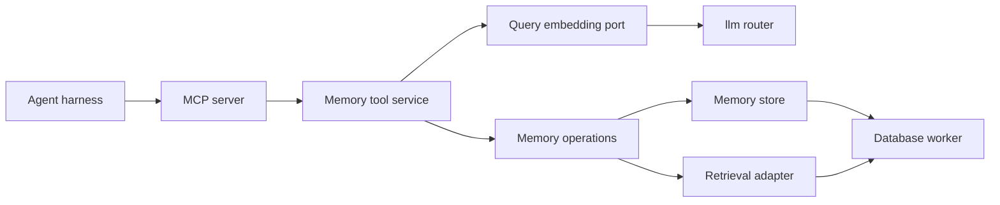
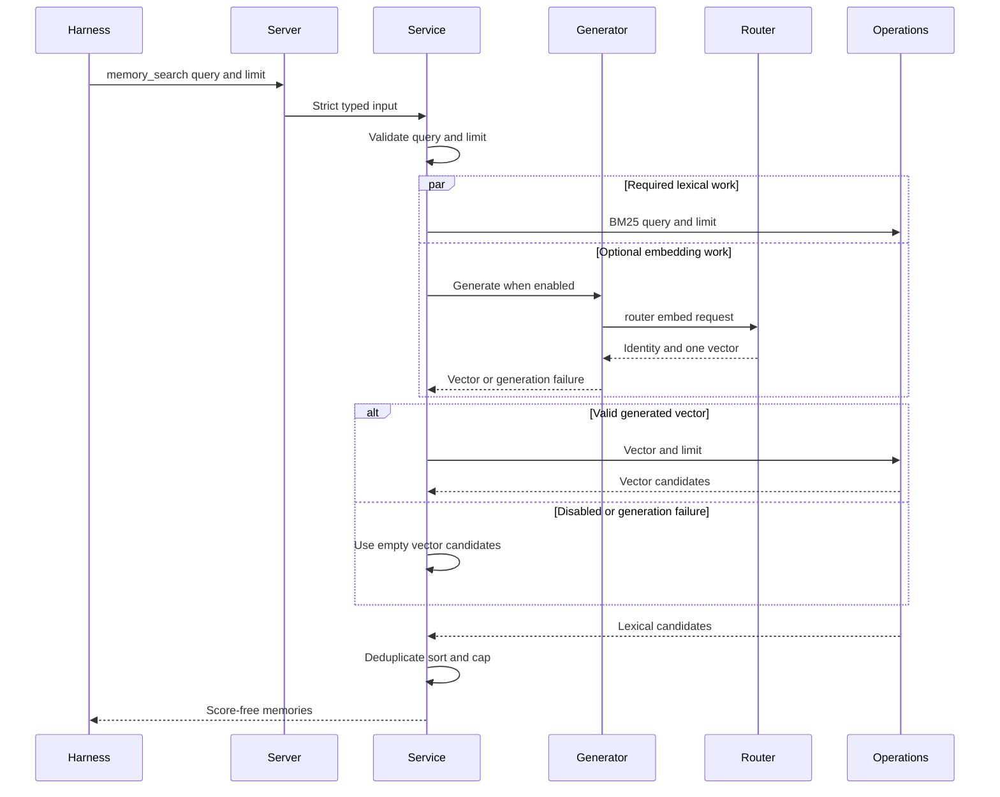

# Design Document: mcp-worker

## Overview

The MCP worker remains the local stdio adapter for memory creation and retrieval.
`memory_search` always runs BM25 and optionally enriches the candidate set with a
generated query vector. Missing configuration or generation failure degrades to
lexical-only results without changing the result contract.

Implementation tasks for this revision cover the amendment delta only. Existing
save, retrieval, merge, protocol, and runtime behavior is regression scope, not
reimplementation scope.

### Goals

- Accept `query` and `limit` as the complete combined-search input.
- Generate and validate one query embedding when configured.
- Return lexical-only results when query embedding is disabled or generation
  fails.
- Preserve bounded execution, deterministic score-free merging, and safe errors.

### Non-Goals

- Stored-memory embedding generation or persistence, query caching, or retries.
- Hybrid relevance scoring, ranking changes, memory schema changes, or search SQL
  changes.
- A shared router crate or a new endpoint on `memory-embedding-worker`.

## Boundary Commitments

### This Spec Owns

- The five stateless MCP tool contracts, including query-only `memory_search`.
- Query validation, optional routed query embedding, lexical fallback, response
  validation, and generated-vector privacy.
- Deterministic projection of lexical candidates and union with exact-vector
  candidates when available.
- Worker configuration, bounded stdio processing, exact/latest retrieval,
  version listing, and process-level verification.

### Out of Boundary

- `memory-schema-search` retains canonical memory validation, immutable storage,
  BM25 ranking, exact vector ranking, and stored embeddings.
- `memory-embedding-worker` retains asynchronous stored-memory embedding work.
- The worker does not prove provider/model provenance for stored vectors, create
  infrastructure, add network MCP transports, or change result ranking.
- The worker does not retry generation or hide BM25 or vector-search failures.

### Allowed Dependencies

- `memory-store` public contracts and existing create/search operations.
- `router::embed` through `iii-sdk` 0.24.0 using the process's managed iii client
  and namespace.
- `rust-mcp-schema` 2.0.0 public wire/result types; no SDK runtime shim.
- Existing Tokio, Serde, Chrono, UUID, async-trait, and thiserror pins.
- Read-only access to `memories` and `memory_search_heads`; no embedding-table
  reads or writes.

### Revalidation Triggers

- A `router::embed` request, response, namespace, provider/model, or timeout
  contract change.
- A canonical vector-validation or memory-search contract change.
- Any MCP tool schema, protocol version, result cap, or merge-order change.
- Stored embedding provenance or model-migration support that replaces the
  deployment-level semantic-space assumption.
- Changes to stdio bounds, active request admission, or iii client composition.

## Architecture

### Existing Architecture Analysis

- The implemented worker already owns strict schemas, application services over
  ports, memory-store delegation, retrieval SQL, bounded stdio, and protocol
  fakes.
- Current search accepts a caller vector and launches both searches concurrently.
- The shared iii client and canonical `EmbeddingVector` contract are reusable.
- The new external effect fits one worker-local adapter; no cross-package
  abstraction or persistence change is justified.

### Architecture Pattern and Boundary Map

The design extends the existing ports-and-adapters pattern with one focused
`QueryEmbeddingGenerator` port. Dependency direction is `contracts and config →
ports → service → adapters → server and runtime`.



Key decisions:

- Add a worker-local router adapter rather than a shared crate or another worker
  hop.
- Return a validated `EmbeddingVector` from the generator port so invalid router
  output cannot reach vector search.
- Use the existing whole-request permit to bound concurrent router calls; a
  finite router timeout bounds permit occupancy.
- Resolve `router::embed` in the worker's effective `III_NAMESPACE`. Deployment
  must make the router function routable there.
- Represent query embedding as disabled or enabled configuration. Disabled mode
  constructs no router adapter; enabled router connectivity remains a request-time
  dependency rather than a startup-readiness claim.

### Technology Stack

| Layer | Choice / Version | Role | Change |
| --- | --- | --- | --- |
| MCP | `rust-mcp-schema` 2.0.0 | Tool wire contracts | Search schema loses `vector` |
| Runtime | Tokio 1.48.0 | Async calls and admission | Existing runtime reused |
| Integration | `iii-sdk` 0.24.0, llm-router 1.4.27 | `router::embed` and database calls | New router adapter |
| Domain | `memory-store` | Vector validation and searches | Existing contracts reused |
| Serialization | Serde 1.0.228 | Strict router and tool DTOs | New router envelopes |

No new dependency or database migration is introduced.

## File Structure Plan

### Directory Structure

```text
workers/mcp-worker/
├── README.md                       # Incidental launch-contract synchronization
├── src/
│   ├── lib.rs                      # Export query embedding boundary
│   ├── config.rs                   # Optional embedding mode and timeout settings
│   ├── contracts.rs                # Query-only memory_search schema
│   ├── embedding.rs                # Generator port and iii router adapter
│   ├── service.rs                  # Mandatory BM25 and optional semantic branch
│   ├── server.rs                   # Updated service composition types
│   ├── runtime.rs                  # Propagate generator type through dispatch
│   └── main.rs                     # Production router adapter composition
├── tests/
│   ├── config.rs                   # Required identity and timeout validation
│   ├── contracts.rs                # Search schema and caller-vector rejection
│   ├── service.rs                  # Generator-aware public service behavior
│   ├── server.rs                   # Query-only dispatch and error privacy
│   ├── runtime.rs                  # Updated service fixtures
│   ├── runtime_server.rs           # Generator-aware runtime integration
│   └── lifecycle.rs                # Valid production configuration fixtures
integration/mcp-worker-fake/
├── README.md                       # Router-backed search scenarios
└── src/main.rs                     # Fake router plus existing database engine
```

`operations.rs` and `backend.rs` retain their current ownership and behavior.
`MemoryToolService`, `McpServer`, and `run_mcp_server` propagate the generator as
a third static generic parameter; no trait-object or type-erasure layer is added.
Existing merge, retrieval, version-list, save, and bounded-runtime tests remain in
place with generator-aware fixtures.

## System Flows

### Search with Lexical Fallback



Invalid input stops before external work. BM25 and enabled generation start
concurrently. Disabled configuration or any generation failure skips vector search
and returns lexical candidates through the existing score-free ID-sorted merge.
BM25 failure or a vector-search failure after valid generation remains a tool
error with no partial result. No layer retries.

## Requirements Traceability

| Requirements | Summary | Components | Contracts and flows |
| --- | --- | --- | --- |
| 1.1, 1.2, 1.3, 1.4, 1.5, 1.6, 1.7, 1.8 | Local stateless MCP availability | Config, Server, Runtime | Discovery, strict dispatch, bounded stdio |
| 2.1, 2.2, 2.3, 2.4, 2.5, 2.6, 2.7, 2.8 | Create one canonical version | Service, Memory Operations | `memory_save` |
| 3.1, 3.2, 3.3, 3.4 | Run BM25 and optionally generate one valid query vector | Config, Generator, Service | Search with Lexical Fallback |
| 3.5, 3.6, 3.7, 3.8, 3.9 | Merge or project successful candidate sets | Service, Memory Operations | Search with Lexical Fallback |
| 3.10, 3.11, 3.12, 3.13 | Reject invalid input and select lexical fallback | Config, Generator, Service | Search with Lexical Fallback |
| 3.14, 3.15 | Keep memory-search failures all-or-error | Service, Memory Operations | Search with Lexical Fallback |
| 3.16, 3.17, 3.18 | Exclude caller vectors and relevance ranking | Contracts, Service | `memory_search` schema and result |
| 4.1, 4.2, 4.3, 4.4, 4.5, 4.6, 4.7, 4.8 | Paginated version history | Service, Retrieval Adapter | `memory_list_versions` |
| 5.1, 5.2, 5.3, 5.4, 5.5, 5.6 | Exact and latest retrieval | Service, Retrieval Adapter | Retrieval tools |
| 6.1, 6.2, 6.3, 6.4, 6.5, 6.6 | Strict contracts and safe failures | Contracts, Generator, Server, Runtime | Schemas and error mapping |
| 7.1, 7.2, 7.3, 7.4, 7.5, 7.6 | Bounded protocol processing | Config, Runtime | Reader, queue, active pool |
| 8.1, 8.2, 8.3, 8.4, 8.5, 8.6, 8.7 | Focused automated verification | Crate tests, Protocol Fake | Recording ports and process smoke |

## Components and Interfaces

| Component | Layer | Intent | Requirements | Dependencies | Contracts |
| --- | --- | --- | --- | --- | --- |
| Config | Boundary | Select disabled or enabled embedding mode | 1.1, 1.6, 3.2, 3.11–3.12, 7.5–7.6 | Environment P0 | State |
| Contracts | Boundary | Define five strict MCP tools | 1.3–1.5, 3.1, 3.10, 3.16, 6.1–6.3 | Serde, MCP schema P0 | API |
| Query Embedding Generator | Integration | Produce one optional validated query vector | 3.2–3.4, 3.13, 6.4–6.5 | iii, llm-router, memory-store P1 | Service |
| Memory Tool Service | Application | Orchestrate generation, searches, and tools | 2.1–5.6, 6.4–6.5 | Generator, Memory Operations P0 | Service |
| Memory Operations | Integration | Preserve memory persistence and retrieval | 2.5, 3.1, 3.4–3.9, 3.14–3.15, 4.1–5.6 | memory-store, database P0 | Service |
| MCP Server and Runtime | Protocol | Dispatch tools under finite bounds | 1.1–1.8, 6.1–7.6 | Service P0 | API, State |
| Protocol Fake | Verification | Prove router and database process flow | 8.1–8.7 | Release worker P0 | Batch |

### Runtime Configuration

| Setting | Required | Default | Validation |
| --- | --- | --- | --- |
| `TOTAL_RECALL_MEMORY_DATABASE` | Yes | None | Existing non-blank database target |
| `TOTAL_RECALL_EMBEDDING_PROVIDER` | No | Disabled | Non-blank only when model is also non-blank |
| `TOTAL_RECALL_EMBEDDING_MODEL` | No | Disabled | Non-blank only when provider is also non-blank |
| `TOTAL_RECALL_MCP_EMBEDDING_TIMEOUT_MS` | No | `21000` | Validate `1..=30000` when embedding is enabled |
| `TOTAL_RECALL_MCP_MAX_LINE_BYTES` | No | `4194304` | Existing positive `usize` |
| `TOTAL_RECALL_MCP_CHANNEL_CAPACITY` | No | `32` | Existing positive `usize` |
| `TOTAL_RECALL_MCP_MAX_IN_FLIGHT` | No | `16` | Existing positive `usize` |

Configuration produces `Disabled` when both provider and model are absent, empty,
or whitespace-only and `Enabled` when both are non-blank. Exactly one non-blank
value is invalid. `III_URL`, `III_WORKER_NAME`, and `III_NAMESPACE` retain current
managed-client semantics. Provider and model identifiers receive redacted `Debug`
behavior and never enter startup diagnostics. Configuration completes before
stdio ownership.

### Contracts

#### Tool Registry Delta

| Tool | Input | Structured success | Errors |
| --- | --- | --- | --- |
| `memory_search` | `query`, `limit` | `{ results }` | `invalid_input`, `backend_failure`, `internal_failure` |

The search input uses `deny_unknown_fields` and `additionalProperties: false`.
Supplying `vector` is therefore invalid. Result DTOs remain unchanged and contain
neither generated nor stored embeddings or relevance scores.

#### Query Embedding Generator

```rust
#[async_trait::async_trait]
pub trait QueryEmbeddingGenerator: Send + Sync {
    async fn generate(&self, query: &str) -> Result<EmbeddingVector, QueryEmbeddingError>;
}
```

`QueryEmbeddingError` distinguishes `Unavailable` from `InvalidResponse` without
carrying query text, vectors, credentials, provider responses, or dependency
messages. Both variants select lexical fallback inside search; they are retained
as separate types for tests and future observability without entering tool errors.

The production adapter sends:

```json
{
  "input": ["<exact query>"],
  "provider": "<configured provider>",
  "model": "<configured model>"
}
```

The llm-router 1.4.27 response contract is:

```json
{
  "provider": "<resolved provider>",
  "model": "<resolved model>",
  "embeddings": [[0.1, 0.2]]
}
```

The adapter requires exact provider/model identity and exactly one embeddings
entry. It decodes components as float32, widens with `f64::from`, and constructs
`EmbeddingVector`. Accepted components are therefore `float4`-exact by
construction; raw JSON decimal precision is not a separate rejection class.

The adapter sets `TriggerRequest.timeout_ms` from
`TOTAL_RECALL_MCP_EMBEDDING_TIMEOUT_MS` and gives timeout ownership solely to
`IIIClient::trigger`. The SDK consumes this bound locally before wire
serialization and removes the pending invocation when it expires. Timeout maps
to `Unavailable`; no outer timer may cancel the SDK future before cleanup. The
adapter makes one attempt and never logs the request or response.

#### Memory Tool Service

```rust
impl<O, C, G> MemoryToolService<O, C, G>
where
    O: MemoryOperations,
    C: CreateContext,
    G: QueryEmbeddingGenerator,
{
    pub async fn search(&self, input: MemorySearchInput)
        -> Result<MemoryResults, ToolError>;
}
```

The service stores the generator as `Option<G>`. Search rejects empty or
NUL-containing queries and preserves every other query byte, including
whitespace-only input. It starts BM25 and enabled generation concurrently. A
missing generator or generation error supplies an empty vector candidate set; a
validated vector triggers exact vector search. Merge behavior remains greatest
version per ID, ascending ID order, final limit, and score-free output.

## Error Handling

| Source | Tool result | Backend activity |
| --- | --- | --- |
| Empty or NUL query, bad limit, caller vector | `invalid_input` | No router or search call |
| Embedding disabled | Successful lexical result | One BM25 call, no router or vector call |
| Router unavailable, timeout, or invalid response | Successful lexical result | One BM25 call, no vector call |
| BM25 failure | Existing classified error | No vector result returned |
| Vector failure after valid generation | Existing classified error | No BM25 result returned |

Logs and errors exclude query text, generated vectors, router responses,
provider/model identifiers, credentials, memory content, and backend statements.
Successful responses expose only existing canonical memory projections.

## Data Models

No persisted model changes. `EmbeddingVector` is the validated in-process handoff
between the generator and vector search. Provider/model alignment remains a
deployment invariant because stored vectors have no model provenance.

## Security and Resource Controls

- Strict search schemas reject legacy caller vectors rather than ignoring them.
- The existing active-request permit covers BM25, optional generation and vector
  search, response serialization, and output flush.
- The router timeout prevents one generation call from holding a permit
  indefinitely; cancellation produces no late result path.
- Raw router envelopes, queries, and vectors never enter diagnostics.
- The 4 MiB frame bound and 50-result cap remain unchanged.

## Testing Strategy

### Unit and Contract Tests

- Snapshot `memory_search` with only `query` and `limit`; reject `vector` and
  unknown fields without generator or memory calls.
- Verify empty and NUL queries and invalid limits stop before external effects.
- Verify disabled configuration runs BM25 only and enabled configuration starts
  BM25 and generation concurrently.
- Record exact query generation and vector search with the generated vector and
  requested limit.
- Cover provider/model mismatch, zero or multiple vectors, empty, oversized,
  non-finite, and zero-norm vectors, with lexical fallback for
  every generation-failure class.
- Keep BM25 and post-generation vector failures as tool errors without partial
  results.
- Preserve existing merge, retrieval, save, version-list, and privacy coverage.

### Adapter and Configuration Tests

- Assert exact `router::embed` request shape, configured identity, managed
  namespace behavior, SDK timeout cleanup, permit release, no retry, and float32
  widening.
- Keep exhaustive router response and vector validation in adapter tests; service
  tests cover generic disabled/error fallback, and the protocol fake covers only
  representative cross-process cases.
- Map remote failure/timeout separately from malformed responses without protected
  data in `Display` or `Debug`.
- Cover fully absent/blank, partially configured, and enabled provider/model
  states plus enabled timeout boundaries.

### Process Smoke

- Extend the fake iii engine to answer one router call before the two existing
  database searches and verify the generated vector reaches vector search.
- Prove disabled embedding and representative remote and invalid-response failures
  produce one BM25 search, no vector search, and content-safe lexical results;
  exhaustive generation-failure coverage remains in adapter tests.
- Prove legacy caller-vector input causes zero router or database calls and BM25
  or vector-search failure returns no partial result.
- Keep existing discovery, save, retrieval, version listing, oversized input,
  backpressure, EOF, signal, and stdout/stderr scenarios.

## Integration and Rollout

- This is an intentional breaking change to `memory_search`; callers must refresh
  tool discovery and stop sending `vector`.
- Deployments may omit provider and model for lexical-only operation. Enabled
  deployments place `llm-router` in the worker's effective namespace and use the
  provider/model configured for stored-memory embedding generation.
- Router availability is evaluated on each search call and degrades to lexical
  results; valid startup does not assert router or provider reachability.
- Rollout requires no migration. Rollback restores the previous schema and
  caller-supplied-vector behavior.
- Acceptance runs the focused worker tests, release build, protocol fake, locked
  workspace tests, formatting, Clippy, Nix checks, and dependency policy gates.
