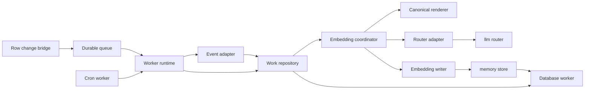
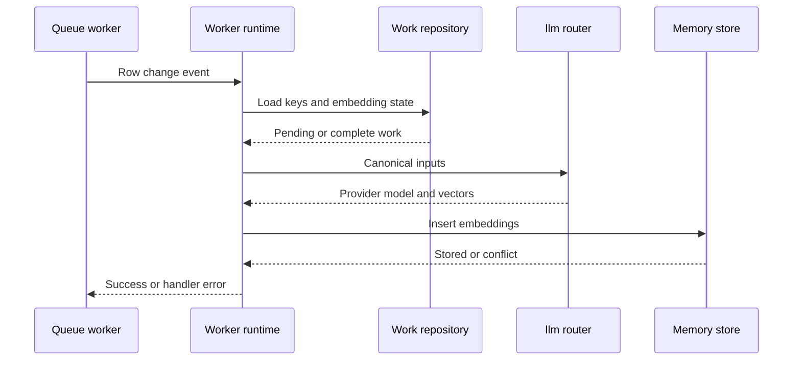
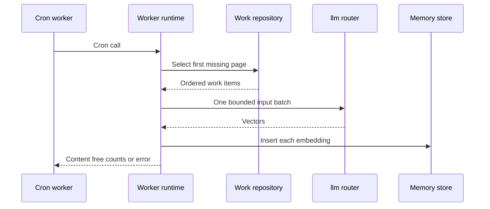

# Design Document

## Overview

The memory embedding worker turns queued memory-insert keys and scheduled
missing-embedding scans into immutable vectors through `router::embed`. It adds
one independently deployable Rust worker without changing canonical memory or
embedding schemas.

### Goals

- Generate one embedding for each selected immutable memory version.
- Repair row-change delivery loss through bounded cron reconciliation.
- Keep queue and reconciliation paths on one rendering, routing, and persistence
  contract.
- Preserve bounded execution, idempotency, and content-safe diagnostics.

### Non-Goals

- Publish database row changes or provision iii workers and PostgreSQL.
- Generate query vectors or change MCP search behavior.
- Replace, version, or migrate existing embeddings.
- Persist reconciliation attempts or guarantee starvation freedom.
- Extract memories, summarize sessions, or add vector indexes.

## Boundary Commitments

### This Spec Owns

- `memory::embed_versions` and `memory::reconcile_embeddings` function
  contracts.
- Durable-subscriber and cron-trigger registration and readiness verification.
- Row-change adaptation, exact memory loading, missing-work selection, canonical
  input rendering, routed generation, and duplicate-safe embedding insertion.
- Worker configuration, resource bounds, lifecycle, diagnostics, protocol fakes,
  PostgreSQL query verification, Nix output, and CI gates.

### Out of Boundary

- The `database::row-changed` to `iii::durable::publish` bridge and its
  deployment.
- Changes to `memory-store` public operations or memory-owned migrations.
- Provider/model provenance, re-embedding, retry state, claims, cursors, or
  terminal failure records.
- Query embedding generation and model-space coordination with MCP clients.
- Queue, cron, database, llm-router, provider, or PostgreSQL provisioning.

### Allowed Dependencies

- `memory-store` contracts and `MemoryStore::insert_embedding` for the canonical
  write; no direct embedding-table mutation.
- `iii-sdk` 0.24.0 for functions, triggers, catalogs, and database/router calls.
- Database worker 0.5.20 row-change and execute envelopes.
- Queue worker 0.21.17 `durable:subscriber` contract with a deployment-selected
  backend that supplies retry and dead-letter behavior; Redis mode is excluded.
- Cron worker 0.21.9 trigger and `CronCallRequest` contract.
- llm-router 1.4.27 `router::embed` contract and one deployment-selected
  provider/model.
- Existing workspace crates only; no new runtime dependency is required.

### Revalidation Triggers

- Changes to canonical memory fields, embedding validation, table names, or
  uniqueness semantics.
- Changes to row-change payloads, queue subscriber configuration, cron payloads,
  catalog shapes, or router request/response fields.
- Changes to cron's 30-second caller timeout or queue delivery timeout/retry
  behavior.
- Changes to provider/model configuration that alter vector dimensions or
  semantic space; query-vector consumers must be revalidated separately.
- Changes to function IDs or the required shared `default` target/provider
  namespace.

## Architecture

### Existing Architecture Analysis

- `memory-store` owns validation and immutable embedding insertion.
- Worker runtimes own iii registration, adapters, readiness, and lifecycle.
- Database reads use static SQL through `database::execute` with opaque failures.
- Existing queue workers retain function and trigger handles and verify a
  per-process nonce before readiness.
- No reusable exact-load or missing-embedding read operation exists.
- The new worker therefore owns read policy while delegating writes to
  `memory-store`.

### Architecture Pattern & Boundary Map



**Architecture Integration**

- **Selected pattern**: Ports and adapters around one embedding coordinator.
- **Dependency direction**: `contracts -> config -> renderer/ports -> coordinator
  -> adapters -> runtime -> binary`. Imports do not point upward.
- **Existing patterns preserved**: Static SQL, typed errors, recording/failing
  ports, retained registrations, nonce readiness, thin binary, and protocol fake.
- **Simplification**: Queue and cron paths differ only in work selection. They do
  not have separate generation pipelines.

### Technology Stack

| Layer | Choice / Version | Role in Feature | Notes |
|---|---|---|---|
| Worker | Rust 1.98.1, edition 2024, Tokio 1.48.0 | Typed async process and bounds | Existing workspace pins |
| Runtime | iii engine and SDK 0.24.0 | Function, trigger, catalog, and invocation contracts | Managed worker identity |
| Data | PostgreSQL 17/18 through database worker 0.5.20 | Exact reads, missing-work scan, immutable write | No migration |
| Messaging | Queue worker 0.21.17 | Retry-capable consumer delivery | Builtin or RabbitMQ backend; Redis excluded |
| Scheduling | Cron worker 0.21.9 | Best-effort reconciliation invocation | UTC, 30-second caller bound |
| Embedding | llm-router 1.4.27 | Provider-independent batch generation | Explicit provider and model |

## File Structure Plan

### Directory Structure

```text
workers/memory-embedding/
├── Cargo.toml                 # Private package and exact workspace dependencies
├── README.md                  # Launch, upstream bridge, limits, and guarantees
├── iii.worker.yaml            # Release start command
├── src/
│   ├── lib.rs                 # Minimal public orchestration surface
│   ├── main.rs                # Config, composition, signals, diagnostics, exit
│   ├── config.rs              # Pure environment validation
│   ├── contracts.rs           # Event, work, router, outcome, and error types
│   ├── renderer.rs            # Canonical input version 1
│   ├── repository.rs          # Static memory load and missing-work reads
│   ├── router.rs              # router::embed request and response adapter
│   ├── writer.rs              # memory-store embedding insertion adapter
│   ├── service.rs             # Shared embedding coordinator
│   └── runtime.rs             # Functions, triggers, readiness, bounds, shutdown
└── tests/
    ├── config.rs              # Launch-contract boundaries
    ├── contracts.rs           # Row event and router schema cases
    ├── service.rs             # Queue/reconcile behavior with recording ports
    ├── adapters.rs            # Exact iii requests and opaque responses
    └── runtime.rs             # Registration, ownership, deadlines, shutdown

integration/memory-embedding-engine-fake/
├── Cargo.toml                 # Private protocol-fake package
├── README.md                  # Scenarios and release invocation contract
└── src/main.rs                # Loopback iii peer and worker process harness

integration/memory-postgres-smoke/scripts/
└── verify-memory-embedding-work.sh # PG17/18 read and race verification
```

### Modified Files

- `Cargo.toml` — register the worker and protocol fake.
- `Cargo.lock` — lock the added workspace packages.
- `flake.nix` — expose the worker and PG17/18 work-query verifiers.
- `.github/workflows/ci.yml` — build the worker and run protocol/database gates.
- `integration/memory-postgres-smoke/README.md` — document the added verifier.

No existing migration, `memory-store` source file, MCP worker, or session worker
is modified.

## System Flows

### Queue-Driven Generation



Valid keys continue independently after another key fails local validation or
storage. The handler returns an error if any key fails; committed embeddings
remain and become already-present results on queue retry.

The queue path uses the same 28-second absolute worker deadline as
reconciliation, even though the queue worker can wait longer.

### Scheduled Reconciliation



Reconciliation admits one router batch and must finish or fail under its
28-second absolute deadline. Selection is stateless; permanent early failures
can be selected again and delay later rows.

## Requirements Traceability

| Requirement | Summary | Components | Interfaces | Flows |
|---|---|---|---|---|
| 1.1, 1.2, 1.3, 1.4, 1.5 | Startup and readiness | Config, Worker Runtime | `RegistrationPlan` | Both |
| 2.1, 2.2, 2.3, 2.4, 2.5, 2.6 | Row event consumption | Event Adapter, Work Repository, Coordinator | `RowChangedEvent`, `load_keys` | Queue |
| 3.1, 3.2, 3.3, 3.4, 3.5, 3.6, 3.7 | Stateless repair | Work Repository, Coordinator, Runtime | `list_missing`, `ReconciliationOutcome` | Reconciliation |
| 4.1, 4.2, 4.3, 4.4, 4.5 | Canonical input | Canonical Renderer | `CanonicalEmbeddingInput` | Both |
| 5.1, 5.2, 5.3, 5.4, 5.5, 5.6 | Routed vectors | Router Adapter, Coordinator | `EmbeddingRouter` | Both |
| 6.1, 6.2, 6.3, 6.4, 6.5, 6.6 | Immutable association | Embedding Writer, Coordinator | `EmbeddingWriter` | Both |
| 7.1, 7.2, 7.3, 7.4, 7.5, 7.6 | Outcomes and bounds | Config, Coordinator, Runtime | permits, deadlines, task tracker | Both |
| 8.1, 8.2, 8.3, 8.4 | Safe operations | All components | `EmbeddingError` | Both |
| 9.1, 9.2, 9.3, 9.4, 9.5, 9.6, 9.7 | Verification | Tests, Engine Fake, PG Smoke | recordings and protocol captures | Both |

## Components and Interfaces

| Component | Layer | Intent | Requirements | Dependencies | Contracts |
|---|---|---|---|---|---|
| Config | Boundary | Validate launch and bounds | 1.1, 1.4, 7.3, 8.3 | Environment P0 | State |
| Event Adapter | Boundary | Validate direct row-change payloads | 2.1–2.6 | Database contract P0 | Event |
| Work Repository | Data | Load keys and select missing versions | 2.4, 2.5, 3.1–3.5 | Database worker P0 | Service, Batch |
| Canonical Renderer | Domain | Produce format-v1 input | 4.1–4.5 | Memory work item P0 | Service |
| Router Adapter | Integration | Invoke and validate `router::embed` | 5.1–5.6 | llm-router P0 | Service, Batch |
| Embedding Writer | Integration | Insert through memory-store | 6.1–6.6 | memory-store P0 | Service |
| Embedding Coordinator | Domain | Drive shared bounded processing | 3.3–3.7, 7.1–7.6, 8.1 | All ports P0 | Service, Batch |
| Worker Runtime | Runtime | Own entry points, triggers, permits, lifecycle | 1.1–1.5, 7.4–7.5 | iii P0 | Service, Event, State |

### Boundary and Runtime

#### Config

| Variable | Default | Constraint |
|---|---|---|
| `TOTAL_RECALL_EMBEDDING_DATABASE` | none | Required non-blank logical target |
| `TOTAL_RECALL_EMBEDDING_QUEUE_TOPIC` | none | Required non-blank topic |
| `TOTAL_RECALL_EMBEDDING_CRON_EXPRESSION` | `0 * * * * *` | Valid UTC six- or seven-field expression |
| `TOTAL_RECALL_EMBEDDING_PROVIDER` | none | Required non-blank router provider |
| `TOTAL_RECALL_EMBEDDING_MODEL` | none | Required non-blank router model |
| `TOTAL_RECALL_EMBEDDING_MAX_EVENT_KEYS` | `16` | `1..=100` and no greater than batch limit |
| `TOTAL_RECALL_EMBEDDING_BATCH_LIMIT` | `16` | `1..=100`; deployment must respect provider limits |
| `TOTAL_RECALL_EMBEDDING_RECONCILIATION_LIMIT` | `16` | `1..=BATCH_LIMIT` |
| `TOTAL_RECALL_EMBEDDING_MAX_INPUT_BYTES` | `32768` | Positive UTF-8 byte bound |
| `TOTAL_RECALL_EMBEDDING_MAX_IN_FLIGHT` | `4` | Positive router-call limit |
| `TOTAL_RECALL_EMBEDDING_DATABASE_TIMEOUT_MS` | `3000` | Positive operation timeout |
| `TOTAL_RECALL_EMBEDDING_ROUTER_TIMEOUT_MS` | `21000` | Positive and below invocation timeout |
| `TOTAL_RECALL_EMBEDDING_INVOCATION_TIMEOUT_MS` | `28000` | Positive, below cron's 30-second bound, and at least router plus two database timeouts |
| `TOTAL_RECALL_EMBEDDING_SHUTDOWN_TIMEOUT_MS` | `30000` | Positive drain bound |

`III_URL`, `III_WORKER_NAME`, and `III_NAMESPACE` retain existing managed iii
semantics except that the effective namespace must be `default`. Cron 0.21.9
invokes targets unqualified from its own namespace, so non-default target
namespaces are rejected at startup. Both trigger providers must be deployed in
`default`. Provider/model values are identifiers, not credentials; they receive
redacted `Debug` output because they still affect protected routing.

#### Event Adapter

**Subscribed event**

| Field | Type | Rule |
|---|---|---|
| `db` | string | Exact configured logical target |
| `table` | string | ASCII-case-insensitive `memories` or `public.memories` |
| `op` | string | Exact `insert` |
| `affected_rows` | positive integer | Equals unique returned-key count |
| `returning` | array | `1..=MAX_EVENT_KEYS` ID/version objects |
| `at` | integer | Epoch milliseconds |
| `truncated` | optional boolean | Absent or false |

Each returned key contains a non-empty ID and positive canonical decimal-string
version. Unknown fields, duplicate keys, numbers for `version`, and noncanonical
values fail before repository activity.

#### Worker Runtime

- Function IDs: `memory::embed_versions` and
  `memory::reconcile_embeddings`.
- Subscriber: `durable:subscriber` with canonical `queue` field (`topic` is
  accepted only as a compatibility alias), concurrent queue policy, three
  retries, 1-second initial backoff, and configured concurrency.
  Deployment must select builtin or RabbitMQ queue storage; the worker cannot
  introspect backend durability.
- Cron: trigger type `cron`, configured expression, explicit target and provider
  namespace `default`, and SDK `CronCallRequest` input. The target function also
  resides in `default` because cron 0.21.9 discards target namespace at fire time.
- Both functions and triggers carry one UUIDv4 registration nonce. Readiness
  requires two owned functions and exactly one active matching trigger per
  function under one 30-second startup deadline.
- One admission gate and task tracker cover both functions. One semaphore covers
  all locally awaited router calls.
- Shutdown releases trigger/function handles, rejects new work, drains admitted
  tasks to the configured deadline, and then shuts down the iii client.

### Processing Domain

#### Work Repository

```rust
trait EmbeddingWorkRepository {
    async fn load_keys(
        &self,
        keys: &[MemoryKey],
        deadline: Deadline,
    ) -> Result<Vec<LoadedEmbeddingWork>, RepositoryError>;

    async fn list_missing(
        &self,
        limit: u32,
        deadline: Deadline,
    ) -> Result<Vec<EmbeddingWorkItem>, RepositoryError>;
}
```

- `load_keys` returns one ordered result per requested key: pending,
  already-present, or missing.
- `list_missing` uses a static anti-join over all `memories` and
  `memory_embeddings`, ordered by `id COLLATE "C" ASC, version ASC`, then limit.
- Rows expose only ID, version, title, content, and concepts to the domain.
- Both operations call `database::execute` with positional parameters and strict
  all-or-error decoding.

#### Canonical Renderer

```json
{
  "format": "total-recall.memory-embedding.v1",
  "title": "<exact title>",
  "content": "<exact content>",
  "concepts": ["<exact ordered concept>"]
}
```

Serialization is compact UTF-8 JSON from a fixed-field struct. The byte bound is
checked after serialization. IDs, memory versions, and provenance are absent.
Snapshot tests lock escaping, empty concepts, duplicate concepts, Unicode, and
field order.

#### Embedding Coordinator

```rust
trait EmbeddingService {
    async fn process_event(
        &self,
        event: RowChangedEvent,
    ) -> Result<EmbeddingOutcome, EmbeddingError>;

    async fn reconcile(
        &self,
        call: CronCallRequest,
    ) -> Result<ReconciliationOutcome, EmbeddingError>;
}
```

- Event processing loads all keys, skips complete rows, and submits at most one
  router batch because `MAX_EVENT_KEYS <= BATCH_LIMIT`.
- Reconciliation validates the cron call, selects one missing page, and submits
  at most one router batch under one absolute deadline.
- Invalid local items do not prevent independent valid items from being
  attempted. Any failed item makes the entry-point result an error after all
  already-admitted independent work settles.
- Embedding writes for one router response run concurrently, bounded by that
  response's batch size and the shared absolute invocation deadline.
- Outcomes contain only selected, generated, already-present, and stored counts.
- No internal retry, attempt persistence, cursor, or claim exists.

### Integration Adapters

#### Router Adapter

```rust
trait EmbeddingRouter {
    async fn embed(
        &self,
        inputs: &[CanonicalEmbeddingInput],
        deadline: Deadline,
    ) -> Result<Vec<GeneratedEmbedding>, RouterError>;
}
```

The adapter calls only `router::embed` with explicit `input`, `provider`, and
`model`. It decodes vector components directly as `f32`, verifies response
provider/model, vector count, `1..=16000` dimensions, finite values, and non-zero
norm, then associates vectors positionally under the router's documented
order-preservation contract and widens each component with `f64::from`. The
worker cannot independently detect a semantically reordered response.

The coordinator acquires a router permit before dispatch. Success, confirmed
remote error, or local timeout releases local wait capacity. A local timeout
discards the response path. The upstream router/provider may continue outside
this process, but its eventual result cannot reach the writer.

#### Embedding Writer

```rust
trait EmbeddingWriter {
    async fn insert(
        &self,
        key: MemoryKey,
        vector: Vec<f64>,
        deadline: Deadline,
    ) -> Result<WriteOutcome, WriterError>;
}
```

The production adapter delegates to `MemoryStore::insert_embedding`. Confirmed
insert maps to `Stored`; duplicate conflict maps to `AlreadyPresent`; missing
parent and opaque database failures remain errors. No direct update, delete, or
embedding-table SQL is permitted.

## Data Models

### Domain Model

- `MemoryKey`: validated non-empty ID plus positive version.
- `EmbeddingWorkItem`: key, title, content, and ordered concepts.
- `LoadedEmbeddingWork`: pending item, already-present key, or missing key.
- `CanonicalEmbeddingInput`: bounded format-v1 JSON text associated with one key.
- `GeneratedEmbedding`: key plus validated float32-origin vector.
- `EmbeddingOutcome`: content-free processing counts.
- `EmbeddingError`: closed stage and reason codes without protected values.

### Logical Data Model

No schema changes occur. `public.memories` remains the immutable parent and
`public.memory_embeddings` remains the optional one-to-one child under
`(id, version)`. The child primary key is the concurrency and idempotency
boundary.

## Error Handling

| Stage | Stable reasons | Entry-point behavior |
|---|---|---|
| Config | missing, blank, malformed, inconsistent | Startup failure |
| Event | malformed, unrelated, truncated, oversized, duplicate | Queue handler error |
| Repository | missing, timeout, backend, malformed response | Handler error |
| Render | input too large, serialization | Item failure |
| Router | timeout, remote, provider mismatch, model mismatch, count mismatch, invalid vector | Batch failure; timed-out upstream work may continue without a usable response |
| Writer | missing parent, timeout, backend, malformed response | Item failure |
| Runtime | registration, ownership, trigger, shutdown | Startup or process failure |

Errors carry only stage and reason. Logs may include content-free counts and
fixed function/operation identifiers, never memory keys, input text, concepts,
vectors, SQL, router bodies, provider/model values, credentials, or source
errors.

## Testing Strategy

### Unit Tests

- Strict row-change acceptance, unknown fields, duplicate keys, truncation,
  affected-row mismatch, table normalization, and no-call rejection (2.1–2.6).
- Canonical JSON snapshots, Unicode preservation, ordered/duplicate concepts,
  exact exclusions, and post-serialization byte bounds (4.1–4.5).
- Single-batch queue processing, reconciliation first-page behavior, partial success, duplicate
  completion, stateless reselection, and no internal retry (3.1–3.7, 6.1–6.6).
- Router provider/model/count, positional association, and float32 vector
  validation (5.1–5.6).
- Config relation checks, shared local permits, admission closure, and drain deadlines
  (1.4, 7.3–7.5).

### Protocol Integration

The `memory-embedding-engine-fake` launches the release worker and emulates:

- worker/function registration and both catalog families;
- durable-subscriber and cron registration with exact namespaces and nonce;
- exact-load and missing-work `database::execute` requests;
- `router::embed` success, mismatch, timeout, malformed, and remote errors;
- embedding inserts, duplicate conflicts, missing parents, and delayed responses;
- queue retry-visible errors, cron counts, shutdown, and protected sentinels.

### PostgreSQL 17/18 Verification

- Exact key loading distinguishes pending, already-present, and missing rows.
- Missing-work anti-join covers every version and deterministic C-collated order.
- The reconciliation limit returns the first bounded page and repeats statelessly.
- Concurrent queue/reconciliation inserts retain one immutable embedding.
- Existing storage, head, BM25, and vector verifiers remain unchanged.

### Quality Gates

- Locked workspace tests, formatting, warning-free Clippy, dependency policy,
  flake checks, release worker build, protocol fake, and both PostgreSQL majors.
- No focused test requires deployed iii, queue, cron, database, llm-router,
  provider, or PostgreSQL infrastructure outside isolated fixtures.

## Security Considerations

- Queue payloads contain only database metadata and memory keys; memory content
  is loaded over the existing database boundary.
- Provider credentials remain owned by provider workers. This worker stores only
  provider/model routing identifiers and never logs them.
- Every external response is shape-validated before domain use. Invalid inputs
  perform no router or writer call.

## Performance and Scalability

- `MAX_EVENT_KEYS`, `BATCH_LIMIT`, `RECONCILIATION_LIMIT`, and
  `MAX_IN_FLIGHT` bound local memory and awaited calls. Configuration requires
  both entry-point limits not to exceed one provider-compatible batch.
- Reconciliation performs one router batch per cron invocation to remain below
  cron's fixed wait bound.
- Exact-load and missing-work queries remain bounded. No index is added; PG17/18
  query verification detects unacceptable plan or ordering regressions.
- Multi-instance execution can duplicate model work. Immutable insertion keeps
  storage correct; preventing duplicate cost requires future claim state.
- A router timeout prevents writes from that call but can leave uncancelled
  upstream provider work outside `MAX_IN_FLIGHT`; provider-side capacity and
  rate limits remain deployment responsibilities.

## Rollout and Operational Contract

- Deploy compatible database, retry-capable queue, cron, llm-router, and provider
  workers plus the row-change bridge before expecting readiness. All target and
  trigger workers use namespace `default` under cron 0.21.9.
- Deploy the embedding worker with one provider/model pair and compatible query
  embedding clients. Existing embeddings remain untouched.
- Enable reconciliation from the first deployment to repair row-change bridge
  loss. Repeated permanent failures require operator correction; the worker has
  no terminal skip or durable retry ledger.
- Rollback stops new generation and leaves committed embeddings valid.
