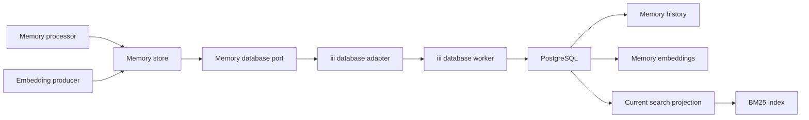
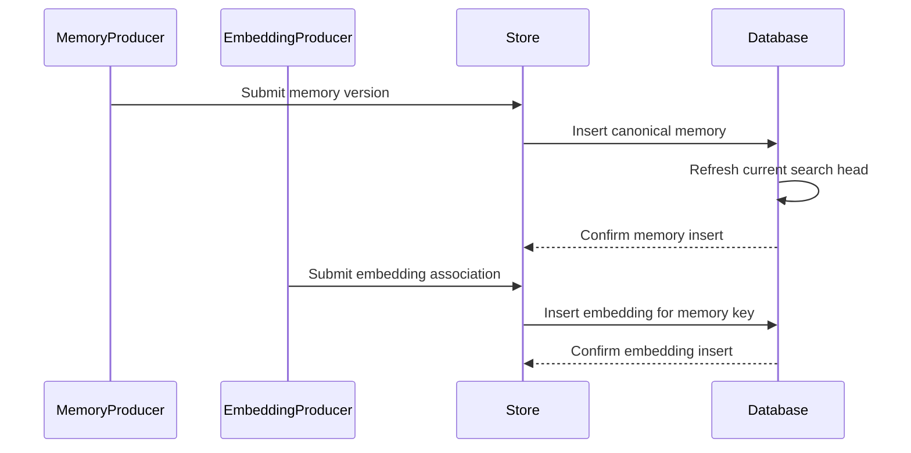

# Design: memory-schema-search

## Overview

This feature adds an in-process Rust memory-store boundary backed by PostgreSQL. It owns immutable versioned memories, separately persisted one-to-one embeddings, a current-version lexical projection, and independent BM25 and exact cosine operations.

### Goals
- Persist every valid memory version under composite identity `(id, version)`.
- Associate at most one immutable embedding with an existing memory version without mutating the memory row.
- Search only the greatest version per ID by title/content/concepts or a compatible associated embedding.
- Preserve deterministic results, protected-data diagnostics, and extension-backed verification.

### Non-Goals
- Memory or embedding generation, public or iii functions, hybrid ranking, additional filters, deletion, retention, approximate vector indexes, or database provisioning.

## Boundary Commitments

### This Spec Owns
- Canonical Rust memory, embedding, query, result, and error contracts.
- The `memories` history table, `memory_embeddings` association table, and derived current-search projection.
- Independent insert-only memory and embedding operations plus BM25 and exact cosine operations through the iii database worker.
- Migration preflight expectations and PostgreSQL 17/18 integration verification.

### Out of Boundary
- Harness event contracts, raw observation interpretation, and session embeddings.
- Memory-type taxonomy, provenance derivation, embedding models, and embedding generation.
- Public transport contracts, authentication, pagination, hybrid fusion, search filters, phrase search, and field boosts.
- PostgreSQL installation, extension installation, credentials, migration execution, backups, replicas, and retention.

### Allowed Dependencies
- `iii-sdk` and iii database worker 0.5.17 for database invocation only.
- PostgreSQL 17 or 18 with preloaded `pg_textsearch` 1.4.0 and pgvector 0.8.6 or later.
- Existing workspace dependencies and conventions: Tokio, Serde, Chrono, `thiserror`, async traits, exact version pins, and content-opaque errors.
- Source observation IDs remain opaque text values. The memory store does not read or reference raw-event tables.

### Revalidation Triggers
- Adding, removing, renaming, or changing the type of a canonical memory or embedding field.
- Changing one-embedding-per-version identity, parent existence, latest-version selection, immutability, collection preservation, score ordering, or result-limit semantics.
- Adding embedding replacement, a transport API, filters, hybrid ranking, an ANN index, tenant RLS, standby reads, or deletion.
- Changing PostgreSQL, `pg_textsearch`, pgvector, iii database worker, vector codec, or extension-loading requirements.
- Replacing the current-search projection or allowing writes outside memory-store operations.

## Architecture

### Existing Architecture Analysis

- The implemented ingestion worker uses strict boundary types, an application service, an async outbound port, and an iii adapter.
- The event-persistence component is approved but unimplemented and excludes memory processing and retrieval.
- Its optional session embeddings have different identity and ownership and are not reused.
- This design preserves the ports-and-adapters dependency direction without making either harness worker own memories.

### Architecture Pattern & Boundary Map



**Architecture Integration**
- Selected pattern: ports and adapters with one independent domain crate.
- Dependency direction: contracts → memory service → database port → iii adapter. Migrations and integration fixtures do not become runtime dependencies.
- Memory and embedding persistence share the port but remain separate operations and consistency boundaries.

### Technology Stack

| Layer | Choice / Version | Role in Feature | Notes |
|---|---|---|---|
| Backend | Rust 1.98.1, edition 2024 | Typed contracts, validation, service, adapter | Exact workspace pins |
| Integration | `iii-sdk` 0.24, database worker 0.5.17 | Parameterized database invocation | Static function identifiers |
| Storage | PostgreSQL 17/18 | Immutable memories, embedding associations, current projection | Primary-only BM25 reads |
| Lexical search | `pg_textsearch` 1.4.0 | BM25 over `text[]` | `english` text configuration |
| Vector search | pgvector 0.8.6+ | Separate dimensionless embeddings and exact cosine distance | No ANN index |

## File Structure Plan

### Directory Structure

```text
crates/memory-store/
├── Cargo.toml                              # Crate dependencies and test targets
├── migrations/
│   └── 0001_memory_schema_search.sql       # Memory, embedding, projection, privilege, and index schema
├── src/
│   ├── lib.rs                              # Public exports
│   ├── contracts.rs                        # Memory, embedding, query, result, and error value types
│   ├── memory.rs                           # Validation and MemoryStore application service
│   └── database.rs                         # MemoryDatabase port and iii adapter
└── tests/
    ├── contracts.rs                        # Memory, embedding, query, and result validation
    ├── memory.rs                           # Service behavior with recording and failing ports
    └── database.rs                         # Request construction, decoding, and leak checks
integration/memory-postgres-smoke/
├── Cargo.toml                              # Workspace shell target
├── README.md                               # Extension and invocation prerequisites
├── scripts/
│   ├── setup.sh                            # Pinned PostgreSQL and extension test setup
│   └── verify-*.sh                         # Direct PG17/18 schema, ranking, and concurrency checks
└── src/main.rs                             # Workspace shell; Nix verifier packages run the scripts
integration/memory-database-engine-fake/
├── Cargo.toml                              # iii SDK protocol-fake dependencies
├── README.md                               # Adapter smoke invocation
└── src/main.rs                             # database::execute request and response-envelope checks
```

### Modified Files
- `Cargo.toml` — Add the memory-store crate and both integration binaries to the workspace.
- `Cargo.lock` — Record exact dependency resolution.
- `flake.nix` — Provide pinned PostgreSQL 17/18 and extension-backed integration tooling.
- `.github/workflows/ci.yml` — Add a PG17/18 direct-database matrix and the iii database protocol fake.

## System Flows

### Independent Memory and Embedding Writes



The operations do not share a transaction. The memory version must be committed before its embedding is submitted. The embedding insert does not update the canonical memory row or current head.

## Requirements Traceability

| Requirement IDs | Summary | Components | Interfaces / State |
|---|---|---|---|
| 1.1, 1.2, 1.3, 1.4, 1.5, 1.6, 1.7, 1.8 | Canonical memory validation and preservation | Contracts, MemoryStore, schema | `MemoryVersionInput`, `ValidatedMemoryVersion`, `memories` |
| 2.1, 2.2, 2.3, 2.4, 2.5, 2.6 | Immutable versions and latest selection | MemoryStore, adapter, projection trigger | `insert_memory`, composite PK, `memory_search_heads` |
| 3.1, 3.2, 3.3, 3.4, 3.5, 3.6 | Independent embedding association | Contracts, MemoryStore, adapter, schema | `insert_embedding`, `memory_embeddings` |
| 4.1, 4.2, 4.3, 4.4, 4.5, 4.6, 4.7 | Latest-only deterministic BM25 | Adapter, current projection, BM25 index | `search_bm25`, `Bm25Search` |
| 5.1, 5.2, 5.3, 5.4, 5.5, 5.6 | Latest-only exact cosine search | Contracts, adapter, current/embedding/history join | `search_vector`, `VectorSearch` |
| 6.1, 6.2, 6.3, 6.4 | Complete results and protected diagnostics | Contracts, service, decoder | `MemorySearchResult`, `MemoryStoreError` |
| 7.1, 7.2, 7.3, 7.4, 7.5, 7.6, 7.7 | Focused and live verification | Crate tests, PostgreSQL Nix verifiers | Recording ports, PG17/18 matrix |

## Components and Interfaces

| Component | Domain / Layer | Intent | Requirement Coverage | Dependencies | Contracts |
|---|---|---|---|---|---|
| Contracts | Domain | Represent validated memory, embedding, search, result, and error values | 1.1–1.8, 3.1–3.4, 4.1, 4.6, 5.1, 5.5, 6.1–6.4 | Chrono, Serde | State |
| MemoryStore | Application | Validate requests and provide complete-or-error operations | 1.1–6.4 | Contracts, MemoryDatabase | Service |
| MemoryDatabase | Port / Adapter | Convert four validated operations to iii database calls and decode outcomes | 2.1–6.4 | iii database worker | Service |
| Schema Migration | Data | Enforce immutable history, embedding identity, parent existence, and current search state | 1.1–5.4 | PostgreSQL extensions | State |
| PostgreSQL Smoke | Verification | Prove extension, schema, ranking, and concurrency behavior | 7.1–7.7 | PostgreSQL 17/18 Nix verifiers | Batch |
| Database Engine Fake | Verification | Prove iii request and response-envelope behavior | 2.6, 3.6, 4.1, 5.1, 6.1–6.4, 7.6 | iii SDK | Batch |

### Domain and Application

#### Contracts and MemoryStore

| Field | Detail |
|---|---|
| Intent | Validate caller data before database invocation and expose typed outcomes |
| Requirements | 1.1–6.4 |

**Responsibilities & Constraints**
- `MemoryVersionInput` carries only the canonical memory fields.
- `EmbeddingInput` carries memory ID, version, and one vector; validated vectors have 1 through 16,000 finite components, round-trip exactly through `float4`, and have a non-zero norm.
- Persistence-bound text is NUL-free, and canonical timestamps use UTC whole seconds in years `0001` through `9999` before the database port is called.
- Validated newtypes enforce non-empty ID/type/title/content, positive `i64` versions, timestamp ordering, and positive search limits.
- `DatabaseTarget` is a non-empty logical database name supplied when the iii adapter is constructed.
- Collection order and duplicates are preserved. Empty collections are valid; missing collections are not.
- `MemorySearchResult` contains canonical fields and `f64` relevance but no embedding.

**Dependencies**
- Inbound: memory processor and embedding producer — construct in-process requests (P1).
- Outbound: MemoryDatabase — executes validated operations (P0).

**Contracts**: Service [x] / API [ ] / Event [ ] / Batch [ ] / State [x]

##### Service Interface

```rust
pub struct MemoryStore<D: MemoryDatabase> { /* private */ }

impl<D: MemoryDatabase> MemoryStore<D> {
    pub async fn insert_memory(&self, input: MemoryVersionInput) -> Result<(), MemoryStoreError>;
    pub async fn insert_embedding(&self, input: EmbeddingInput) -> Result<(), MemoryStoreError>;
    pub async fn search_bm25(&self, query: Bm25Search) -> Result<Vec<MemorySearchResult>, MemoryStoreError>;
    pub async fn search_vector(&self, query: VectorSearch) -> Result<Vec<MemorySearchResult>, MemoryStoreError>;
}
```

- Preconditions: Requests pass domain validation before the port is called; callers commit a memory version before submitting its embedding.
- Postconditions: Success represents one confirmed insert or one complete ordered result set.
- Invariants: Errors contain operation and field identifiers, never protected values.

### Integration

#### MemoryDatabase Port and iii Adapter

| Field | Detail |
|---|---|
| Intent | Isolate iii request/response details behind static parameterized operations |
| Requirements | 1.6, 2.1–6.4 |

**Responsibilities & Constraints**
- The adapter invokes `database::execute` with static SQL and positional values.
- Collections cross iii as JSON arrays and become native text arrays in memory SQL without reordering or deduplication.
- Memory inserts contain no vector parameter. Embedding inserts bind one vector as text with an explicit cast.
- Insert success requires returned keys matching the request. Duplicate memory/embedding keys map to `Conflict`; a missing embedding parent maps to `MissingMemoryVersion`.
- Search projections convert arrays to JSON, never select embeddings, and decode all-or-error.

**Dependencies**
- Inbound: MemoryStore — validated operations (P0).
- External: iii database worker 0.5.17 — execution and returned rows (P0).
- External: configured PostgreSQL primary — storage and ranking (P0).

**Contracts**: Service [x] / API [ ] / Event [ ] / Batch [ ] / State [ ]

##### Service Interface

```rust
#[async_trait::async_trait]
pub trait MemoryDatabase: Send + Sync {
    async fn insert_memory(&self, memory: &ValidatedMemoryVersion) -> Result<(), DatabaseError>;
    async fn insert_embedding(&self, embedding: &ValidatedEmbedding) -> Result<(), DatabaseError>;
    async fn search_bm25(&self, query: &ValidatedBm25Search) -> Result<Vec<MemorySearchResult>, DatabaseError>;
    async fn search_vector(&self, query: &ValidatedVectorSearch) -> Result<Vec<MemorySearchResult>, DatabaseError>;
}

impl IiiMemoryDatabase {
    pub fn new(client: iii_sdk::IIIClient, database: DatabaseTarget) -> Self;
}
```

### Data

#### Schema Migration

| Field | Detail |
|---|---|
| Intent | Make canonical history, one-to-one embeddings, and current-version search transactionally consistent |
| Requirements | 1.1–3.6, 4.2–4.5, 5.1–5.4 |

**Responsibilities & Constraints**
- The migration requires installed extensions; it does not install, preload, or upgrade them.
- `memories` is authoritative. `memory_embeddings` is an immutable child relation. `memory_search_heads` is a derived current-version projection.
- The embedding primary key and restrictive composite foreign key enforce one existing parent and one embedding per version.
- An after-memory-insert trigger computes `ARRAY[title, content] || concepts` and advances a head only for a greater version.
- The trigger function is migration-owned, `SECURITY DEFINER`, schema-qualified, fixed to a trusted `pg_catalog` search path, and unavailable for direct `PUBLIC` execution.
- The application role receives insert/select permissions but no update/delete permission on memories or embeddings and no direct head mutation.

**Dependencies**
- External: PostgreSQL 17/18 — constraints, trigger, transactions (P0).
- External: `pg_textsearch` 1.4.0 — BM25 index and scoring (P0).
- External: pgvector 0.8.6+ — vector type and cosine functions (P0).

**Contracts**: Service [ ] / API [ ] / Event [ ] / Batch [ ] / State [x]

##### State Management
- State model: append-only memories, one immutable embedding per memory version, and one mutable derived head per ID.
- Persistence: `(id, version)` is the canonical and embedding primary key; the embedding key is also a restrictive composite foreign key to history.
- Concurrency: head upserts prevent version regression; embedding PK conflicts allow exactly one concurrent association to succeed.

## Data Models

### Domain Model

- `MemoryVersion` is the aggregate root identified by `(MemoryId, Version)`.
- `MemoryEmbedding` is a child entity with the same identity and independent write lifecycle.
- `MemorySearchHead` is derived state, not a second source of truth.
- Embedding values and vector queries contain 1 through 16,000 finite components that round-trip exactly through PostgreSQL `float4` and have a non-zero norm; dimensions remain per-value.
- Canonical timestamps use UTC whole seconds in years `0001` through `9999`. Persisted text, collection values, lexical queries, and database targets are NUL-free.
- `Bm25Search` and `VectorSearch` are distinct requests with a positive `u32` result limit.

### Physical Data Model

#### `memories`

| Column | Type | Constraints |
|---|---|---|
| `id` | `TEXT` | Non-empty, NUL-free; composite PK |
| `version` | `BIGINT` | Positive; composite PK |
| `type` | `TEXT` | Non-empty, NUL-free |
| `title` | `TEXT` | Non-empty, NUL-free |
| `content` | `TEXT` | Non-empty, NUL-free |
| `created_at` | `TIMESTAMPTZ` | Required; UTC whole-second value with year `0001` through `9999` |
| `updated_at` | `TIMESTAMPTZ` | Required; UTC whole-second value with year `0001` through `9999`, not before `created_at` |
| `concepts` | `TEXT[]` | Required; may be empty; entries NUL-free |
| `files` | `TEXT[]` | Required; may be empty; entries NUL-free |
| `session_ids` | `TEXT[]` | Required; may be empty; entries NUL-free |
| `source_observation_ids` | `TEXT[]` | Required; may be empty; entries NUL-free; no foreign key |

#### `memory_embeddings`

| Column | Type | Constraints |
|---|---|---|
| `id` | `TEXT` | Composite PK and FK to `memories` |
| `version` | `BIGINT` | Composite PK and FK to `memories` |
| `embedding` | `vector` | Required; 1 through 16,000 `float4`-exact finite dimensions and positive norm |

The foreign key uses restrictive update/delete behavior. Historical versions may receive embeddings; no index is added to the vector column.

#### `memory_search_heads`

| Column | Type | Constraints |
|---|---|---|
| `id` | `TEXT` | Primary key |
| `version` | `BIGINT` | Composite foreign key to `memories` |
| `search_document` | `TEXT[]` | Title, content, then concepts |

Indexes are the two composite primary keys, the head primary key, and one BM25 index on `memory_search_heads.search_document` using the `english` text configuration.

### Search Contracts

- BM25 scores every current search head, excludes non-matches, joins canonical fields, exposes the negated extension score as positive relevance, then orders by relevance descending, ID ascending under `C` collation, and version ascending before applying the limit.
- Deterministic ordering is favored over `pg_textsearch` top-K optimization. A future performance change requires revalidation because it can change tie membership.
- Vector search joins current head → embedding → canonical memory and evaluates `<=>` only inside a `CASE` branch whose prior conditions confirm equal dimensions and non-zero norms.
- A latest version without an embedding produces no vector result for that ID; search never falls back to an older embedded version.
- BM25 queries run on the primary. Hot-standby BM25, RLS tenant isolation, and mixed lexical-vector scoring are unsupported.

## Error Handling

| Category | Cases | Response |
|---|---|---|
| Validation | Missing/empty/NUL text, fractional-second or unsupported-year timestamps, timestamp inversion, PostgreSQL-incompatible vector, empty query, zero limit | `InvalidInput` with field and stable code |
| Missing parent | Embedding references an absent memory version | `MissingMemoryVersion` with key only |
| Conflict | Duplicate memory or embedding `(id, version)` | `Conflict` without replacement |
| Database | Invocation error, unconfirmed outcome, trigger/index failure | `DatabaseFailure` with operation only |
| Decode | Missing/wrong returned column or unsupported value | `InvalidDatabaseResponse` with column name only |

No error or log includes title, content, vectors, collection values, SQL parameter values, or returned rows. Database failure produces no successful or partial result.

## Testing Strategy

### Unit and Port Tests
- Validate every canonical field, collection, timestamp relation and wire-compatible precision/range, embedding value, query text/vector, database target, and positive limit before the port is called.
- Verify invalid requests never call the recording database port and failures remain content-opaque.
- Verify memory, embedding, BM25, and vector requests use distinct static SQL, positional parameters, required casts, and embedding-free projections.
- Verify complete result decoding, duplicate and missing-parent mapping, deterministic returned order, and malformed-row all-or-error behavior.

### PostgreSQL Integration Tests
- Apply the migration on PostgreSQL 17 and 18 with exact extension preconditions and verify all constraints and grants.
- Insert initial, newer, lower out-of-order, concurrent, and duplicate memory versions; verify immutable history and the greatest-version head.
- Insert embeddings after parent commit, before parent availability, concurrently, for historical versions, and after head advancement; verify one-to-one immutability.
- Prove a latest version without an embedding suppresses older embeddings and becomes vector-searchable after its embedding insert without a head update.
- Prove title, content, and concepts BM25 matches plus deterministic lexical and vector ordering, empty matches, limits, JSON projections, and omitted embeddings.
- Scan diagnostics with sentinel protected values and fail on any leak.

### iii Protocol Verification
- Run the adapter against a loopback engine fake that emulates `database::execute` without provisioning the database worker.
- Verify four function invocations, logical database selection, SQL text, positional values, vector casts, JSON collection binds, returned-row envelopes, database failures, and malformed responses.
- Keep a live iii/database-worker deployment smoke test out of boundary; direct PostgreSQL and protocol suites split the contracts reproducibly.

## Security Considerations

- Production database connections use TLS hostname verification and least-privilege credentials.
- The application role cannot update/delete memories or embeddings or directly mutate search heads.
- The projection trigger executes as its migration owner with a fixed trusted search path; deployment grants do not expose the trigger function directly.
- Static SQL and positional parameters prevent query/index-name injection.
- Strict tenant isolation through RLS is unsupported because BM25 corpus statistics can reveal hidden-term frequency.

## Performance and Scalability

- BM25 deterministic tie-breaking intentionally forgoes the extension's optimized single-expression top-K path.
- Exact cosine search scans embeddings associated with current heads and has no ANN latency claim.
- PostgreSQL role-level `statement_timeout` bounds both search operations because iii exposes no per-call timeout.
- Track ranked-search latency, rows scored, BM25 index scans, synchronous compaction pressure, and write latency before adding performance requirements.

## Migration Strategy

- Verify PostgreSQL and extension versions before applying `0001_memory_schema_search.sql`.
- Apply the migration before any caller uses the crate; the feature has no legacy rows or embedded column to backfill.
- Run the direct PG17/18 smoke suite and iii protocol fake after migration and before enabling callers.
- If migration validation fails before writes, roll back the migration. After accepted writes, disable callers and apply a forward repair rather than dropping canonical history.
