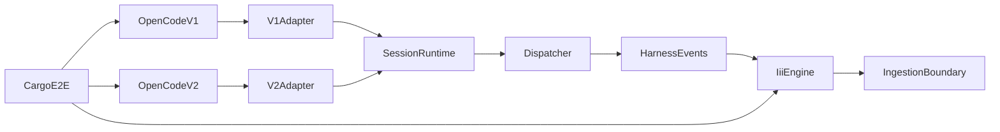
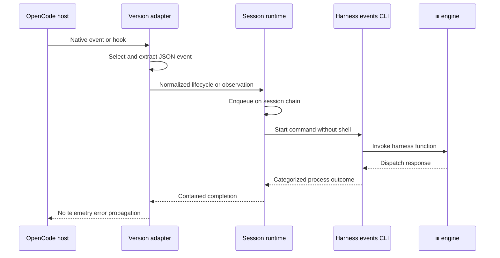
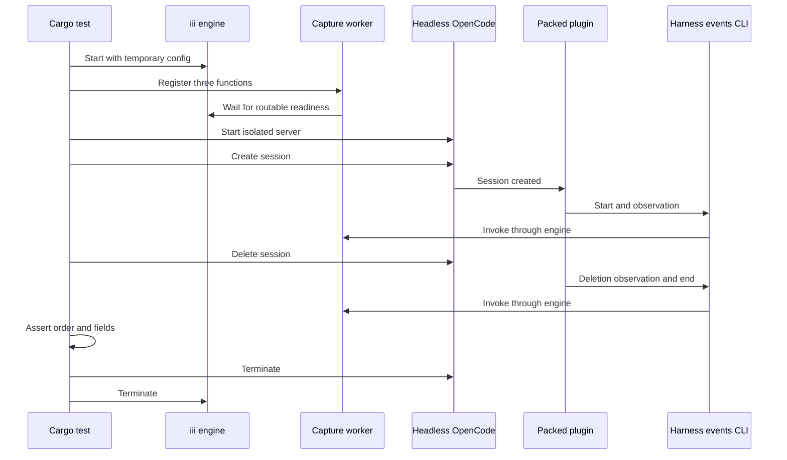

# Design Document: opencode-harness-events-plugin

## Overview

The feature adds one Bun-managed TypeScript package that adapts OpenCode v1 and v2 events to the existing `harness-events` process contract. A separate Cargo test crate verifies the packed package through headless OpenCode processes and a real iii engine.

### Goals
- Keep OpenCode generation differences at two thin adapter boundaries.
- Preserve native coarse event payloads while excluding streaming deltas.
- Contain CLI failures without adding retry, persistence, or iii logic.
- Verify the distributable package against real process boundaries.

### Non-Goals
- Define a cross-generation semantic event schema.
- Implement, bundle, install, or distribute `harness-events` or OpenCode.
- Guarantee durable, ordered, deduplicated, or replayable delivery.
- Exercise model-dependent prompts or tool execution in end-to-end tests.
- Supply Bun or pinned OpenCode Nix tools on upstream-unsupported Intel macOS.

## Boundary Commitments

### This Spec Owns
- The dual v1 `server` and v2 `setup` package entrypoint.
- Selection and normalization of accepted OpenCode native events and hooks.
- Per-runtime lifecycle tracking and local per-session submission order.
- No-shell child-process invocation, timeout handling, and payload-free diagnostics.
- Bun package metadata, lockfile, build, checks, unit tests, and packed artifact.
- Dependabot Bun configuration and the Cargo-driven live-engine test harness.

### Out of Boundary
- The CLI command grammar, exit codes, iii invocation, protobuf contracts, and distribution.
- OpenCode CLI distribution, remote package-registry installation, and user installer workflows.
- Ingestion, queue, persistence, authentication, redaction, retry, replay, batching, or durable state.
- Ordering or deduplication across plugin reloads, process restarts, or concurrent OpenCode instances.
- A common semantic interpretation of version-specific event payloads.

### Allowed Dependencies
- `harness-events` as an external process implementing the approved `harness-events-cli` contract.
- Type-only APIs from `@opencode-ai/plugin@1.18.29`, `@opencode-ai/sdk@1.18.29`, `@opencode/plugin@2.0.10`, and `@opencode/client@2.0.10`.
- Bun 1.4.2 for package management and execution; TypeScript 5.9.x for strict checking and emission; Biome 2.5.14 for linting and formatting.
- Node-compatible `node:child_process` supplied by the OpenCode/Bun runtime.
- iii 0.24.0 and the repository-pinned Rust stack only in the end-to-end crate.
- No production import from OpenCode CLI packages, iii SDK, protobuf packages, repository worker crates, or the Rust test crate.

### Revalidation Triggers
- Any OpenCode plugin entrypoint, context, event, hook, cleanup, configuration, or headless API change.
- Any change to supported pins `1.18.29` or `2.0.10`.
- Any `harness-events` command, option, stdin, exit-status, timeout, or diagnostic change.
- Any change to iii engine startup, registration readiness, function routing, or success response.
- Any Bun lockfile, packing, Dependabot ecosystem, TypeScript emission, or Biome compatibility change.
- Any expansion from coarse native events to streaming, batching, retry, or durable state.

## Architecture

### Existing Architecture Analysis
- Product components are Rust workspace crates; integration runners live under `integration/`.
- The approved CLI is the sole adapter-facing iii boundary and remains independently generated from the root protobuf.
- Existing process tests use explicit deadlines, readiness checks, piped diagnostics, and TERM-to-kill cleanup.
- `.opencode/` is repository agent tooling and excludes package assets; it is not a product package location.
- Nix supplies Rust and iii but no Bun or OpenCode binaries.
- The new package introduces an isolated product-adapter boundary under `integrations/`.

### Architecture Pattern and Boundary Map



- Selected pattern: Two host adapters around a small normalized runtime and process port.
- Dependency direction: JSON types and configuration → dispatcher → session runtime → generation adapters → dual entrypoint.
- The package has no production dependency on repository Rust crates or OpenCode CLI packages.
- The Cargo E2E crate depends on built artifacts; product code never depends on test infrastructure.

### Technology Stack

| Layer | Choice / Version | Role | Constraint |
|---|---|---|---|
| Package runtime | Bun 1.4.2, ESM | Install, scripts, tests, packing | Committed text `bun.lock` |
| Language | TypeScript 5.9.x | Strict types, ESM JS and declarations | `any` forbidden; exact pin in lockfile |
| Style | Biome 2.5.14 | Formatting and stable-rule linting | Warnings fail checks |
| OpenCode v1 | `@opencode-ai/plugin` 1.18.29 | Type-only server API | Minimum supported v1 baseline |
| OpenCode v2 | `@opencode/plugin` 2.0.10 | Type-only Promise API | Pinned supported v2 baseline |
| Process | `node:child_process` | No-shell CLI invocation | Runtime built-in only |
| E2E | Rust 1.98.1, Tokio 1.48.0, iii-sdk 0.24.0 | Process orchestration and capture functions | Cargo test runner, serial ignored test |
| Infrastructure | Nix, iii 0.24.0 | Reproducible tool and engine pins | Bun/OpenCode tools on ARM macOS and Linux; live CI on x86-64 Linux |

## File Structure Plan

### Directory Structure

```text
integrations/opencode-harness-events/
├── package.json                 # Package exports, exact tools, and Bun scripts
├── bun.lock                     # Bun dependency lock
├── tsconfig.json                # Strict source and test type checking
├── tsconfig.build.json          # ESM JavaScript and declaration emission
├── biome.json                   # Strict lint and formatting policy
├── README.md                    # v1 and v2 loading, environment, and guarantees
├── LICENSE                      # Package artifact license
├── src/
│   ├── model.ts                 # JSON, event, submission, outcome, and diagnostic types
│   ├── config.ts                # Executable and timeout environment parsing
│   ├── dispatcher.ts            # No-shell child lifecycle and exit classification
│   ├── runtime.ts               # Per-session lifecycle state and submission chains
│   ├── v1.ts                    # V1 context, events, hooks, and dispose adapter
│   ├── v2.ts                    # V2 context, subscriptions, hooks, and cleanup adapter
│   └── index.ts                 # Plain dual-generation default export
└── test/
    ├── config.test.ts           # Defaults and invalid configuration
    ├── dispatcher.test.ts       # Arguments, stdin, timeout, exits, and diagnostics
    ├── runtime.test.ts          # Lifecycle synthesis, order, state, and cleanup
    ├── v1.test.ts               # V1 event matrix and adapter extraction
    ├── v2.test.ts               # V2 event matrix and adapter extraction
    └── package.test.ts          # Build exports and packed-content contract

integration/opencode-harness-events-e2e/
├── Cargo.toml                   # Private crate dependencies and test target
├── src/
│   ├── lib.rs                   # Harness module exports
│   ├── engine.rs                # Real iii child and capture worker readiness
│   ├── opencode.rs              # V1 and v2 server API scenarios
│   └── process.rs               # Child guards, deadlines, logs, and cleanup
└── tests/
    └── live.rs                  # Serial ignored Cargo E2E matrix
```

### Modified Files
- `Cargo.toml` — Add the private E2E crate as a workspace member and its shared dependency pins.
- `Cargo.lock` — Lock E2E dependencies.
- `flake.nix` — Pin Bun 1.4.2 and distinct `opencode-v1` 1.18.29 and `opencode-v2` 2.0.10 commands on upstream-supported systems; retain the Rust-only Intel macOS shell.
- `.gitignore` — Ignore package `node_modules`, `dist`, and generated tarballs without ignoring `bun.lock`.
- `.github/dependabot.yml` — Retain Cargo updates and add the package directory with `package-ecosystem: bun`.
- `.github/workflows/ci.yml` — Run Bun checks, build and pack artifacts, build the CLI, then invoke the ignored Cargo live test.

## System Flows

### Runtime Event Submission



An unknown session is first enqueued with `session-start`. A deletion event is enqueued as an observation followed by `session-end`. The adapter does not await the chain before returning control to the host. Cleanup stops subscriptions, aborts outstanding chains, then attempts shutdown ends within its separate bound.

### Live Test Topology



Artifacts are built before Cargo starts. The test receives explicit binary and tarball paths, installs the tarball into temporary Bun consumers, and never recursively invokes Cargo.

## Requirements Traceability

| Requirements | Summary | Design elements |
|---|---|---|
| 1.1, 1.2, 1.3, 1.4, 1.5 | Dual loading and cleanup | Dual Entrypoint, V1 Adapter, V2 Adapter, Package Contract |
| 2.1, 2.2, 2.3, 2.4, 2.5, 2.6 | Session lifecycle | Session Runtime, lifecycle state flow |
| 3.1, 3.2, 3.3, 3.4, 3.5, 3.6 | Coarse observations | Accepted Event Matrix, Observation Envelope, adapters |
| 4.1, 4.2, 4.3, 4.4, 4.5, 4.6, 4.7, 4.8 | CLI inputs | Config, Dispatcher, Submission Contract |
| 5.1, 5.2, 5.3, 5.4, 5.5, 5.6 | Failure isolation | Dispatcher outcomes, Diagnostic Contract, Session Runtime |
| 6.1, 6.2, 6.3, 6.4, 6.5, 6.6 | Package quality | Package Contract, TypeScript and Biome configuration |
| 7.1, 7.2, 7.3, 7.4 | Dependency updates | Dependabot Bun entry and lockfile gate |
| 8.1, 8.2, 8.3, 8.4, 8.5, 8.6 | Unit verification | Bun test files and injected dispatcher function |
| 9.1, 9.2, 9.3, 9.4, 9.5, 9.6, 9.7, 9.8 | Live verification | Cargo E2E Runner, Engine Harness, OpenCode Scenarios, Process Guard |

## Components and Interfaces

| Component | Layer | Intent | Requirements | Dependencies |
|---|---|---|---|---|
| Dual Entrypoint | Package | Expose the host-selected generation adapter | 1.1–1.3, 6.5–6.6 | V1 Adapter, V2 Adapter |
| V1 Adapter | Host | Extract supported v1 events and hooks | 1.1, 1.3–1.5, 2.1–3.5 | V1 type APIs, Session Runtime |
| V2 Adapter | Host | Extract supported v2 events and hooks | 1.2–1.5, 2.1–3.5 | V2 type APIs, Session Runtime |
| Session Runtime | Application | Track local lifecycle and serialize each session | 2.1–2.6, 3.6, 5.1–5.2 | Dispatcher function |
| Dispatcher | Process | Execute one CLI command and classify its outcome | 4.1–4.8, 5.1–5.5 | Config, child process |
| Package Contract | Tooling | Produce a checked ESM artifact and lock graph | 6.1–8.6 | Bun, TypeScript, Biome |
| Cargo E2E Runner | Test | Orchestrate the real cross-process matrix | 9.1–9.8 | Engine Harness, OpenCode Scenarios, Process Guard |

### Shared Model

```typescript
type JsonPrimitive = string | number | boolean | null;
type JsonValue = JsonPrimitive | JsonObject | readonly JsonValue[];
interface JsonObject { readonly [key: string]: JsonValue }

type Generation = "v1" | "v2";

interface EventMetadata {
  readonly generation: Generation;
  readonly sessionId: string;
  readonly projectName: string;
  readonly currentWorkingDirectory: string;
  readonly timestamp: string;
}

type Submission =
  | { readonly kind: "start"; readonly metadata: EventMetadata }
  | { readonly kind: "observation"; readonly metadata: EventMetadata; readonly hookType: string; readonly data: JsonObject }
  | { readonly kind: "end"; readonly metadata: EventMetadata };

type DispatchResult =
  | { readonly ok: true }
  | { readonly ok: false; readonly category: "configuration" | "serialization" | "spawn" | "timeout" | "usage" | "connection" | "invocation" | "signal" };

type DispatchFailureCategory = Extract<DispatchResult, { readonly ok: false }>["category"];
```

No `any` type or unsafe cast crosses an adapter boundary. Unknown native input is narrowed before a submission is accepted.

### Generation Adapters

```typescript
interface AdapterDependencies {
  readonly runtime: SessionRuntime;
  readonly report: (diagnostic: Diagnostic) => void;
  readonly now: () => Date;
}

declare function setupV1(input: V1PluginInput, options?: Record<string, unknown>): Promise<V1Hooks>;
declare function setupV2(context: V2Context): Promise<() => Promise<void>>;
```

The default export is a plain object with `id`, `server: setupV1`, and `setup: setupV2`. OpenCode API packages are type-only development dependencies.

#### Accepted Event Matrix

| Category | V1 source | V2 source | Rule |
|---|---|---|---|
| Lifecycle | `session.created`, `session.deleted` | `session.created`, `session.deleted` | Observe both; add start before create and end after delete |
| Session state | `session.updated`, `session.status`, `session.idle` | `session.execution.started`, `.succeeded`, `.interrupted` | Preserve the full native event |
| Prompt | `chat.message` hook | `session` `prompt` hook | Preserve hook input and output objects |
| Message | `message.updated` | `session.text.ended`, `session.reasoning.ended` | Complete or snapshot events only |
| Tool | `tool.execute.before`, `tool.execute.after` hooks | `tool` `execute.before`, `execute.after` hooks | Do not duplicate v2 terminal tool events |
| Error | `session.error` | `session.execution.failed`, `session.step.failed`, `session.compaction.failed` | Preserve native error object; never log it |
| Excluded | `message.part.updated` with delta | `session.text.delta`, `session.reasoning.delta`, `session.tool.progress` | No observation |

`hook_type` is `opencode.<generation>.<source>.<native-kind>`. Observation stdin contains `{ "source": "opencode", "generation": <generation>, "kind": <native-kind>, "payload": <native-object> }`.

#### Metadata Extraction

- Project name is the basename of the OpenCode project directory because neither supported API declares a project name.
- V1 prefers the event session directory, then plugin directory. V2 prefers event location, then context location.
- Missing event-level directories use the tracked session directory, then adapter context.
- V2 uses the event `created` millisecond value. V1 uses session creation/update time where semantically applicable. Hooks and events without timestamps use the injected clock.
- Every timestamp passes through `Date.toISOString()`, producing RFC 3339 with exactly three fractional digits.
- An event with no non-blank session ID, usable directory, or JSON object is rejected before runtime submission.

### Session Runtime

```typescript
interface SessionRuntime {
  start(metadata: EventMetadata): void;
  observe(submission: Extract<Submission, { readonly kind: "observation" }>): void;
  end(metadata: EventMetadata): void;
  close(): Promise<void>;
}

type Dispatch = (submission: Submission, signal: AbortSignal) => Promise<DispatchResult>;
```

- State is an in-memory map keyed by native session ID with metadata, started/ended flags, and one promise tail.
- `start` is locally idempotent. `observe` synthesizes start for unknown sessions. `end` appends once and removes state after completion.
- Each session chain preserves local start → observations → end order. Different sessions may dispatch concurrently.
- Adapter callbacks enqueue work and return without propagating telemetry errors.
- Adapter cleanup first stops hooks and subscriptions, then calls `close`.
- `close` rejects new work, aborts outstanding session chains, and starts one dedicated `session-end` attempt for every still-active session.
- Shutdown end attempts run concurrently under a separate 5-second abort bound, then state is cleared.
- State is never persisted and provides no cross-runtime uniqueness guarantee.

### Config and Dispatcher

```typescript
interface PluginConfig {
  readonly executable: string;
  readonly executionTimeoutMs: number;
  readonly shutdownTimeoutMs: number;
}

declare function loadConfig(environment: Readonly<Record<string, string | undefined>>): PluginConfig;
declare function dispatch(config: PluginConfig, submission: Submission, signal: AbortSignal): Promise<DispatchResult>;
```

| Setting | Default | Validation |
|---|---:|---|
| `HARNESS_EVENTS_BIN` | `harness-events` | Non-blank executable name or path |
| `HARNESS_EVENTS_TIMEOUT_MS` | `35000` | Positive integer, maximum `120000` |
| `HARNESS_EVENTS_SHUTDOWN_TIMEOUT_MS` | `5000` | Positive integer, maximum execution timeout |

- `spawn` receives an argument array, `shell: false`, inherited environment, piped stdin/stdout/stderr, and no observation data in arguments.
- Lifecycle stdin is closed empty. Observation stdin receives one serialized envelope and closes.
- The dispatcher drains stdout and at most 8 KiB from stderr to avoid deadlock, then discards both.
- Exit `0` is success; `2`, `3`, and `4` map to usage, connection, and invocation. Spawn, signal, serialization, and timeout have plugin-owned categories.
- Timeout or shutdown abort sends termination and escalates to kill after a bounded grace period.
- The dispatcher never retries and never throws a categorized process failure through the host adapter.

#### Diagnostic Contract

```typescript
interface Diagnostic {
  readonly category: DispatchFailureCategory;
  readonly generation?: Generation;
  readonly nativeKind?: string;
  readonly sessionId?: string;
}
```

Diagnostics use one `console.error` record capped at 512 characters. They exclude project paths, native payloads, serialized stdin, prompt or tool content, child output, remote errors, and stack traces.

### Package Contract

- `package.json` declares ESM, `dist/index.js`, `dist/index.d.ts`, an explicit `files` allowlist, root default export, and no production dependencies.
- Bun scripts expose `typecheck`, `lint`, `format`, `format:check`, `test`, `build`, `pack`, and aggregate `check` commands.
- `tsconfig.json` enables strict mode, `noUncheckedIndexedAccess`, `exactOptionalPropertyTypes`, and no emit.
- `tsconfig.build.json` excludes tests and emits ESM JavaScript, source maps, and declarations into `dist/`.
- Biome enables all stable lint rules; package checks use warnings-as-errors. Narrow rule exceptions require an inline reason.
- `bun pm pack` is inspected by `package.test.ts`; the tarball includes built JavaScript, declarations, manifest, README, and license only.
- Dependabot uses `package-ecosystem: bun`, the package directory, and a weekly schedule alongside the existing Cargo entry.

### Cargo E2E Runner

```rust
struct ArtifactPaths {
    iii: PathBuf,
    opencode_v1: PathBuf,
    opencode_v2: PathBuf,
    harness_events: PathBuf,
    plugin_tarball: PathBuf,
}

async fn run_generation(generation: Generation, artifacts: &ArtifactPaths) -> Result<CaptureSet, E2eError>;
```

- `live.rs` is ignored by default and runs explicitly with one test thread after CI builds all artifacts.
- The crate is `publish = false`; modules under `src/` use ordinary `[dependencies]` even though the crate exists only for tests.
- `EngineHarness` starts iii with a temporary config, disables telemetry/update checks, registers three capture functions, and waits until all are visible through `engine::functions::info`.
- Capture functions return exactly `{"dispatched":true}` and retain function IDs, namespaces, payloads, and receive order in memory.
- `OpenCodeScenario` installs the tarball into an isolated Bun consumer, writes generation-specific config, starts `serve`, and waits for authenticated HTTP readiness with the exact version.
- V1 uses `plugin`, `POST /session`, and `DELETE /session/:id`. V2 uses `plugins`, `POST /api/session`, and `DELETE /api/session/:id`.
- Each scenario sets isolated home and XDG directories, disables model fetch, auto-update, LSP download, and file watching, and supplies shared `III_URL`, `III_NAMESPACE`, and CLI path.
- On x86-64 Linux, `ProcessGuard` starts iii and OpenCode in owned Unix process groups so descendants share cleanup ownership.
- Normal completion and returned errors use async TERM, bounded wait, then process-group KILL. An unwind-safe drop guard issues best-effort process-group KILL during panic.

#### Implementation Prerequisite

- Package, unit-test, and E2E harness work can compile independently of the CLI implementation.
- Live E2E execution and its CI gate depend on the `harness-events-cli` spec landing a buildable `harness-events-cli` Cargo package and `harness-events` binary.
- The test accepts an explicit `HARNESS_EVENTS_BIN` artifact path and does not add a fake production CLI fallback.
- Task ordering must keep live-test enablement and CI gating behind that upstream dependency.

## Error Handling

| Failure | Owner | Result |
|---|---|---|
| Missing session, directory, or object payload | Adapter | Skip event; payload-free serialization diagnostic |
| Invalid executable or timeout setting | Config | Use safe default; configuration diagnostic |
| Child spawn or signal failure | Dispatcher | Categorized result; host continues |
| Child exceeds execution bound | Dispatcher | Terminate then kill; timeout result |
| CLI exit `2`, `3`, or `4` | Dispatcher | Usage, connection, or invocation result |
| Adapter subscription closes unexpectedly | Adapter | Payload-free signal diagnostic; cleanup remaining resources |
| Shutdown bound expires | Session Runtime | Abort remaining shutdown-end attempts; host cleanup completes |
| E2E child, panic, or readiness failure | Process Guard | Clean owned process groups; fail Cargo test with bounded metadata |

No runtime failure causes a retry or exposes child stderr. A CLI success remains an invocation acknowledgment only.

## Testing Strategy

### Bun Unit Tests
- Verify exact v1/v2 default loading and disposal without real hosts.
- Exercise every accepted and excluded event-matrix row, including resumed-session synthesis and duplicate local lifecycle signals.
- Assert per-session order, cross-session independence, shutdown ends, shutdown abort, and no error propagation.
- Record `spawn` options, arguments, stdin, environment, timeout, signals, and categorized exits through injected process seams.
- Seed payload sentinels and assert diagnostics and child arguments never contain them.
- Build and inspect the packed artifact's exports and file allowlist.

### Cargo Live Test
- Start real iii 0.24.0 and prove all capture functions are routable before OpenCode starts.
- For v1 1.18.29 and v2 2.0.10, create and delete one provider-free session through the headless server API.
- Assert one start, at least one creation observation, one deletion observation, and one end with native session ID and local order.
- Assert project basename, canonical fixture directory, hook type, envelope generation/kind, native payload sentinel, and millisecond RFC 3339 timestamps.
- Assert isolated roots, exact host versions, successful API operations, and complete child cleanup.

### CI Gates
- Run `bun install --frozen-lockfile` and the package aggregate check.
- Pack the package and build `harness-events` before starting Cargo E2E.
- Run the ignored E2E test explicitly with artifact paths and `--test-threads=1`.
- Preserve workspace Cargo test, rustfmt, Clippy, actionlint, release builds, and protocol smoke tests.
- Run live plugin verification on x86-64 Linux; evaluate but do not add unavailable Bun/OpenCode tools to the Intel macOS shell.
- Raise the CI timeout only if measured execution exceeds the existing 20-minute bound.

## Security Considerations

- Accepted native payloads intentionally remain unredacted and are sent only through child stdin; users must treat the iii destination as trusted.
- Session ID, project basename, directory, timestamp, and hook type are process arguments and visible through normal process inspection.
- Shell expansion is disabled. Child stdout, stderr, remote error text, and event payloads never enter plugin diagnostics.
- The plugin adds no credentials, network client, persistence, or authentication behavior.
- E2E credentials bind only to loopback and exist only in temporary test state.

## Performance and Lifecycle Limits

- One accepted coarse event creates one CLI process; streamed deltas and progress events are excluded.
- Sessions serialize locally; different sessions can run concurrently. No batcher, retry worker, or persistent queue exists.
- Every ordinary child is bounded by 35 seconds by default. Unload aborts ordinary work and gives dedicated end attempts at most 5 seconds.
- Unit tests cover burst ordering and cleanup; no throughput guarantee is claimed beyond bounded child lifetimes.
