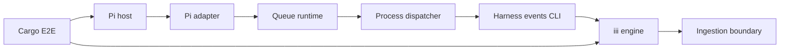
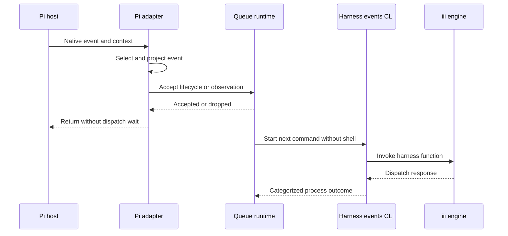
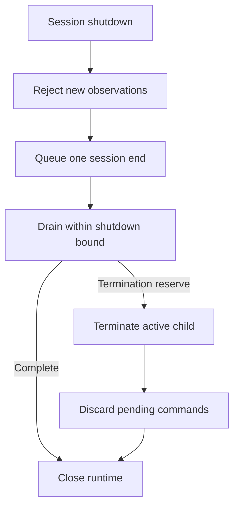

# Design Document: pi-harness-events-extension

## Overview

The feature adds one npm-managed TypeScript package that adapts Pi `0.86.1` events to the existing `harness-events` process contract. A separate Cargo test crate verifies the packed Jiti-loaded package through headless Pi on every declared Node LTS runtime and a real iii engine.

### Goals
- Keep Pi-specific event extraction at one thin host boundary.
- Preserve coarse native activity while excluding streaming and sensitive host context.
- Isolate CLI latency and failures behind a bounded serial queue.
- Verify the distributable source package across real process boundaries.

### Non-Goals
- Implement, bundle, install, or distribute `harness-events`, Pi, or iii.
- Define a cross-harness semantic event schema or shared adapter SDK.
- Guarantee durable, exactly-once, replayable, or cross-process ordered delivery.
- Detect secrets inside accepted user-authored message or tool data.
- Support the deprecated Pi package, non-LTS Node releases, or Node releases below 24.

## Boundary Commitments

### This Spec Owns
- The Pi package manifest and Jiti-loaded TypeScript extension entrypoint.
- Selection and projection of accepted Pi `0.86.1` events.
- Per-extension lifecycle state, bounded observation capacity, serial dispatch, and shutdown flushing.
- No-shell child-process invocation, timeout handling, and payload-free diagnostics.
- npm package metadata, lockfile, strict checks, unit tests, and packed artifact verification.
- Node LTS compatibility declarations, Dependabot npm configuration, and the Pi-specific Cargo E2E harness.

### Out of Boundary
- CLI grammar, exit statuses, iii invocation, protobuf contracts, authentication, or binary distribution.
- OpenCode integration code or shared adapter runtime and E2E infrastructure.
- Ingestion, queue publication, persistence, redaction, retry, replay, batching, or durable state.
- Pi installation, global package management, project trust, model providers, or user configuration.
- Ordering or deduplication across extension reloads, Pi restarts, or concurrent Pi processes.

### Allowed Dependencies
- `harness-events` as an external process implementing the approved `harness-events-cli` contract.
- Type-only APIs from `@earendil-works/pi-coding-agent@0.86.1`; the host supplies the runtime API.
- Node `24.x` initially, npm, TypeScript `7.0.2`, `@types/node` `24.13.6`, Biome `2.5.14`, and Prettier `3.9.8` for Markdown checks.
- Node built-ins for process execution, testing, paths, files, clocks, and abort signals.
- iii `0.24.0` and the repository-pinned Rust stack only in the E2E crate.
- No production import from Jiti, iii SDK, protobuf packages, repository workers, OpenCode code, or Rust test support.

### Revalidation Triggers
- Any Pi extension manifest, factory, context, event, Jiti loading, session replacement, or shutdown change.
- Any change to Pi pin `0.86.1` or a supported Node LTS major.
- Any `harness-events` command, option, stdin, exit-status, timeout, or diagnostic change.
- Any expansion to streaming, provider traffic, interception hooks, retries, batching, persistence, or shared adapter infrastructure.
- Any change to iii startup, registration readiness, function routing, or success response.

## Architecture

### Existing Architecture Analysis
- Product components are Rust workspace crates; integration runners live under `integration/`.
- The approved CLI is the sole adapter-facing iii boundary but is not implemented yet.
- Existing process tests use semantic readiness checks, deadlines, and payload-safe diagnostics.
- `.opencode/` is ignored agent tooling, not a product package location.
- Nix supplies Rust and iii but no Node or npm.
- The new package introduces an isolated product adapter under `integrations/`.

### Architecture Pattern and Boundary Map



- Selected pattern: a host adapter around a bounded application queue and process port.
- Dependency direction: model → configuration → dispatcher → queue runtime → Pi adapter → entrypoint.
- The package has no production dependency on repository Rust crates or Pi's CLI implementation.
- The Cargo crate consumes staged artifacts; product code never depends on test infrastructure.

### Technology Stack

| Layer | Choice / Version | Role | Constraint |
|---|---|---|---|
| Host runtime | Node `24.x` LTS | Pi and extension execution | Later majors require LTS status and full validation |
| Host API | `@earendil-works/pi-coding-agent` `0.86.1` | Extension types and headless host | Exact development and E2E pin |
| Loader | Host-provided Jiti `2.7.0` | Direct TypeScript loading | No extension dependency on Jiti |
| Package | npm from Node `24.x` | Install, lock, scripts, packing | Committed `package-lock.json` |
| Language | TypeScript `7.0.2` | Strict source checking | No emit; erasable syntax only; `any` forbidden |
| Style | Biome `2.5.14`, Prettier `3.9.8` | Biome linting/formatting and Markdown format checks | Biome warnings and Prettier check failures fail the package gate |
| Unit tests | Node `node:test` | TypeScript package tests | Run on every declared Node LTS major |
| E2E | Rust `1.98.1`, Tokio `1.48.0`, iii-sdk `0.24.0` | Process orchestration and capture | Cargo test runner, serial ignored test |
| Infrastructure | Nix, iii `0.24.0` | Reproducible runtime pins | Node `24.x` on all existing flake systems |

## File Structure Plan

### Directory Structure

```text
integrations/pi-harness-events/
├── package.json                 # Pi manifest, Node engines, exact tools, and npm scripts
├── package-lock.json            # npm dependency lock
├── tsconfig.json                # Strict no-emit and erasable-syntax checks
├── biome.json                   # Strict lint and formatting policy
├── README.md                    # Loading, environment, privacy, and delivery guarantees
├── LICENSE                      # Package artifact license
├── src/
│   ├── model.ts                 # JSON, metadata, submission, outcome, and diagnostic types
│   ├── config.ts                # Executable, queue, and timeout environment parsing
│   ├── dispatcher.ts            # No-shell child lifecycle and exit classification
│   ├── queue.ts                 # Lifecycle state, observation capacity, serial pump, and close
│   ├── adapter.ts               # Pi subscriptions, metadata extraction, and event projection
│   └── index.ts                 # Default ExtensionFactory export
└── test/
    ├── config.test.ts           # Defaults and invalid configuration
    ├── dispatcher.test.ts       # Arguments, stdin, timeout, exits, and diagnostics
    ├── queue.test.ts            # Capacity, order, lifecycle reservation, and shutdown
    ├── adapter.test.ts          # Event matrix, projection, identity, and handler containment
    ├── package.test.ts          # Tarball contents and isolated install contract
    └── fixtures/
        └── scripted-provider.ts # Offline provider and deterministic fixture tool

integration/pi-harness-events-e2e/
├── Cargo.toml                   # Private crate dependencies and live test target
├── src/
│   ├── lib.rs                   # Harness module exports
│   ├── artifacts.rs             # Explicit artifact and fixture path validation
│   ├── engine.rs                # Real iii child, capture functions, and readiness
│   ├── pi.rs                    # Headless Pi scenario and capture assertions
│   └── process.rs               # Process groups, bounded logs, deadlines, and cleanup
└── tests/
    └── live.rs                  # Serial ignored Node and Pi matrix
```

### Modified Files
- `Cargo.toml` — Add the private E2E crate and exact shared dependency pins; keep E2E-only Tokio features in the crate manifest.
- `Cargo.lock` — Lock E2E dependencies.
- `flake.nix` — Add Node `24.x` and npm additively to the existing four-system shell without removing tools introduced by adjacent specs.
- `.gitignore` — Ignore package dependencies, coverage, test state, and generated tarballs without ignoring `package-lock.json`.
- `.github/dependabot.yml` — Retain Cargo and other adapter entries while adding the extension directory with the npm ecosystem.
- `.github/workflows/ci.yml` — Add a separate Pi Node LTS matrix job for npm gates, package staging, CLI build, and the live Cargo test; do not matrix-expand the existing Rust job.

All shared-file edits are additive and preserve independently landed OpenCode, CLI, and worker configuration.

## System Flows

### Event Acceptance and Dispatch



Only the queue pump awaits a child process. Host handlers catch normalization and acceptance failures before returning to Pi.

### Shutdown



The queue reserves lifecycle capacity independently of the 256-observation limit. One extension runtime owns at most one start and one end command. The absolute shutdown deadline includes drain, termination, kill escalation, and confirmed child exit.

## Requirements Traceability

| Requirements | Summary | Design elements |
|---|---|---|
| 1.1, 1.2, 1.3, 1.4, 1.5, 1.6 | Pi and Node compatibility | Package Contract, Pi Adapter, Node matrix |
| 2.1, 2.2, 2.3, 2.4, 2.5, 2.6 | Session lifecycle | Pi Adapter, Queue Runtime, shutdown flow |
| 3.1, 3.2, 3.3, 3.4, 3.5, 3.6, 3.7 | Coarse observations | Accepted Event Matrix, Event Projection Contract |
| 4.1, 4.2, 4.3, 4.4, 4.5, 4.6, 4.7, 4.8, 4.9 | CLI inputs | Configuration, Process Dispatcher, metadata extraction |
| 5.1, 5.2, 5.3, 5.4, 5.5, 5.6, 5.7, 5.8 | Bounded dispatch | Queue Runtime, shutdown flow |
| 6.1, 6.2, 6.3, 6.4, 6.5, 6.6 | Failure isolation | Adapter containment, Dispatcher outcomes, Diagnostic Contract |
| 7.1, 7.2, 7.3, 7.4, 7.5, 7.6, 7.7, 7.8 | npm package quality | Package Contract, TypeScript and Biome configuration |
| 8.1, 8.2, 8.3, 8.4 | Dependency automation | Dependabot npm entry and lockfile gate |
| 9.1, 9.2, 9.3, 9.4, 9.5, 9.6 | Unit verification | Injected package seams and Node tests |
| 10.1, 10.2, 10.3, 10.4, 10.5, 10.6, 10.7, 10.8, 10.9 | Live verification | Cargo E2E Runner, Engine Harness, Pi Scenario, Process Guard |

## Components and Interfaces

| Component | Layer | Intent | Requirements | Dependencies |
|---|---|---|---|---|
| Shared Model | Contract | Define typed JSON, submissions, outcomes, and diagnostics | 3.3, 3.6, 4.3, 6.4 | None |
| Configuration | Configuration | Resolve bounded process and queue settings | 4.1–4.2, 5.2, 6.3 | Shared Model |
| Process Dispatcher | Process | Execute one CLI command and classify its result | 3.7, 4.1–4.9, 6.1, 6.3–6.6 | Configuration, Shared Model |
| Queue Runtime | Application | Preserve local order and isolate host handlers | 2.1–2.6, 5.1–5.8, 6.2 | Process Dispatcher |
| Pi Adapter | Host | Register hooks and project supported native events | 1.1–1.6, 3.1–3.6, 6.1–6.2 | Pi type APIs, Queue Runtime |
| Package Contract | Tooling | Produce a checked Jiti-loadable source package | 7.1–9.6 | npm, TypeScript, Biome, Node test |
| Cargo E2E Runner | Test | Verify the real Node, Pi, CLI, and iii path | 10.1–10.9 | Staged artifacts, iii, Rust process support |

### Shared Model

```typescript
type JsonPrimitive = string | number | boolean | null;
type JsonValue = JsonPrimitive | JsonObject | readonly JsonValue[];
interface JsonObject { readonly [key: string]: JsonValue }

interface EventMetadata {
  readonly sessionId: string;
  readonly projectName: string;
  readonly currentWorkingDirectory: string;
  readonly timestamp: string;
}

type Submission =
  | { readonly kind: "start"; readonly metadata: EventMetadata }
  | { readonly kind: "observation"; readonly metadata: EventMetadata; readonly hookType: string; readonly data: JsonObject }
  | { readonly kind: "end"; readonly metadata: EventMetadata };

type DispatchResult =
  | { readonly ok: true }
  | { readonly ok: false; readonly category: DispatchFailureCategory };
```

`DispatchFailureCategory` is a closed union of `configuration`, `normalization`, `serialization`, `queue-overflow`, `spawn`, `timeout`, `usage`, `connection`, `invocation`, `signal`, and `unknown-exit`. No `any` or unchecked cast crosses the host boundary.

### Configuration

```typescript
interface ExtensionConfig {
  readonly executable: string;
  readonly executionTimeoutMs: number;
  readonly shutdownTimeoutMs: number;
  readonly observationCapacity: number;
}

declare function loadConfig(environment: Readonly<Record<string, string | undefined>>): ExtensionConfig;
```

| Setting | Default | Validation |
|---|---:|---|
| `HARNESS_EVENTS_BIN` | `harness-events` | Non-blank executable name or path |
| `HARNESS_EVENTS_TIMEOUT_MS` | `35000` | Integer from `2000` through `120000` |
| `HARNESS_EVENTS_SHUTDOWN_TIMEOUT_MS` | `5000` | Integer from `1500` through the execution timeout |
| `HARNESS_EVENTS_QUEUE_CAPACITY` | `256` | Positive integer, maximum `4096` |

Invalid values select the safe default and emit one configuration diagnostic. Shutdown reserves its final 1 second for child termination: 500 milliseconds before kill escalation and 500 milliseconds for exit confirmation. Child stderr capture is fixed at 8 KiB; diagnostics are capped at 512 characters.

### Pi Adapter

```typescript
import type { ExtensionFactory } from "@earendil-works/pi-coding-agent";

declare const extension: ExtensionFactory;
export default extension;
```

The factory registers handlers synchronously, catches every handler failure, and retains unsubscribe callbacks until `session_shutdown`. Context values are read inside each handler because session replacement invalidates captured session-bound objects.

#### Accepted Event Matrix

| Category | Pi source | Projection |
|---|---|---|
| Lifecycle | `session_start`, `session_shutdown` | Queue start or end; no observation duplicate |
| Session status | `session_info_changed`, `session_compact`, `session_compact_failed` | Native status metadata; omit compaction summary text |
| Agent status | `agent_start`, `agent_settled` | Native event object |
| User wait status | `ui_prompt_start`, `ui_prompt_end` | Native reason, kind, and optional title |
| Turn | `turn_start`, `turn_end` | Turn index and native timestamp; omit embedded messages and tool results |
| User message | `message_end` with role `user` | Text content and timestamp; omit image blocks |
| Assistant message | `message_end` with role `assistant` | Text, model identifiers, usage, timestamp, stop reason, and error message; omit thinking and tool-call blocks |
| Tool | `tool_execution_start`, `tool_execution_end` | Call ID, name, JSON-compatible arguments or result, and `isError` |
| Excluded | `input`, `before_agent_start`, `agent_end`, `message_start`, `message_update`, `tool_execution_update` | No observation |
| Excluded | `context`, interception hooks, provider request or response hooks, system messages | No observation |

Assistant stop reasons `error` and `aborted`, tool `isError`, and `session_compact_failed` are the supported native error signals. Pi exposes no general error event.

#### Metadata and Observation Contract

- Session ID: `ctx.sessionManager.getSessionId()`.
- Directory: absolute `ctx.cwd`; project name is its basename.
- Timestamp: native message, turn, or compaction time when present; otherwise handler-entry time. `Date.toISOString()` provides millisecond RFC 3339 values.
- Hook type: `pi.<native-event-type>`.
- Observation stdin: `{ "source": "pi", "version": "0.86.1", "event": <native-type>, "payload": <projected-object> }`.
- JSON normalization accepts null, booleans, strings, finite numbers, arrays, and plain objects. Unsupported or cyclic input rejects the event.
- Known Pi image content blocks are omitted. Arbitrary user and tool text is not secret-scanned or redacted.

### Queue Runtime

```typescript
interface SubmissionQueue {
  start(metadata: EventMetadata): void;
  observe(submission: Extract<Submission, { readonly kind: "observation" }>): void;
  close(metadata: EventMetadata): Promise<void>;
}

type Dispatch = (submission: Submission, signal: AbortSignal) => Promise<DispatchResult>;
```

- State is runtime-local: `new`, `active`, `closing`, or `closed`, with one session ID, FIFO, pump promise, and active abort controller.
- `start` is locally idempotent. An observation received before start synthesizes one start from the same metadata.
- Observation capacity counts queued and active observations. Start and end use two separate lifecycle slots, so total accepted work is bounded at capacity plus two.
- Saturation drops the incoming observation, emits one identity-only diagnostic, and does not disturb accepted work.
- One pump dispatches start, observations, and end serially in acceptance order.
- `close` rejects new observations, appends one end, and establishes one absolute shutdown deadline. Normal draining stops when the 1-second termination reserve begins; the runtime discards queued work, terminates the active child, escalates after 500 milliseconds, and confirms exit within the remaining deadline.
- Dispatch wrappers supplied to the queue are trusted internal code. A wrapper that claims dispatcher-managed shutdown completion must resolve its dispatch promise.
- State is never persisted and provides no cross-runtime uniqueness or delivery guarantee.

### Process Dispatcher

```typescript
declare function dispatch(
  config: ExtensionConfig,
  submission: Submission,
  signal: AbortSignal,
): Promise<DispatchResult>;
```

- `spawn` receives an argument array, `shell: false`, the submission directory as `cwd`, inherited environment, and piped standard streams.
- Lifecycle commands close stdin empty. Observations receive one serialized object and close stdin.
- The dispatcher drains stdout and up to 8 KiB of stderr, then discards both.
- Exit `0` is success; `2`, `3`, and `4` map to usage, connection, and invocation. Other exits and signals use plugin-owned categories.
- Timeout or abort sends termination, escalates after 500 milliseconds, and awaits child exit within the caller's remaining deadline.
- The dispatcher never retries, exposes child output, or throws a categorized process failure through the queue.

#### CLI Arguments

| Submission | Command fields |
|---|---|
| Start | `session-start --session-id --project-name --current-working-directory --timestamp` |
| Observation | `observation --hook-type --project-name --current-working-directory --timestamp --session-id` |
| End | `session-end --session-id --project-name --current-working-directory --timestamp` |

#### Diagnostic Contract

```typescript
interface Diagnostic {
  readonly category: DispatchFailureCategory;
  readonly nativeEvent?: string;
  readonly sessionId?: string;
}
```

Diagnostics are one `console.error` record. They exclude paths, native payloads, serialized stdin, message or tool content, child output, credentials, environment values, remote messages, and stack traces.

### Package Contract

- `package.json` names `@dwsr/pi-harness-events`, declares ESM and MIT, and exposes `{ "pi": { "extensions": ["./src/index.ts"] } }`.
- `files` includes only `src`, `README.md`, and `LICENSE`; no `main`, JavaScript build, or Jiti dependency is added.
- `engines.node` is `^24.0.0`. A later even-numbered major is added as a separate range only after LTS entry and complete matrix success.
- Pi is `"*"` in `peerDependencies` and exactly `0.86.1` in `devDependencies`. Production `dependencies` is empty.
- npm scripts expose `typecheck`, `lint`, `format`, `format:check`, `test`, `pack:check`, and aggregate `check` commands.
- `tsconfig.json` enables strict mode, `noUncheckedIndexedAccess`, `exactOptionalPropertyTypes`, `erasableSyntaxOnly`, and no emit. Source and tests avoid enums, namespaces, parameter properties, and path aliases.
- `node --test` executes `.test.ts` files. Biome checks source, tests, and JSON with warnings treated as errors. Prettier checks Markdown formatting.
- `pack:check` creates a real tarball, verifies its allowlist, and installs it into an isolated consumer with npm offline, scripts disabled, and legacy peer handling.
- The package archive omits `package-lock.json` by npm convention; the repository commits and validates the lockfile.

### Node and CI Matrix

- `flake.nix` adds `nodejs_24`, which supplies Node and npm, to the default shell on all four existing systems.
- A separate Pi CI job uses a Node-major matrix containing `24` initially. Each declared major runs `npm ci`, the aggregate package check, tarball staging, and the live E2E test without repeating the existing full Rust job.
- Future LTS support adds a distinct Nix shell and CI matrix entry before changing `engines.node`.
- Dependabot adds one weekly npm entry scoped to `/integrations/pi-harness-events` and retains Cargo automation.

### Cargo E2E Runner

```rust
struct ArtifactPaths {
    node: PathBuf,
    pi_cli: PathBuf,
    iii: PathBuf,
    harness_events: PathBuf,
    extension_root: PathBuf,
    scripted_provider: PathBuf,
}

async fn run_headless_pi(artifacts: &ArtifactPaths) -> Result<CaptureSet, E2eError>;
```

- The crate is private and uses ordinary dependencies because support modules live under `src/`. Process, time, synchronization, and I/O Tokio features are enabled in this crate rather than expanding unrelated workspace consumers.
- CI builds artifacts and stages the packed extension before Cargo starts; the test never invokes npm or recursively invokes Cargo.
- The engine harness starts real iii with temporary loopback configuration, disables update and telemetry work, registers the three capture functions, and waits until all are routable through `engine::functions::info`.
- Capture functions return exactly `{ "dispatched": true }` and retain function ID, namespace, payload, and receive order.
- The Pi scenario invokes the pinned CLI module with the matrix Node binary and explicit extensions for the staged package root and scripted provider fixture.
- The scripted provider emits one tool call, the fixture tool returns one deterministic result, and the second provider turn emits final assistant text without network or credential access.
- The scenario isolates `HOME`, `TMPDIR`, XDG roots, `PI_CODING_AGENT_DIR`, session state, package state, npm cache, and working directory.
- iii and Pi run in owned Unix process groups on Linux CI. Normal paths use asynchronous termination, bounded wait, then group kill; each guard also has an unwind-safe `Drop` fallback that issues best-effort group kill.

#### Headless Pi Arguments

The scenario uses JSON mode with one fixture prompt and these controls: `--no-session`, `--offline`, `--no-approve`, `--no-extensions`, explicit `-e` package roots, disabled skills/templates/themes/context/builtin tools, the fixture tool, scripted provider/model/key, and thinking disabled. It invokes the local pinned CLI module directly and never uses `npx`.

#### Implementation Prerequisite

- Package, unit-test, E2E harness, and fixture work can compile independently of the CLI implementation.
- Live execution and its CI gate require the `harness-events-cli` spec to provide a buildable `harness-events` binary.
- The live test accepts explicit artifact paths and never substitutes a fake production CLI.

## Error Handling

| Failure | Owner | Result |
|---|---|---|
| Missing session ID, directory, or object payload | Pi Adapter | Skip event; normalization diagnostic |
| Unsupported, cyclic, or non-finite event data | Pi Adapter | Skip event; serialization diagnostic |
| Invalid environment configuration | Configuration | Safe default; configuration diagnostic |
| Observation capacity exhausted | Queue Runtime | Drop incoming observation; overflow diagnostic |
| Hook or queue exception | Pi Adapter | Payload-free diagnostic; Pi continues |
| Child spawn, signal, or unknown exit | Process Dispatcher | Categorized result; queue continues |
| Child exceeds execution bound | Process Dispatcher | Terminate then kill; timeout result |
| CLI exit `2`, `3`, or `4` | Process Dispatcher | Usage, connection, or invocation result |
| Shutdown termination reserve begins | Queue Runtime | Discard pending work; terminate, escalate, and reap active child by the absolute deadline |
| E2E child, readiness, assertion, or panic failure | Process Guard | Clean owned process groups through normal and `Drop` paths; fail with bounded metadata |

No runtime failure causes a retry or exposes child stderr. CLI success remains an invocation acknowledgment only.

## Testing Strategy

### Node Unit Tests
- Verify exact default-factory registration and unsubscription with a recording Pi API.
- Exercise every accepted and excluded matrix row, including image/thinking removal and error signals.
- Assert session ID, directory, project basename, native and fallback timestamps, hook type, and observation envelope.
- Assert capacity plus lifecycle bounds, FIFO order, overflow drops, duplicate lifecycle suppression, valid timeout boundaries, shutdown drain, and an absolute-deadline hung-child termination and reap.
- Record spawn options, arguments, stdin, environment, timeouts, signals, bounded output, and exit categories through an injected process seam.
- Seed payload and environment sentinels and assert diagnostics never contain them.
- Pack and install the archive, then verify manifest discovery and file allowlisting.

### Cargo Live Test
- Start real iii `0.24.0` and prove all capture functions are routable before Pi starts.
- Run Pi `0.86.1` headlessly through Node `24.x` and every later declared LTS major.
- Load the staged package root so Pi resolves its manifest and Jiti-imports `src/index.ts`.
- Exercise one user message, assistant tool call, tool start/end, tool result, final assistant message, agent lifecycle, session start, and shutdown.
- Assert one start, expected coarse observations, one end, FIFO order, native session ID, fixture directory, project basename, event identities, payload sentinels, and millisecond timestamps.
- Assert isolated roots, exact runtime versions, no model network request, and complete child cleanup.

### CI Gates
- Run `npm ci` and `npm run check` for each supported Node LTS major.
- In the separate Pi matrix job, stage the verified tarball and build `harness-events` before the ignored live Cargo test.
- Run the live test with explicit artifact paths and `--test-threads=1`.
- Preserve workspace Cargo tests, rustfmt, Clippy, actionlint, release builds, and protocol smoke tests.
- Raise the current 20-minute limit only if measured execution requires it.

## Security Considerations

- Accepted user text, assistant text, tool arguments, and tool results remain unredacted and travel only through child stdin; users must trust the configured iii destination.
- System prompts, provider traffic, image blocks, thinking blocks, process environment data, and unrelated Pi configuration are not observation fields.
- Session ID, project basename, directory, timestamp, and hook type are process arguments visible through operating-system process inspection.
- Shell expansion is disabled. Child output, native payloads, credentials, and environment values never enter extension diagnostics.
- Pi extensions execute with user privileges. Documentation requires explicit installation or loading and does not authorize project-local resources.
- Pi offline mode is not a network sandbox; the E2E provider's no-I/O contract prevents model traffic by construction.

## Performance and Lifecycle Limits

- One accepted coarse event creates one CLI process; streamed updates and progress events are excluded.
- One global runtime queue serializes commands and holds at most 256 observations plus start and end.
- Ordinary children are bounded to 35 seconds by default. Shutdown has one 5-second absolute deadline whose final 1 second covers termination, 500-millisecond kill escalation, and exit confirmation.
- Saturation preserves accepted FIFO work and lifecycle eligibility by dropping the incoming observation.
- No throughput or delivery guarantee exists beyond finite memory, child lifetime, and shutdown bounds.
