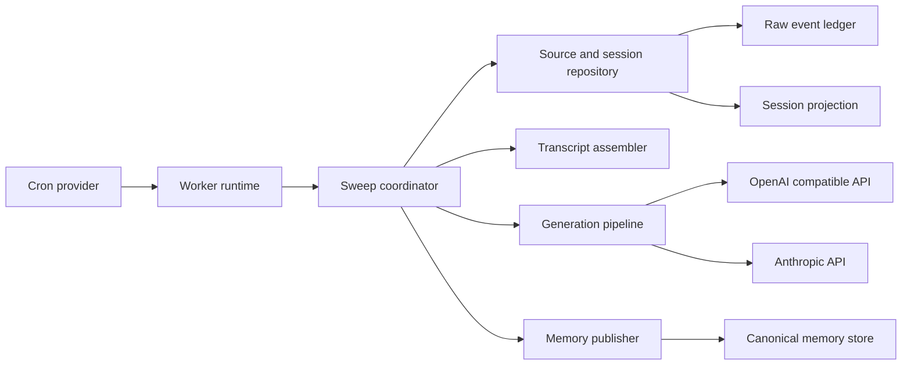
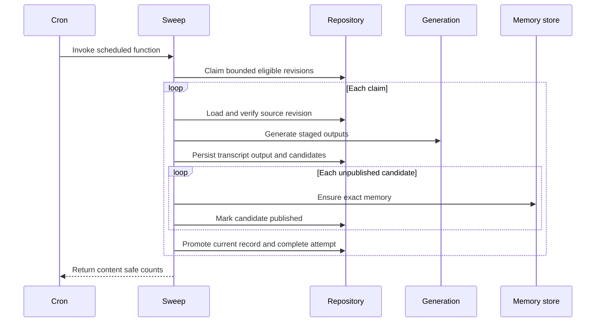
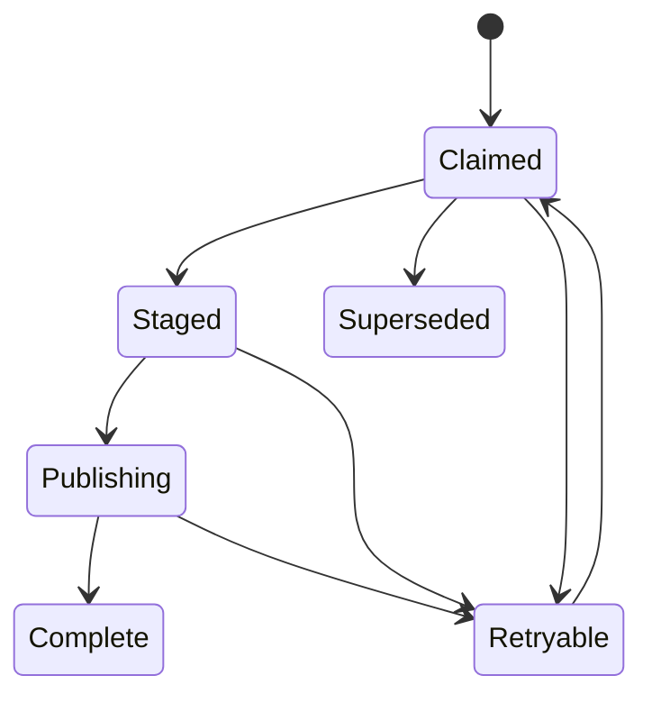
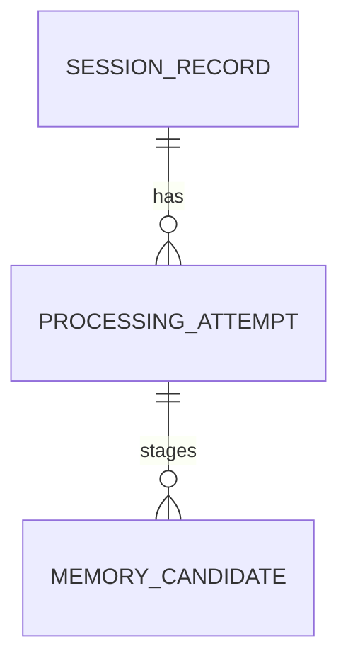

# Design Document: session-post-processing-worker

## Overview
The feature adds one Rust iii worker that converts eligible append-only harness events into a current comprehensive session record and zero or more canonical memories. It owns scheduled coordination, generated output, durable progress, and session projection state while preserving the raw ledger and canonical memory boundaries.

### Goals
- Finalize ended or inactive sessions on a configurable UTC cron schedule.
- Maintain one current comprehensive record per session with a bounded summary and exactly 10 concepts.
- Create retry-safe canonical memories and refresh records when late source events satisfy the end-or-inactivity gate again.
- Support one explicitly selected OpenAI-compatible or Anthropic endpoint per deployment.

### Non-Goals
- Change event ingestion, source-event semantics, memory search, or MCP tools.
- Generate embeddings or expose a session-record API.
- Route requests dynamically or fail over between model providers.
- Delete or revise memories created by earlier session revisions.

## Boundary Commitments

### This Spec Owns
- The `session-post-processing` worker, its cron binding, configuration, provider adapters, orchestration, and lifecycle.
- Processor-owned attempt, candidate, and current-session tables in the source-and-session database.
- Deterministic transcript assembly, source-revision calculation, summary and concept generation, and late-revision refresh.
- An idempotent exact-equivalence operation over the canonical memory store, implemented at the worker integration boundary.

### Out of Boundary
- Raw ledger writes, queue delivery, event protobufs, and lifecycle validation.
- Canonical memory schema, ranking, embeddings, public tools, retention, and deletion.
- Production provisioning of PostgreSQL, iii, cron, or model services.
- Provider account policy, quotas, billing, content moderation, or dynamic routing.
- Mutation of previously created session-derived memories.

### Allowed Dependencies
- Read-only access to `session_events` and `raw_observations` under their append-only contract.
- `memory-store` validation and insertion plus read-only exact lookup through the canonical memory database.
- iii engine and SDK 0.24.0, cron worker 0.21.9-compatible bindings, and iii database functions.
- PostgreSQL 17/18.
- `reqwest` 0.12.28, SHA-256, Serde, Schemars, Tokio, Chrono, and UUID from the pinned workspace.
- One active OpenAI-compatible Chat Completions or Anthropic Messages endpoint.

### Revalidation Triggers
- Any change from append-only source rows, database-assigned recorded times, or globally correlated `session_id` values.
- Event table, timestamp, receipt-ID, observation JSON, or canonical memory contract changes.
- iii cron registration, catalog, namespace, or missed-fire behavior changes.
- Provider authentication, endpoint path, structured-output, refusal, or truncation contract changes.
- A decision to split source/session state across database targets or to expose session records publicly.

## Architecture

### Existing Architecture Analysis
- Ingestion validates and publishes typed events; persistence appends independent source rows.
- The raw ledger intentionally has no session projection or interpretation behavior.
- `memory-store` validates immutable canonical memory versions but treats duplicate keys as conflicts.
- Workers use typed iii registration, process-owned readiness checks, injected async ports, and payload-free diagnostics.
- This design adds a downstream worker; it does not move processing into ingestion or persistence.

### Architecture Pattern and Boundary Map
The worker uses ports and adapters around a durable session-processing saga. The source-and-session repository owns local atomic state; canonical memory publication remains an external idempotent step.



**Architecture Integration**
- Selected pattern: durable saga with ports and adapters; model calls and memory writes occur outside source/session transactions.
- Dependency direction: `contracts -> config -> domain services -> ports -> adapters -> runtime -> binary`.
- Existing patterns preserved: pure configuration, static SQL, typed errors, managed iii registration, and test doubles at external boundaries.
- No queue is added between cron and processing; database claims already provide overlap safety and recovery.

### Technology Stack

| Layer | Choice / Version | Role in Feature | Notes |
|---|---|---|---|
| Worker | Rust 1.98.1, Tokio 1.48.0 | Domain coordination and bounded concurrency | Workspace-pinned |
| Runtime | iii-sdk 0.24.0 | Function and cron registration, database invocation | Process-owned readiness |
| Scheduling | iii cron worker 0.21.9-compatible | UTC scheduled invocation | Separate deployment prerequisite |
| HTTP | reqwest 0.12.28 with rustls | Provider-specific HTTPS requests | No vendor SDK |
| Data | PostgreSQL 17/18 | Ledger reads, claims, staging, current projection | Source and session state share one target |
| Memory | `memory-store` plus worker lookup adapter | Canonical validation, insertion, and exact-equivalence publication | Existing schema and crate interfaces unchanged |

## File Structure Plan

### Directory Structure
```text
workers/session-post-processing/
├── Cargo.toml
├── iii.worker.yaml
├── migrations/
│   └── 0001_session_post_processing.sql
├── src/
│   ├── lib.rs
│   ├── main.rs
│   ├── config.rs
│   ├── contracts.rs
│   ├── coordinator.rs
│   ├── repository.rs
│   ├── transcript.rs
│   ├── generation.rs
│   ├── memory_publisher.rs
│   ├── runtime.rs
│   └── provider/
│       ├── mod.rs
│       ├── openai_compatible.rs
│       └── anthropic.rs
└── tests/
    ├── config.rs
    ├── contracts.rs
    ├── coordinator.rs
    ├── generation.rs
    ├── openai_provider.rs
    ├── anthropic_provider.rs
    ├── repository.rs
    ├── runtime.rs
    └── migrations.rs

integration/session-post-processing-engine-fake/
├── Cargo.toml
└── src/main.rs

integration/session-post-processing-postgres-smoke/
├── Cargo.toml
├── src/lib.rs
└── scripts/
    ├── setup.sh
    └── verify.sh
```

### Modified Files
- `Cargo.toml` and `Cargo.lock` — add the worker, fixtures, direct HTTP dependency, and UUID v5 support.
- `.github/workflows/ci.yml` — build and test the worker, protocol fake, and PostgreSQL smoke matrix.
- `flake.nix` — include new source paths and release packages without changing the Rust toolchain.

## System Flows

### Scheduled Processing


Claims never span a model or memory call. One unfinished attempt is allowed per session. The coordinator obtains a lease permit before every provider or memory request, clips that request's deadline to the permit, and fences every state mutation with the lease token.

### Attempt State


`Complete` and `Superseded` are terminal. A pre-generation source-count mismatch supersedes the stale claim; otherwise a changed ledger count creates the next revision after the unfinished attempt completes.

## Requirements Traceability

| Requirement | Summary | Components | Interfaces | Flows |
|---|---|---|---|---|
| 1.1, 1.2, 1.3, 1.4, 1.5 | Scheduled readiness | Config, Worker Runtime | `Config`, `RegistrationPlan` | Startup and cron registration |
| 2.1, 2.2, 2.3, 2.4, 2.5, 2.6 | Eligibility | Repository, Sweep Coordinator | `claim_eligible` | Scheduled Processing |
| 3.1, 3.2, 3.3, 3.4, 3.5 | Bounded exclusive work | Sweep Coordinator, Repository | `Claim`, lease operations | Attempt State |
| 4.1, 4.2, 4.3, 4.4, 4.5, 4.6, 4.7, 4.8 | Comprehensive record | Transcript Assembler, Generation Pipeline, Repository | `SourceSnapshot`, `SessionRecord` | Scheduled Processing |
| 5.1, 5.2, 5.3, 5.4, 5.5, 5.6, 5.7 | Model providers | Config, Model Provider adapters, Generation Pipeline | `ModelProvider`, provider wire contracts | Generation map and reduce |
| 6.1, 6.2, 6.3, 6.4, 6.5, 6.6, 6.7 | Memory creation | Generation Pipeline, Memory Publisher | `MemoryCandidate`, `ensure_memory` | Candidate publication |
| 7.1, 7.2, 7.3, 7.4, 7.5, 7.6, 7.7 | Late refresh | Repository, Coordinator, Generation Pipeline | `SourceRevision`, memory scope | Scheduled Processing |
| 8.1, 8.2, 8.3, 8.4, 8.5 | Recovery | Repository, Coordinator, Memory Publisher | attempt state, lease, ensure outcome | Attempt State |
| 9.1, 9.2, 9.3, 9.4 | Confidentiality | All adapters and runtime | typed redacted errors | Every boundary |
| 10.1, 10.2, 10.3, 10.4, 10.5, 10.6, 10.7 | Verification | Unit suites, engine fake, PostgreSQL smoke | recorded ports and protocol captures | Critical flows |

## Components and Interfaces

| Component | Domain | Intent | Requirements | Dependencies | Contracts |
|---|---|---|---|---|---|
| Config | Boundary | Validate all settings before registration | 1, 3, 5, 8, 9 | Environment P0 | State |
| Worker Runtime | Runtime | Own one function and cron binding | 1, 3, 9 | iii P0 | Service, Event |
| Sweep Coordinator | Domain | Drive bounded revision attempts | 2, 3, 6, 7, 8 | Repository P0, Generation P0, Memory P0 | Batch, State |
| Source and Session Repository | Data | Claim work and persist staged/current state | 2, 3, 4, 7, 8 | PostgreSQL P0 | Service, State |
| Transcript Assembler | Domain | Produce complete deterministic source transcription | 4, 7 | Source snapshot P0 | Service |
| Generation Pipeline | Domain | Map and reduce bounded model calls | 4, 5, 6, 7 | Model Provider P0 | Service, Batch |
| Model Provider | External | Adapt one selected provider wire contract | 5, 9 | HTTP endpoint P0 | API |
| Memory Publisher | Integration | Ensure staged canonical memories exactly once | 6, 7, 8 | memory-store P0 | Service, State |

### Boundary and Runtime

#### Config
The active provider is selected by `TOTAL_RECALL_POST_PROCESSING_PROVIDER`. Both provider configurations may be present, but only the selected provider is validated and instantiated.

| Variable | Default | Constraint |
|---|---|---|
| `TOTAL_RECALL_POST_PROCESSING_DATABASE` | none | Required non-empty source and session target |
| `TOTAL_RECALL_POST_PROCESSING_MEMORY_DATABASE` | none | Required non-empty canonical memory target |
| `TOTAL_RECALL_POST_PROCESSING_CRON_EXPRESSION` | `0 * * * * *` | Valid UTC six- or seven-field expression |
| `TOTAL_RECALL_POST_PROCESSING_BATCH_LIMIT` | `10` | Positive bounded integer |
| `TOTAL_RECALL_POST_PROCESSING_CONCURRENCY` | `2` | Positive and no greater than batch limit |
| `TOTAL_RECALL_POST_PROCESSING_LEASE_SECONDS` | `600` | Greater than one model request deadline and no greater than `i64::MAX` seconds |
| `TOTAL_RECALL_POST_PROCESSING_PROVIDER` | none | Exactly `openai` or `anthropic` |
| `TOTAL_RECALL_POST_PROCESSING_OPENAI_BASE_URL` | `https://api.openai.com/v1/` | Active-provider HTTPS root; loopback HTTP allowed in tests |
| `TOTAL_RECALL_POST_PROCESSING_OPENAI_API_TOKEN` and `TOTAL_RECALL_POST_PROCESSING_OPENAI_MODEL` | none | Required and non-empty when OpenAI-compatible is active |
| `TOTAL_RECALL_POST_PROCESSING_OPENAI_OUTPUT_MODE` | `json_schema` | `json_schema`, `json_object`, or `prompt` |
| `TOTAL_RECALL_POST_PROCESSING_ANTHROPIC_BASE_URL` | `https://api.anthropic.com/v1/` | Active-provider HTTPS root; loopback HTTP allowed in tests |
| `TOTAL_RECALL_POST_PROCESSING_ANTHROPIC_API_TOKEN` and `TOTAL_RECALL_POST_PROCESSING_ANTHROPIC_MODEL` | none | Required and non-empty when Anthropic is active |
| `TOTAL_RECALL_POST_PROCESSING_MODEL_TIMEOUT_SECONDS` | `180` | Positive and below lease duration |
| `TOTAL_RECALL_POST_PROCESSING_MODEL_ATTEMPTS` | `3` | Positive bounded integer |
| `TOTAL_RECALL_POST_PROCESSING_MODEL_CHUNK_BYTES` | `131072` | Positive UTF-8 payload bound |
| `TOTAL_RECALL_POST_PROCESSING_MODEL_OUTPUT_TOKENS` | `8192` | Positive provider request bound |
| `TOTAL_RECALL_POST_PROCESSING_SHUTDOWN_DRAIN_SECONDS` | `30` | Positive graceful-shutdown drain deadline |

Secrets use redacted wrapper types whose `Debug` and `Display` never reveal the value.

#### Worker Runtime
**Responsibilities and constraints**
- Register `session_post_processing::sweep` and one `cron` trigger in the configured namespace.
- Retain both handles and verify the process nonce, function owner, trigger provider, active status, expression, and namespace before readiness.
- Bound admitted sweep concurrency; overlapping cron invocations may return after discovering no claimable work.
- Stop admissions on shutdown and wait only for the configured drain deadline.

**Contracts**: Service, Event
- The function accepts `iii_sdk::builtin_triggers::CronCallRequest`; validated trigger, job, scheduled-time, and actual-time fields are not used as processing state.
- Result contains attempted, staged, completed, retryable, and skipped counts. `staged` records a confirmed stage awaiting candidate publication and promotion; it is not complete. For every nonempty sweep, `attempted = staged + completed + retryable + skipped`.
- Missed cron fires are not replayed by this worker.

### Processing Domain

#### Sweep Coordinator
```rust
trait SessionProcessingService {
    async fn run_sweep(&self, now: DateTime<Utc>) -> Result<SweepOutcome, ProcessingError>;
}
```

**Preconditions**
- Configuration and registrations are ready.
- The repository clock instant is supplied explicitly.

**Postconditions**
- At most the batch limit is claimed; at most the concurrency limit is active.
- A current session record changes only after every staged memory candidate is ensured.
- Loss of lease prevents new external calls and state mutations. An already-sent memory request may complete, but deterministic ensure semantics make its later recovery safe.

```rust
trait ExternalCallLease {
    async fn permit(&self, maximum: Duration) -> Result<LeasePermit, LeaseError>;
}
```

`LeasePermit` carries the current fencing token and a deadline earlier than lease expiry. Generation and memory publication require a permit for each request, including every map and reduce call.

#### Source and Session Repository
```rust
trait SessionRepository {
    async fn claim_eligible(&self, now: DateTime<Utc>, limit: u32, lease: Duration)
        -> Result<Vec<Claim>, RepositoryError>;
    async fn renew(&self, claim: &Claim, now: DateTime<Utc>, lease: Duration)
        -> Result<bool, RepositoryError>;
    async fn load_snapshot(&self, claim: &Claim) -> Result<SnapshotLoadOutcome, RepositoryError>;
    async fn stage(&self, claim: &Claim, output: StagedRevision) -> Result<(), RepositoryError>;
    async fn load_unpublished_candidates(&self, claim: &Claim)
        -> Result<Vec<StagedMemoryCandidate>, RepositoryError>;
    async fn mark_memory_published(&self, claim: &Claim, memory_id: &str)
        -> Result<(), RepositoryError>;
    async fn promote(&self, claim: &Claim) -> Result<(), RepositoryError>;
    async fn retry(&self, claim: &Claim, failure: FailureCategory, next_at: DateTime<Utc>)
        -> Result<(), RepositoryError>;
}
```

**Port contracts**
- `StagedRevision` contains the assembled transcript, validated generated revision, and normalized candidate payloads for one claim; the claim supplies the session and source-revision identity.
- `StagedMemoryCandidate` carries a normalized content fingerprint, canonical payload, and supporting receipt IDs. `load_unpublished_candidates` returns only candidates for the fenced claim whose publication timestamp is absent.
- `LeasePermit` carries the active `LeaseToken` and a deadline before lease expiry.
- `RepositoryError`, `LeaseError`, `ProviderError`, and `MemoryPublishError` expose only the existing fixed failure category, stage, and retryability. They never retain source, generated, credential, SQL, or provider payloads.
- `SnapshotLoadOutcome` is `Current(LoadedSnapshot)` or `Superseded`. `LoadedSnapshot` carries the complete `SourceSnapshot` and its exact `memory_scope`. A source-count or revision mismatch fences and supersedes a `claimed` attempt before any provider or memory call; reclaimed `staged` and `publishing` attempts retain durable progress and are not superseded by source loading.
- Initial `memory_scope` contains every observation receipt in the loaded snapshot. Refresh `memory_scope` is the loaded snapshot's observation receipt set minus the prior current projection's observation receipt set. The repository derives the prior set from the stored projection transcript while loading the fenced snapshot; the coordinator does not query projection state directly.

**Claim invariants**
- Session identity is the exact `session_id`; conflicting project or directory values remain per-source metadata.
- Eligibility uses persisted session ends or `MAX(raw_observations.ingested_at) <= now - 24 hours`.
- A processed session with changed counts is reevaluated under the original eligibility rule: a persisted end permits refresh, otherwise the latest observation must be quiet for 24 hours.
- A partial unique constraint permits only one unfinished attempt per session. New source revisions wait until that attempt completes, preventing an older revision from promoting after a newer revision.
- Expired attempts are reclaimed with a new lease token; creation, renewal, staging, candidate updates, retry, and promotion compare that token.
- Snapshot counts must match claimed counts. A mismatch before provider calls atomically marks the stale attempt `superseded`, allowing the latest counts to form a new attempt.
- A snapshot cutoff is the maximum `ingested_at` over every loaded source row. The repository loads every selected append-only row without a row or payload cap; generation bounds its own later input.
- Refresh provenance uses receipt-set difference rather than a timestamp comparison, so tied recorded times cannot broaden a new revision's memory evidence scope.
- A retryable attempt reclaims as `claimed` even when staged output exists. The coordinator regenerates and stages it; candidate conflict handling preserves previously staged or published candidate rows and never changes a committed canonical memory.
- `failure_category` retains the last content-safe failure category across reclaim and completion. Retry times are floored to whole seconds before persistence and comparison.
- `source_revision` is UUIDv5 over sorted event-kind and receipt-ID pairs. Its namespace is `Uuid::new_v5(&Uuid::NAMESPACE_URL, b"total-recall/session-post-processing/source-revision/v1")`; its name bytes join canonical `event_type`, NUL, receipt ID, and newline for each sorted pair. Transcript order does not affect revision identity.
- `attempt_id` and newly issued `lease_token` values are UUIDv7. Reclaiming an expired `staged` or `publishing` attempt retains its state and durable progress while issuing a new lease token; `Claim` carries the retained attempt state.
- Lifecycle and observation counts are nonnegative `u64` values. Repository lease issue and comparison times are floored to whole seconds before they cross the iii database boundary.

#### Transcript Assembler
```rust
trait TranscriptAssembler {
    fn assemble(&self, snapshot: SourceSnapshot) -> Result<Transcript, TranscriptError>;
}
```

`TranscriptError` is `Infallible`: snapshot validation occurs before assembly. Source entries are a discriminated `lifecycle` or `observation` union. Every entry preserves receipt ID, event type, session ID, project name, working directory, source timestamp text and instant, recorded time, and variant fields. Order is ascending `(source_timestamp_utc, ingested_at, event_kind_rank, receipt_id)`, with ranks `session_start = 0`, `observation = 1`, and `session_end = 2`. A duplicate receipt ID across the combined lifecycle and observation source rows is invalid source data and is rejected before assembly.

#### Generation Pipeline
```rust
trait SessionGenerator {
    async fn generate(&self, input: GenerationInput) -> Result<GeneratedRevision, GenerationError>;
}

struct GenerationInput {
    transcript: Transcript,
    memory_scope: BTreeSet<ReceiptId>,
}
```

**Map and reduce contract**
- Serialize transcript entries into ordered UTF-8 chunks no larger than the configured byte bound. Oversized individual entries use numbered fragments retaining the source receipt ID.
- Map calls produce one to five summary sentences, concepts, and memory candidates. Candidate evidence must be a non-empty subset of `memory_scope`.
- The repository provides `memory_scope`: initial processing receives every observation receipt, while refresh receives only receipt IDs absent from the prior current projection.
- Recursive reduction consumes map summaries and concepts until one response produces one to five non-empty summary sentences and exactly 10 concepts.
- The stored summary joins validated sentence elements with one space. Concepts are trimmed and distinct under Unicode lowercase comparison.
- Memory candidates contain `title`, `content`, `concepts`, and supporting receipt IDs. The worker sets type `session-derived`, files empty, session IDs, whole-second timestamps, version `1`, and a normalized content fingerprint over type, title, content, and concepts.
- Fingerprint normalization trims title and content, trims and Unicode-lowercases concepts, sorts the normalized concepts, and encodes version `1`, type, title, content, and concepts as UTF-8 fields prefixed by unsigned 64-bit big-endian lengths. The worker stores the lowercase hexadecimal SHA-256 digest of those bytes.
- The memory-ID namespace is `Uuid::new_v5(&Uuid::NAMESPACE_URL, b"total-recall/session-post-processing/memory-id/v1")`. The memory ID is UUIDv5 over length-framed session ID and fingerprint bytes. A unique `(session_id, content_fingerprint)` candidate constraint collapses duplicates within an attempt and suppresses exact memories already staged or published by an earlier revision.
- Equivalent candidates in one revision merge supporting receipt IDs into a sorted unique set before staging. An existing candidate from an earlier staged or published revision remains unchanged.

### External Integrations

#### Model Provider
```rust
trait ModelProvider {
    async fn generate(&self, request: StructuredGenerationRequest)
        -> Result<StructuredGenerationResponse, ProviderError>;
}
```

| Provider | Request | Authentication | Structured result |
|---|---|---|---|
| OpenAI-compatible | `POST chat/completions` below configured `/v1` root | Bearer token | configured JSON Schema, JSON object, or prompt-only mode |
| Anthropic | `POST messages` below configured `/v1` root | `x-api-key` and `anthropic-version: 2023-06-01` | `output_config.format` JSON Schema |

Every mode uses the same local closed-schema validation; output mode changes only the OpenAI-compatible request hint. Before every provider call, the pipeline renews ownership and limits the HTTP deadline to the smaller of the configured timeout and lease permit. Refusal, content filtering, truncation, empty output, schema mismatch, invalid evidence, sentence-count failure, and concept-count failure are generation failures. Network failures, `429`, and provider `5xx` responses use bounded exponential backoff with jitter and `Retry-After`; authentication, unsupported-contract, and request-size failures skip in-attempt retry. Any provider failure that reaches the coordinator persists `next_attempt_at` as the ceiling to a whole second of the supplied clock instant plus 60 seconds and an injected uniformly random one-sided jitter from zero through 10 seconds. A failed retry-state update leaves the attempt recoverable after lease expiry.

#### Memory Publisher
```rust
trait CanonicalMemorySink {
    async fn ensure_memory(&self, memory: MemoryVersionInput)
        -> Result<EnsureMemoryOutcome, MemoryPublishError>;
}

enum EnsureMemoryOutcome {
    Inserted,
    ExistingEquivalent,
}
```

`ensure_memory` validates and inserts with the existing `MemoryStore`. On conflict or an unknown insert result, the worker's read-only lookup adapter queries that exact version and returns `ExistingEquivalent` only when every canonical field equals the staged payload. A missing or mismatched row preserves the original failure or returns a conflict. Existing `memory-store` interfaces and duplicate-insert behavior do not change.

## Data Models

### Domain Model


- `SessionRecord` is the single current product projection for a session ID.
- `ProcessingAttempt` is an internal immutable source revision with mutable progress and lease state.
- `MemoryCandidate` is a staged canonical payload and publication marker.

### Physical Data Model

| Table | Key | Selected fields | Invariants |
|---|---|---|---|
| `session_records` | `session_id` | source revision, counts, cutoff, transcript JSONB, summary sentence array, rendered summary, concepts, generation time | One current row; one to five sentence elements; exactly 10 concepts |
| `session_processing_attempts` | `attempt_id` | session ID, source revision, source counts, state, lease token/expiry, retry time, staged summary/concepts/transcript | UUIDv7 attempt and lease identifiers; unique revision; at most one nonterminal attempt per session; controlled states including terminal complete and superseded |
| `session_memory_candidates` | attempt and ordinal | session ID, content fingerprint, deterministic memory ID, canonical payload JSONB, supporting receipt IDs, publication state | Unique session and fingerprint; candidate belongs to one attempt |

`attempt_id`, `source_revision`, `lease_token`, and candidate `memory_id` are UUID values. `session_id`, `content_fingerprint`, and persisted failure categories are text. Candidate publication progress uses a nullable `published_at` timestamp. `source_revision` is unique across attempts, and attempt state is restricted to `claimed`, `staged`, `publishing`, `complete`, `superseded`, or `retryable`.

`session_records` has no foreign key to an attempt: it is keyed by session ID and retains the promoted current revision. `session_memory_candidates` has a restrictive foreign key to its processing attempt. Processor tables do not reference append-only source rows or canonical memory rows across ownership boundaries.

The provisioned `session_post_processing_migrator` role owns processor schema changes. The migration revokes `PUBLIC` access and grants `session_post_processing_application` only `SELECT`, `INSERT`, and `UPDATE` on processor tables. The ledger provisioner separately grants that application role read-only access to ledger tables; this migration neither owns nor changes ledger permissions. Processor-owned indexes support eligible retry time, lease expiry, current session revision, and candidate publication state.

### Consistency and Recovery
- Claim, stage, candidate-state changes, and promotion are individually transactional in the source-and-session database.
- Model calls and canonical memory writes never hold source/session locks.
- Every attempt mutation uses the current lease-token compare-and-set; promotion also requires the attempt to be the session's sole unfinished revision.
- The prior `session_records` row remains current until every candidate for the new revision is confirmed.
- Memory publication is at-least-once invocation with exactly equivalent canonical outcome through deterministic IDs and `ensure_memory`.
- A newly recorded source row changes counts and creates a later attempt only after the end-or-inactivity gate is satisfied; append-only counts are a required invariant.

## Error Handling

| Category | Examples | Action |
|---|---|---|
| Startup | Invalid schedule, active provider missing settings, registration mismatch | Exit before readiness |
| Source conflict | Claimed and loaded counts differ | Fence and supersede before provider or memory calls, then claim the latest revision |
| Lease conflict | Lease lost or fencing token changed | Stop new calls and let the current attempt be reclaimed |
| Provider transient | Timeout, transport, `429`, `5xx` | Bounded in-attempt retry, then persist retry at `ceil(now + 60s + 0..=10s jitter)` |
| Provider contract | Refusal, truncation, malformed schema, invalid concepts or evidence | Persist content-safe category at `ceil(now + 60s + 0..=10s jitter)` |
| Memory unknown | Timeout after insert | Retry deterministic ensure and compare exact version |
| Memory mismatch | Existing key differs from staged payload | Preserve attempt as retryable conflict; do not promote |
| Repository | Invocation failure, unconfirmed commit, invalid response | Preserve prior record and retry after lease expiry |

Public errors expose only stage, stable category, attempt correlation ID, and retryability. Session IDs, receipt IDs, raw or generated content, provider bodies, credentials, SQL, and backend errors are excluded from `Display`, `Debug`, logs, and iii responses.

## Testing Strategy

### Unit and Package Tests
- Config defaults, exactly-one-provider selection, inactive-provider tolerance, URL rules, bounds, and secret redaction.
- Eligibility and refresh at the 24-hour boundary, end-only sessions, resumed activity, repeated lifecycle events, changed counts, claim-to-snapshot supersession, batch limits, claims, lease renewal, and lease expiry.
- Complete transcript projection, source revision stability, deterministic tie ordering, fragmented entries, sentence arrays, concept normalization, evidence checks, and incremental memory scope.
- OpenAI-compatible and Anthropic request/header/schema snapshots plus refusal, truncation, status, malformed body, timeout, and retry classification.
- Saga transitions for zero memories, prior-revision fingerprint suppression, partial publication, unknown commits, exact conflict equivalence, mismatches, failed refresh, and final promotion.

### Integration Tests
- The loopback iii fake proves function and cron registration, process-owned readiness, default and overridden expressions, database envelopes, scheduled result counts, and shutdown.
- An in-process HTTP peer independently validates both provider wire contracts and returns scripted structured, rejected, truncated, delayed, and oversized responses.
- PostgreSQL 17/18 smoke tests use synthetic source tables with the production read columns and explicit receipt IDs. They verify processor migrations, least privilege, concurrent claims, expired leases, fenced promotion, one current session row, refresh replacement, candidate uniqueness, and rollback without requiring `pg_uuidv7`.
- Memory publisher tests verify existing insert behavior is unchanged and the worker accepts only exact lookup equivalence after a conflict or unknown result.

### Quality Gates
- Run workspace tests, formatting, Clippy, license/advisory policy, release worker/fake builds, Nix checks, and both supported PostgreSQL majors.
- Tests use injected clocks and local fakes; no live cron, iii, provider, or production database is required.

## Security Considerations
- Treat raw observations as untrusted prompt data. Provider system instructions delimit evidence as data, and generated output is never executed.
- Validate every generated field and evidence receipt against the claimed revision before persistence.
- Send provider tokens only in headers to the configured active endpoint; never persist them.
- Default provider roots use HTTPS. Non-HTTPS roots are accepted only for loopback test addresses.
- Apply least privilege separately to source/session migrations, source/session runtime access, and canonical memory access.
- Keep transcript and generated fields out of telemetry; operational metrics use counts, durations, states, and fixed categories.

## Performance and Scalability
- Default each cron sweep to 10 claims with 2 concurrent attempts; both are bounded configuration.
- Renew leases before each bounded provider or memory call, clip request deadlines to lease permits, and fence all state transitions; overlapping cron invocations safely compete for claims.
- Hierarchical map and reduce bounds each provider request and recursively handles sessions larger than one model context.
- Candidate discovery uses the existing ledger schema and aggregates append-only rows. Query-plan validation on representative volumes is required before raising batch or schedule frequency; any future ledger index is a persistence-schema change requiring revalidation.

## Migration Strategy
1. Apply processor-owned state and projection tables with migration and application roles.
2. Deploy the compatible cron provider and model credentials.
3. Deploy the worker disabled from readiness until migrations and catalog verification pass.
4. Enable the cron binding and verify content-safe sweep counters.

Rollback disables the worker and cron binding while preserving source rows, current projections, attempts, candidates, and memories. No destructive down migration is part of this feature.
