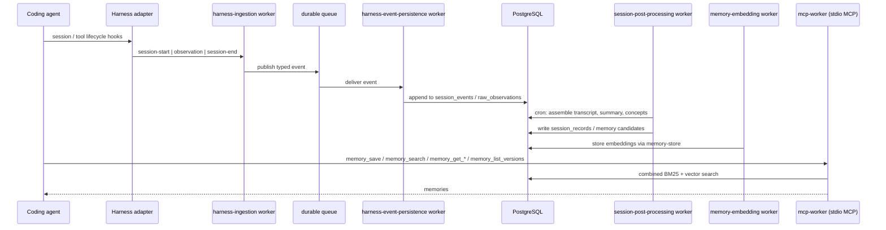

# Total Recall

A harness-neutral memory substrate for coding agents. Total Recall captures
agent-session activity, preserves the raw evidence, stores immutable versioned
memories, and exposes retrieval over the Model Context Protocol (MCP).

Coding-agent harnesses (OpenCode, Pi, and others) have no durable memory across
sessions. Total Recall sits between the harnesses and the storage layer so that
no harness needs to know about the iii runtime, PostgreSQL, or the internal
storage schemas. Harness integrations stay thin; delivery semantics stay
explicit (no implicit retries or exactly-once claims); memory history is kept as
immutable versions rather than mutable rows.

## Architecture



Event flow:

1. **Capture.** A harness adapter observes session lifecycle and tool events and
   invokes the `harness-events` CLI, which makes exactly one iii function call
   per event (`session-start`, `observation`, `session-end`). Adapters fail open
   — memory capture never breaks the harness.
2. **Validation and durable delivery.** The `harness-ingestion` worker validates
   each event against the protobuf contracts in `proto/` and publishes typed
   events to a durable queue topic.
3. **Evidence preservation.** The `harness-event-persistence` worker subscribes
   to the queue and appends events to PostgreSQL (`session_events`,
   `raw_observations`, `session_embeddings`). Raw evidence is written before any
   interpretation happens.
4. **Post-processing.** The `session-post-processing` worker runs on a cron
   trigger, finds eligible sessions (session ended, or 24h of inactivity),
   assembles the transcript, and generates a summary, exactly 10 concepts, and
   memory candidates via an OpenAI-compatible or Anthropic provider.
5. **Embedding.** The `memory-embedding` worker renders canonical title/content/
   concepts and calls the iii `router::embed` function, storing vectors in
   `memory-store`.
6. **Retrieval.** The `mcp-worker` is a local stdio MCP server exposing memory
   tools to coding agents. Search combines lexical (BM25) and vector (exact
   cosine) signals with a deterministic, score-free merge.

## Repository layout

| Path | Contents |
| --- | --- |
| `crates/memory-store` | Canonical memory domain: immutable `(id, version)` memories, embeddings, search |
| `crates/knowledge-graph-store` | Relational knowledge graph: concepts, aliases, assertions, evidence |
| `clients/harness-events-cli` | `harness-events` — thin CLI adapter boundary for harnesses |
| `workers/harness-ingestion` | iii functions validating and publishing harness events |
| `workers/harness-event-persistence` | Queue subscriber writing the append-only event ledger |
| `workers/session-post-processing` | Cron-driven summarization and memory candidate generation |
| `workers/memory-embedding` | Queue + cron embedding reconciliation into `memory-store` |
| `workers/mcp-worker` | Local stdio MCP server for memory retrieval |
| `integrations/opencode-harness-events` | OpenCode v1/v2 plugin (TypeScript, Bun) |
| `integrations/pi-harness-events` | Pi extension (TypeScript, Node) |
| `integration/` | Loopback protocol fakes, PostgreSQL smoke verifiers, live E2E tests |
| `proto/` | Protobuf wire contracts for harness events |

## Tech stack

- **Rust** (edition 2024) workspace for the CLIs, workers, and domain crates.
- **iii engine** (`iii-sdk`) — workers register typed functions, queue
  subscribers, cron triggers, and database workers over WebSocket.
- **PostgreSQL 17/18** with `pg_textsearch` (BM25), `pgvector` (cosine
  similarity), and `pg_uuidv7`. Extensions are provisioned by the operator.
- **MCP** via `rust-mcp-schema`, protocol `2026-07-28`, stdio transport only.
- **TypeScript** harness adapters (Bun for OpenCode, Node 24/npm for Pi).
- **Nix flake** pins the toolchain, `protoc`, `iii`, test harness binaries, and
  quality tooling; `nix develop` (or direnv) is the supported dev shell.

## Development

```sh
nix develop --command cargo test --workspace --locked
nix develop --command cargo fmt --all --check
nix develop --command cargo clippy --workspace --all-targets --locked -- -D warnings
nix develop --command cargo deny --locked check licenses advisories
nix flake check
```

TypeScript packages:

```sh
# integrations/opencode-harness-events
bun install --frozen-lockfile && bun run check

# integrations/pi-harness-events (inside nix develop .#node24)
npm ci && npm run check
```

Runtime configuration is environment-driven. Common variables: `III_URL`
(default `ws://127.0.0.1:49134`), `III_NAMESPACE`, `TOTAL_RECALL_QUEUE_TOPIC`.
Each package documents its own variables in its README (for example
`workers/mcp-worker/README.md`) and `TOTAL_RECALL_*` settings for database,
embedding, and post-processing behaviour.

## Status

Completed: harness ingestion and persistence, harness-events CLI, memory schema
search, embedding and session post-processing workers, MCP worker,
knowledge-graph foundation, and the OpenCode and Pi adapters. In progress:
startup-context support for OpenCode and Pi.

## License

MIT — see [LICENSE](LICENSE). Note that the iii engine is under the Elastic
License 2.0, which is a deployment constraint.
